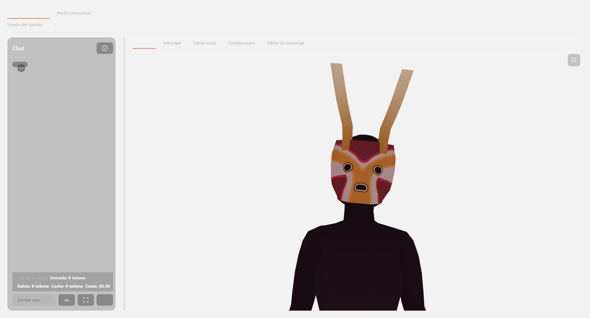

# Codetuver Avatar

Aplicación de escritorio para Windows que presenta una sesión real de **Claude Code** como un avatar VTuber: un personaje 3D (VRM) o 2D (Live2D) que reacciona en tiempo real a lo que el agente hace — lee archivos, ejecuta comandos, piensa, pide permiso — con voz opcional, un chat legible del intercambio, y modos de presentación que van desde una ventana de trabajo completa hasta una mascota de escritorio siempre encima.

Claude Code es el único agente real: la aplicación nunca decide nada ni genera respuestas por su cuenta, es una capa de presentación sobre el CLI real de `claude`.



## Requisitos

- **Windows 11** (única plataforma soportada y probada — ver [`docs/adr/0002-stack-tauri-rust-vue.md`](docs/adr/0002-stack-tauri-rust-vue.md)).
- **Claude Code instalado y autenticado por separado.** Codetuver Avatar no lo instala ni lo autentica.

## Instalación (paquete publicado)

Ver [`docs/how-to/instalar-codetuver-avatar.md`](docs/how-to/instalar-codetuver-avatar.md) para la guía completa, incluida la advertencia de Windows SmartScreen (el instalador se distribuye sin firma Authenticode, igual que un proyecto open source típico en GitHub Releases).

## Desarrollo

Requiere Node 22 LTS y el toolchain de Rust estable (`cargo`).

```bash
npm install
npm run tauri dev    # levanta Vite + la ventana nativa con recarga en caliente
```

Otros comandos:

| Comando | Qué hace |
|---|---|
| `npm run dev` | Solo el frontend Vite (sin la ventana nativa de Tauri) |
| `npm run build` | Type-check (`vue-tsc --noEmit`) + build de producción del frontend |
| `npm run tauri build` | Compila el instalable nativo completo (`.msi`/`.exe`) |
| `npx vitest` | Pruebas unitarias TypeScript (junto al código fuente, `src/**/*.spec.ts`) |
| `cargo test` (en `src-tauri/`) | Pruebas unitarias Rust |

## Stack

Tauri 2 + Rust (núcleo nativo) · Vue 3 Composition API + TypeScript + Vite (presentación) · Three.js + `@pixiv/three-vrm` (render del avatar) · `@theatre/core` (editor de pose/animación) · Web Speech API (voz, sin dependencia nueva) · CSS con tokens OKLCH (theme-first, sin framework de utilidades).

## Capturas

<table>
<tr>
<td><br><sub>Modo companion — la sesión al lado de tu trabajo</sub></td>
<td><br><sub>Modo mascota — siempre encima, con burbuja de reacción</sub></td>
</tr>
<tr>
<td><br><sub>Chat legible del intercambio real con Claude Code</sub></td>
<td><br><sub>Editor de animación — ajusta poses y timeline sin salir de la app</sub></td>
</tr>
</table>

Más capturas por dominio funcional en [`docs/specs/`](docs/specs/arquitectura-general/overview.md).

## Documentación

Toda la documentación técnica vive en [`docs/`](docs/README.md), empezando por [`docs/specs/arquitectura-general/overview.md`](docs/specs/arquitectura-general/overview.md) — el punto de entrada real para entender cómo está construida la aplicación, con un dominio funcional completo por carpeta hermana (sesión y transporte, chat, personajes, animación, reacciones y voz, presentación de ventana, administración, UI compartida, robustez y actualizaciones, orquestación).

## Distribución y actualizaciones

El instalable se publica sin certificado Authenticode (decisión explícita: el costo recurrente no se justifica para una distribución estilo proyecto de código abierto). La aplicación sí se actualiza sola: comprueba en silencio contra GitHub Releases al iniciar y firma cada actualización con una clave Ed25519 propia del proyecto, independiente de cualquier firma comercial. Detalle completo en [`docs/specs/robustez-y-actualizaciones/overview.md`](docs/specs/robustez-y-actualizaciones/overview.md).
