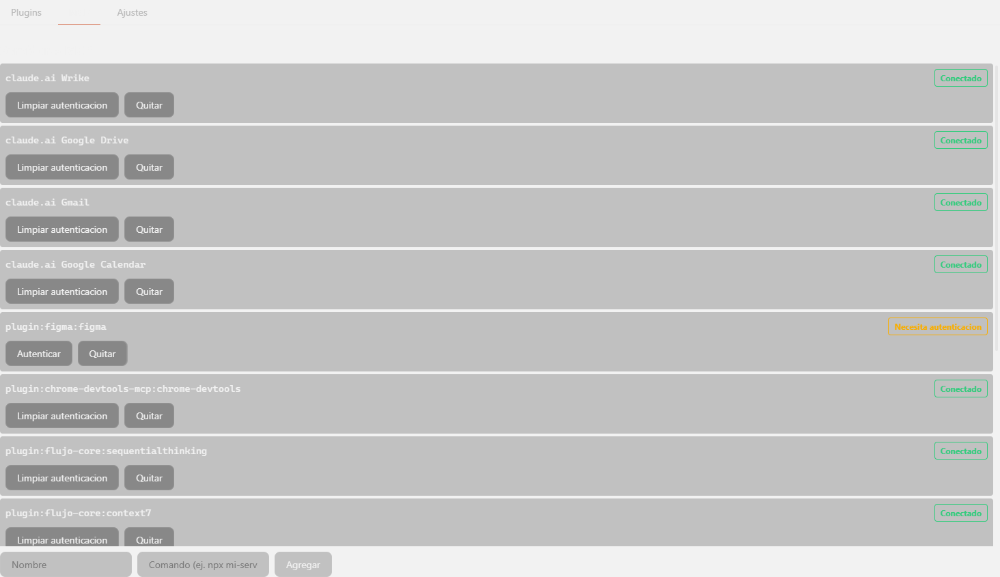
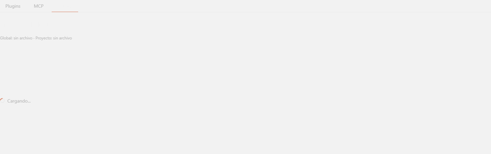
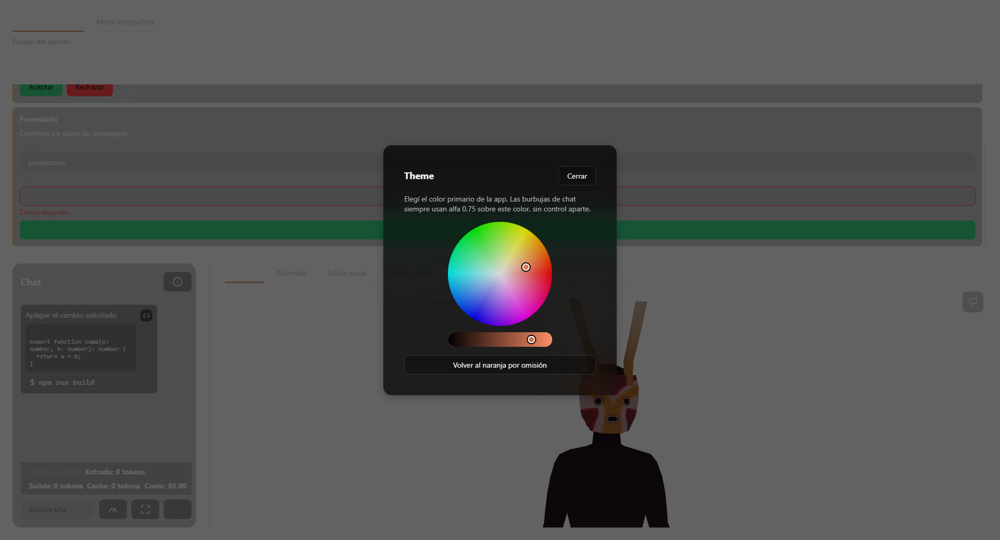

# Referencia — administración y configuración

## `src/claude-transport.ts` — comandos Tauri del panel de administración

### Tipos

```ts
interface PluginSummary { id: string; version: string; scope: string; enabled: boolean }
interface AvailablePlugin { pluginId: string; name: string; description: string; marketplaceName: string; installCount: number }
type McpStatus =
  | { kind: 'connected' }
  | { kind: 'needs-authentication' }
  | { kind: 'pending-approval' }
  | { kind: 'failed'; reason: string }
  | { kind: 'unknown'; raw: string };
type McpLoginOutcome =
  | { kind: 'confirmed' }
  | { kind: 'failed-early'; message: string }
  | { kind: 'still-in-progress' };
interface McpServerSummary { name: string; status: McpStatus }
interface ScopedSettings { global: Record<string, unknown> | null; project: Record<string, unknown> | null }
interface AdminOperationResult { requiresRestart: boolean }
```

### Funciones (cada una hace `invoke` de un comando Tauri homónimo en snake_case)

- `listPlugins(cwd: string | null): Promise<PluginSummary[]>` → `list_plugins`.
- `setPluginEnabled(id: string, enabled: boolean): Promise<AdminOperationResult>` → `set_plugin_enabled`.
- `listAvailablePlugins(cwd: string | null): Promise<AvailablePlugin[]>` → `list_available_plugins`.
- `installPlugin(pluginId: string): Promise<AdminOperationResult>` → `install_plugin`.
- `uninstallPlugin(id: string): Promise<AdminOperationResult>` → `uninstall_plugin` (usa `-y` internamente en Rust, no hay TTY para confirmar).
- `getPluginDetails(id: string): Promise<string>` → `get_plugin_details` (texto crudo; `claude plugin details` no soporta `--json`).
- `addPluginMarketplace(source: string): Promise<AdminOperationResult>` → `add_plugin_marketplace`.
- `listMcpServers(): Promise<McpServerSummary[]>` → `list_mcp_servers`.
- `addMcpServer(name: string, command: string): Promise<AdminOperationResult>` → `add_mcp_server`.
- `removeMcpServer(name: string): Promise<AdminOperationResult>` → `remove_mcp_server`.
- `authenticateMcp(name: string): Promise<McpLoginOutcome>` → `authenticate_mcp` (abre navegador real, no espera a que el login termine).
- `clearMcpAuthentication(name: string): Promise<AdminOperationResult>` → `clear_mcp_authentication`.
- `readAdminSettings(projectDir: string | null): Promise<ScopedSettings>` → `read_admin_settings`.

## `src/mcp-auth-outcome.ts`

- `PLUGIN_MCP_PREFIX = 'plugin:'`.
- `isPluginNamespacedMcp(name: string): boolean` — `name.startsWith('plugin:')`.
- `pluginNamespaceNotice(name: string): string | null` — `null` si no es namespaced; si lo es, devuelve el texto fijo sobre que la autenticación depende del plugin publicador.
- `interface McpAuthMessage { notice: string | null; error: string | null }`.
- `describeMcpLoginOutcome(name: string, outcome: McpLoginOutcome): McpAuthMessage` — si `outcome.kind === 'failed-early'`, devuelve `{ notice: pluginNotice, error: outcome.message }`; en cualquier otro caso (`confirmed` o `still-in-progress` se tratan igual, ninguno es un fallo confirmado) devuelve un aviso de "se abrió el navegador... completa el proceso ahí y luego actualiza esta lista", con el aviso de namespacing de plugin anexado si aplica.

## `src-tauri/src/claude_admin.rs` — núcleo Rust

### Constantes y tipos clave

- `ALLOWED_SETTINGS_KEYS: &[&str] = &["permissions"]` — único vocabulario que cruza de `.claude/settings.json` a presentación.
- `AdminErrorKind` / `AdminError` — error tipado interno, nunca un `String` suelto.
- `AdminOperationResult { requires_restart: bool }`.
- `RawPlugin` (deserializado de `claude plugin list --json`, incluye `installPath`/`mcpServers`) → `PluginSummary` (los descarta).
- `RawAvailablePlugin` (incluye `source`) → `AvailablePlugin` (lo descarta).
- `McpStatus` — mismo enum reflejado en TS.
- `McpLoginOutcome` — mismo enum reflejado en TS.

### Funciones internas

- `belongs_to_project(plugin_scope: &str, plugin_path: &str, cwd: &str) -> bool` — comparación de rutas insensible a mayúsculas; solo se aplica cuando `scope == "project"` (Hallazgo 8: `claude plugin list --json` devuelve instalaciones de todos los proyectos sin filtrar).
- `parse_plugin_list(json: &str, cwd: &str) -> Vec<PluginSummary>`.
- `plugin_toggle_args(id: &str, enabled: bool) -> Vec<String>`.
- `filter_allowed_keys(value: &serde_json::Value) -> serde_json::Value` — conserva solo las claves de nivel superior en `ALLOWED_SETTINGS_KEYS`; una clave anidada con el mismo nombre en un nivel inferior no cuenta.
- `read_settings_file(path: &Path) -> Option<serde_json::Value>` — `None` si el archivo no existe o el JSON es inválido (no distingue entre ambos casos a este nivel).
- `parse_mcp_list(output: &str) -> Vec<McpServerSummary>` / `parse_mcp_line(line: &str) -> Option<McpServerSummary>` / `parse_mcp_status(symbol: &str, rest: &str) -> McpStatus` — parseo de texto plano; símbolos reales `✔` (connected), `!` (needs-authentication), `✘` seguido de razón (failed), `⏸` (pending-approval); cualquier otro símbolo → `unknown{raw}`; líneas malformadas se descartan silenciosamente.
- `mcp_add_args(name: &str, command: &str) -> Vec<String>` / `mcp_remove_args(name: &str) -> Vec<String>`.
- `run_claude(args: &[String], cwd: Option<&str>) -> Result<Output, AdminError>` — `Command::new("claude").args(args)`, nunca una shell; `stdin(Stdio::null())`; en Windows agrega la bandera de creación `CREATE_NO_WINDOW`.
- `EARLY_DETECTION_WINDOW: Duration = Duration::from_secs(4)`.
- `read_all(...)` / `early_failure_message(...)` / `detect_early_login_outcome(child, timeout) -> McpLoginOutcome` — usa `tokio::join!` sobre `child.wait()` y la lectura de stdout/stderr en paralelo, evitando el deadlock clásico de buffer de pipe lleno mientras nadie lo lee.
- `spawn_claude_detached(args: &[String]) -> Result<Child, AdminError>` — para `claude mcp login`; el proceso hijo nunca se espera hasta completarse (es interactivo/OAuth por naturaleza).
- `command_output_to_text(output: &Output) -> String`.
- `is_claude_ai_connector_no_op(text: &str) -> bool` — verifica la presencia literal de la cadena `"claude.ai connector"` en la salida de `claude mcp get`; confirmado en vivo que `claude mcp logout` sobre este tipo de servidor devuelve éxito (`exit 0`) sin efecto real.

### Comandos Tauri (`#[tauri::command]`)

| Comando | Firma | Notas |
|---|---|---|
| `list_plugins` | `(cwd: Option<String>) -> Result<Vec<PluginSummary>, AdminError>` | Filtra por `belongs_to_project` cuando aplica. |
| `list_available_plugins` | `(cwd: Option<String>) -> Result<Vec<AvailablePlugin>, AdminError>` | |
| `install_plugin` | `(plugin_id: String) -> Result<AdminOperationResult, AdminError>` | |
| `add_plugin_marketplace` | `(source: String) -> Result<AdminOperationResult, AdminError>` | |
| `set_plugin_enabled` | `(id: String, enabled: bool) -> Result<AdminOperationResult, AdminError>` | |
| `uninstall_plugin` | `(id: String) -> Result<AdminOperationResult, AdminError>` | Agrega `-y` (sin TTY para confirmar interactivamente). |
| `get_plugin_details` | `(id: String) -> Result<String, AdminError>` | Sin soporte `--json` en el CLI real; texto crudo. |
| `list_mcp_servers` | `() -> Result<Vec<McpServerSummary>, AdminError>` | |
| `add_mcp_server` | `(name: String, command: String) -> Result<AdminOperationResult, AdminError>` | |
| `remove_mcp_server` | `(name: String) -> Result<AdminOperationResult, AdminError>` | |
| `authenticate_mcp` | `(name: String) -> Result<McpLoginOutcome, AdminError>` | `spawn_claude_detached` + `detect_early_login_outcome`. |
| `clear_mcp_authentication` | `(name: String) -> Result<AdminOperationResult, AdminError>` | Detecta no-op de conector `claude.ai` vía `is_claude_ai_connector_no_op`, pero no lo distingue del éxito real en el resultado devuelto hoy. |
| `read_admin_settings` | `(app: AppHandle, project_dir: Option<String>) -> Result<ScopedSettings, AdminError>` | Aplica `filter_allowed_keys` a global y proyecto por separado. |

Cobertura de tests (`#[cfg(test)]`, ~cómo se valida cada punto anterior): ids inexistentes en desinstalar/detalles/logout no producen pánico; detección de no-op de conector `claude.ai`; detección de resultado temprano de login (éxito/fallo/aún en curso) contra procesos hijos reales de `cmd.exe` usados como doble; parseo de lista de plugins descarta secretos/`installPath`/`mcpServers` y filtra correctamente el escenario multi-proyecto (Hallazgo 8); parseo de plugins disponibles descarta `source`; parseo de lista MCP cubre los 4 símbolos reales más el caso `unknown` y líneas malformadas descartadas; filtrado de allowlist de settings no dejar pasar claves anidadas que imitan el nombre permitido, y no entra en pánico con valores no-objeto; lectura de archivo de settings devuelve `None` tanto en ausencia como en corrupción.

## `src/app-settings.ts`

```ts
interface AppSettings {
  corner: ScreenCorner;
  windowSize: WindowSize;
  opacity: number; // persistido con default 1.0, pero inerte hoy: ningun punto real de src/ lo lee ni lo aplica a la ventana
  alwaysOnTop: boolean;
  monitor: string;
  initialMode: PresentationMode;
  activityVisibility: PanelVisibility;
  chatColumnWidthPx?: number;
  primaryColorRgb?: [number, number, number];
  sessionStartOptions?: SessionStartOptions;
  petWindowPosition?: PetWindowPosition;
}
type AppSettingsPartial = Partial<AppSettings>;
interface AppSettingsResolution { settings: AppSettings; usedDefaults: boolean }
```

- `getAppSettings(cwd: string | null): Promise<AppSettingsResolution>` — invoca `get_app_settings`; `usedDefaults` es `true` únicamente si algún archivo presente estaba corrupto (nunca por archivo ausente).
- `setGlobalAppSettings(settings: AppSettings): Promise<void>` — invoca `set_global_app_settings`, reemplazo total.
- `setProjectAppSettings(cwd: string, partialSettings: AppSettingsPartial): Promise<void>` — invoca `set_project_app_settings`.
- `mergeAndPersistAppSettings(partial: AppSettingsPartial): Promise<AppSettings>` — relee `getAppSettings()` en frío antes de fusionar el `partial` (evita pisar una escritura concurrente de otra ventana, p. ej. `PetView`), persiste el resultado fusionado y lo devuelve.

## `src-tauri/src/app_settings.rs`

- `WindowSize { width: u32, height: u32 }`, `PetWindowPosition { x: i32, y: i32 }` (con `#[serde(default)]` para compatibilidad hacia atrás con JSON guardado antes de que este campo existiera).
- `AppSettings` — mismos campos que en TS, serde en camelCase.
- `AppSettingsPartial` — todos los campos `Option<T>`.
- `merge(base: &AppSettings, partial: &AppSettingsPartial) -> AppSettings` — por cada campo, `partial.campo.unwrap_or(base.campo)` (u `.or` para los `Option<T>`); nunca reemplaza el objeto completo.
- `project_hash(cwd: &str) -> u64` — `DefaultHasher` con claves de normalización fijas; determinista y estable entre ejecuciones para el mismo `cwd` real, sin colisión entre variantes de casing/separador de la misma ruta en Windows (cubierto por test).
- `global_settings_path(app_data_dir) -> PathBuf` / `project_settings_path(app_data_dir, cwd) -> PathBuf`.
- `enum ReadOutcome<T> { Loaded(T), Missing, Invalid }`.
- `read_json<T>(path) -> ReadOutcome<T>` / `write_json<T>(path, value) -> io::Result<()>`.
- `read_global_settings` / `write_global_settings` / `read_project_settings` / `write_project_settings` — cada lectura devuelve `(AppSettings, bool)`, donde el `bool` (`used_defaults`) es `true` únicamente si el archivo existía y era inválido; un archivo ausente nunca activa `used_defaults`.
- `resolve_settings(app_data_dir, project_cwd: Option<&str>) -> (AppSettings, bool)` — combina global + proyecto vía `merge`.
- Comandos Tauri: `get_app_settings(app, cwd: Option<String>) -> Result<AppSettingsResolutionDto, String>`, `set_global_app_settings(app, settings: AppSettings) -> Result<(), String>`, `set_project_app_settings(app, cwd: String, partial: AppSettingsPartial) -> Result<(), String>`.

Cobertura de tests: archivo ausente nunca es falla; archivo corrupto sí lo es; fusión parcial de proyecto sobre global respeta cada campo independientemente; compatibilidad hacia atrás cuando falta la clave `pet_window_position`; rutas de `cwd` no-ASCII o con separadores distintos no colisionan en el hash de proyecto.

## `src/theme-color.ts`

```ts
type PrimaryColorRgb = [number, number, number];
const DEFAULT_PRIMARY_COLOR_RGB: PrimaryColorRgb = [217, 119, 87]; // terracota de marca de Claude
```

- `sanitizePrimaryColorRgb(value: unknown): PrimaryColorRgb` — `DEFAULT_PRIMARY_COLOR_RGB` si `value` no es un arreglo de 3 elementos o si algún canal no clampea a un entero finito en `[0, 255]`; nunca lanza.
- `primaryColorRgbToCssValue(rgb): string` — `"${r} ${g} ${b}"`, formato listo para `rgb(var(--color-primary-rgb))`.
- `applyPrimaryColorRgb(rgb): void` — `document.documentElement.style.setProperty('--color-primary-rgb', ...)`.
- `primaryColorRgbToHex(rgb): string` — `#rrggbb`.
- `hexToPrimaryColorRgb(hex): PrimaryColorRgb | null` — acepta con o sin `#`, exactamente 6 hex; `null` si no matchea el patrón (nunca un color parcial).

## Wiring real en `src/App.vue`

- `loadedAppSettings = ref<AppSettings | null>(null)` (línea 229) — única fuente reactiva local del estado de configuración cargado.
- `initializeAppSettings(cwd: string | null = null)` (línea 1525) — idempotente; llamada en el montaje y en cada cambio de `cwd` activo (líneas 1368, 1407, 1609). Orden real: `getAppSettings` → aviso si `usedDefaults` → `chatColumnWidthPx` si vino guardado → `sanitizePetWindowSizePx`/`sanitizePetWindowPosition` → `sanitizePrimaryColorRgb` + `applyPrimaryColorRgb` → `draftFromSessionStartOptions` → `presentationManager.applyPersistedSettings(settings)`.
- `openThemePopup()` (línea 1127) — guarda `document.activeElement` en `themePopupReturnFocus`, empuja `'themePopup'` a `openOverlayStack` (pila compartida de overlays de la app).
- `closeThemePopup()` (línea 1131) — retira el overlay, devuelve el foco al elemento guardado.
- `trapThemePopupTab(event)` (línea 1136) — delega en la función compartida `trapOverlayTab(panelEl, event)` (misma que usa el overlay de importar personaje).
- `commitPrimaryColor(rgb: PrimaryColorRgb)` (línea 1140) — `async`; actualiza `currentPrimaryColorRgb` de inmediato, luego `mergeAndPersistAppSettings({ primaryColorRgb: rgb })`; error solo logueado (`console.error`), nunca propagado.
- `onRestorePetWindowPosition()` (línea 602) — `mergeAndPersistAppSettings({ petWindowPosition: undefined })`.
- `onPetWindowSizeChange(event)` (línea 620) — `mergeAndPersistAppSettings({ windowSize: { width: px, height: px } })`.
- `(window as any).__qaOpenTheme = () => openThemePopup()` (línea 1590) — hook de QA solo relevante en desarrollo, ver [ui-compartida](../ui-compartida/overview.md) para el resto de hooks `__qa*`.

## UI real — `AdminSettingsPanel.vue`

- Estructura: 3 pestañas raíz (`role="tablist"`, ids vía `tabButtonId('admin', tab)`/`tabPanelId('admin', tab)`) — **Plugins** (con 2 sub-pestañas **Instalados**/**Instalar**), **MCP**, **Ajustes**.
- Fila de plugin instalado: id, versión, alcance, badge Activado/Desactivado, botones Desactivar/Activar, Detalles (expande/colapsa un bloque `<pre>` con texto crudo), Desinstalar (confirmación en 2 pasos in-place).
- Fila de plugin disponible: nombre, marketplace, conteo de instalaciones, descripción (recortada a 2 líneas con `-webkit-line-clamp`), botón Instalar.
- Formulario "Agregar marketplace": input de texto libre + botón, con mensaje de error de validación inline (`marketplaceFormError`).
- Fila de servidor MCP: nombre, badge de estado (5 variantes visuales distintas, una por cada `McpStatus.kind`), acciones condicionales: Autenticar/Re-autenticar (si necesita auth o falló), Limpiar autenticación (si conectado), Reintentar conexión (si falló o desconocido), Quitar (confirmación en 2 pasos in-place).
- Formulario "Agregar servidor MCP": 2 inputs (nombre, comando) + botón Agregar, con validación de campos vacíos y de nombre duplicado antes de invocar el backend.
- Pestaña Ajustes: encabezado con presencia de archivo global/proyecto, cuerpo con JSON preformateado de solo lectura.
- Aviso persistente compartido: `"El cambio surte efecto en la próxima sesión de Claude Code"` tras cualquier operación que devuelva `requiresRestart: true`.







## UI real — `ThemePopup.vue`

- Overlay centrado con encabezado ("Theme" + botón Cerrar), texto de ayuda sobre el alfa fijo de las burbujas de chat, rueda de color de `@jaames/iro` (matiz/saturación + slider de valor, sin slider de alfa), botón "Volver al naranja por omisión".
- La rueda es enfocable (`tabindex="0"`, `role="slider"`, `aria-valuenow` en vivo) y responde a `ArrowLeft`/`ArrowRight` con pasos de 5 grados, cada uno confirmado (persistido) de inmediato.


