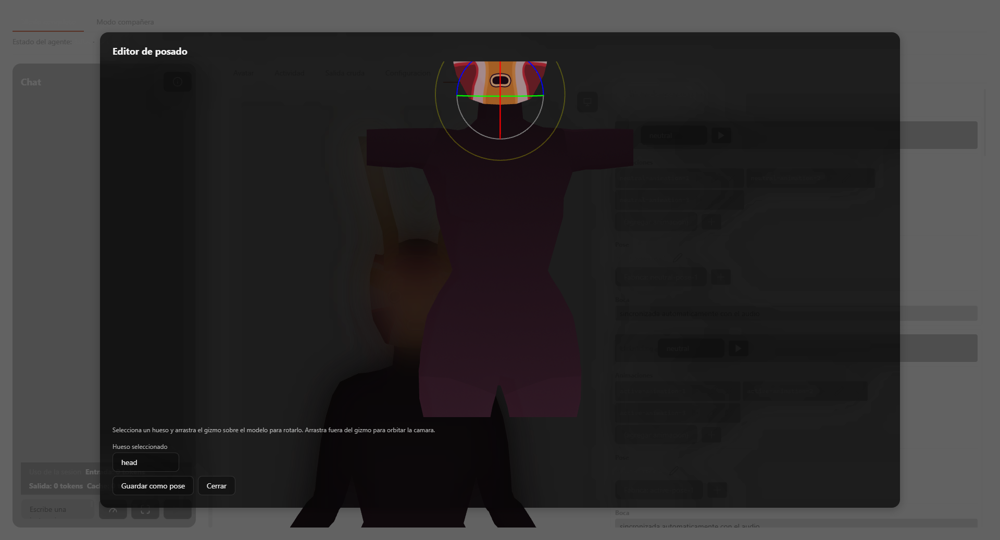
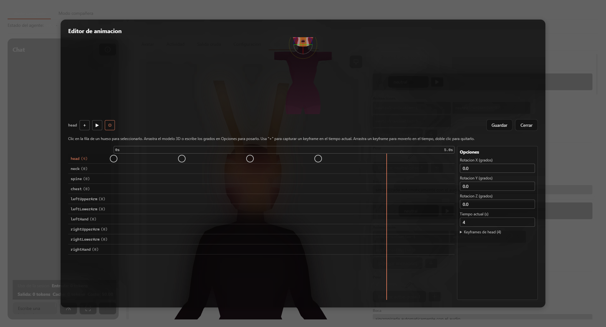

# Animación y render — referencia

Referencia función por función del dominio [animacion-y-render](overview.md).

## `src/avatar-controller.ts`

- `AvatarController` (interfaz): `{ setState(state), setExpression(expression), speak(text?), stopSpeaking() }`.
- `AvatarSnapshot`: `{ state: string, expression: string, isSpeaking: boolean, lastError: string | null }`.
- `TestAvatarController` (clase): única implementación real de `AvatarController` en el proyecto — mueve tanto al avatar SVG/CSS de prueba como al avatar VRM real (`AvatarStage.vue` la usa como tipo del prop `avatarController`). Expone `snapshot` (getter reactivo), `setState`, `setExpression`, `speak`, `stopSpeaking`, `simulateSpeech()` (temporizador de desarrollo que alterna `isSpeaking`), `armAvatarDrawFault()`/`consumeDrawFault()` (inyección de fallas solo para QA/desarrollo).

## `src/avatar-animation-pool.ts`

| Símbolo | Firma | Comportamiento |
|---|---|---|
| `ANIMATION_CHANGE_MIN_MS` / `MAX_MS` | `6000` / `14000` | Rango de tiempo entre cambios automáticos de animación. |
| `pickRandomAnimation` | `(pool: string[], excludeId: string \| null, random?: () => number) => string \| null` | `null` si el pool está vacío. Evita repetir `excludeId` cuando el pool tiene más de una opción. |
| `createAnimationPoolState` | `(pool: string[], random?) => AnimationPoolState` | Estado inicial con un id elegido al azar y el temporizador para el próximo cambio. |
| `advanceAnimationPool` | `(state: AnimationPoolState, deltaMs: number, random?) => AnimationPoolState` | Descuenta `deltaMs`; al llegar a cero (o menos), elige nueva animación distinta de la actual y reprograma el próximo cambio. |

## `src/avatar-transition.ts`

- `DEFAULT_TRANSITION_DURATION_MS = 750`.
- `TransitionDecision`: `'crossfade' | 'stop-immediately' | 'none'`.
- `decideTransition(hasPreviousAction: boolean, durationSeconds: number): TransitionDecision` — sin acción previa → `'none'`; duración > 0 → `'crossfade'`; si no, `'stop-immediately'`.

## `src/avatar-pose-timer.ts`

| Símbolo | Firma | Comportamiento |
|---|---|---|
| `PoseTimerPhase` | `'idle' \| 'active'` | — |
| `POSE_TRIGGER_MIN_MS` / `MAX_MS` | `1500` / `4000` | Espera en `idle` antes de disparar una pose. |
| `POSE_HOLD_MIN_MS` / `MAX_MS` | `18000` / `35000` | Duración de la fase `active`. |
| `createPoseTimerState` | `(random?) => PoseTimerState` | Estado inicial en `idle` con temporizador aleatorio. |
| `advancePoseTimer` | `(state, deltaMs: number, hasPose: boolean, random?) => PoseTimerState` | Si `hasPose` es `false`, reinicia a un estado `idle` fresco sin importar la fase anterior. Si no, avanza el temporizador y alterna de fase al llegar a cero. |
| `isPoseActive` | `(state: PoseTimerState) => boolean` | `true` solo en fase `active`. |
| `boneNameFromTrackName` | `(trackName: string) => string` | Quita el sufijo `.quaternion`/`.position` de un nombre de pista de `THREE.KeyframeTrack`. |
| `needsAdditiveBlend` | `(backgroundTrackNames: string[], poseTrackNames: string[]) => boolean` | `true` solo si al menos un hueso (tras `boneNameFromTrackName`) aparece en ambas listas. |

## `src/avatar-face-presentation.ts`

Lógica de presentación exclusiva del avatar SVG/CSS de prueba (no aplica al render VRM, que usa `vrm-expression-mapping.ts` en su lugar).

- `STATE_MOOD`: `Record<string, string>` — mapea 11 estados a 6 moods.
- `MOUTH_PATH`: `Record<string, string>` — 4 paths SVG de boca (`neutral`, `happy`, `sad`, `angry`).
- `resolveMood(state: string): string` — también reutilizada por `VrmAvatar.vue` para elegir el intervalo de parpadeo.
- `isKnownState(state: string): boolean`.
- `resolveMouthPath(expression: string): string`.
- `isMouthOpen(snapshot: AvatarSnapshot, mouthSyncOpen?: boolean): boolean` — prioridad: `surprised` (siempre boca abierta) → `mouthSyncOpen` si se pasó → `snapshot.isSpeaking`.
- `isAngryExpression(expression: string): boolean`.

## `src/avatar-imported-model.ts`

- `resolveImportedVrmModelUrl(character: ImportedCharacterSummary | null, convertFileSrc: (path: string) => string): string | null` — `null` salvo que `character?.format === 'vrm'`.

## `src/vrm-camera-framing.ts`

- `MIN_DISTANCE = 0.2`.
- `computeFramingDistance(box: { width, height, depth }, aspect: number, fovDeg: number): number` — algoritmo "contain": calcula la distancia necesaria para que el eje restrictivo (ancho o alto, según `aspect` vs. la proporción de `box`) toque los bordes del viewport, con un piso de `MIN_DISTANCE`.

## `src/vrm-clip-resolver.ts`

- `ClipCache`: `Map<string, THREE.AnimationClip>`.
- `loadVrmaClip(vrm: VRM, url: string, cache: ClipCache): Promise<THREE.AnimationClip | null>` — carga un `.vrma` externo (`GLTFLoader` + `VRMAnimationLoaderPlugin`), lo retargea (`retargetProceduralClip`) y lo cachea por `url`. Cualquier error se captura y registra por consola; retorna `null`.
- `retargetedProceduralClip(vrm: VRM, id: string, cache: ClipCache): THREE.AnimationClip | null` — busca `id` en `PROCEDURAL_CLIPS_BY_ID`, retargea y cachea bajo la clave `` `procedural:${id}` `` (evita colisión con URLs `.vrma` cacheadas en el mismo mapa).
- `resolveClip(vrm: VRM, idOrUrl: string, cache: ClipCache): Promise<THREE.AnimationClip | null>` — despacha a una función u otra según si `idOrUrl` coincide con un id del catálogo procedural.

## `src/vrm-clip-retarget.ts`

- `BoneNodeResolver`: `(boneName: string) => THREE.Object3D | null`.
- `HUMAN_BONE_NAMES`: arreglo de 11 nombres de hueso humanoid.
- `retargetTrack(track, resolveBoneNode): THREE.KeyframeTrack | null` — reescribe el nombre de una pista al nodo real resuelto; `null` si no resuelve.
- `retargetProceduralClip(clip: THREE.AnimationClip, resolveBoneNode: BoneNodeResolver): THREE.AnimationClip | null` — aplica `retargetTrack` a cada pista; `null` si ninguna pista resuelve.
- `resolveBoneNodeFromVrm(vrm: VRM): BoneNodeResolver` — usa `vrm.humanoid.getRawBoneNode`.
- `resolveRawBoneNodeFromNormalizedNodeName(vrm: VRM): BoneNodeResolver` — traduce el nombre de nodo **normalizado** (el que usa `createVRMAnimationClip()`) de vuelta al hueso **raw** real; es el resolver que corrige el bug de retargeting descrito en el overview.
- `boneNameFromRawNodeName(vrm: VRM): (rawNodeName: string) => string | null` — mapeo inverso, usado por el editor de timeline para traducir las pistas de un clip real ya cargado a nombres de hueso del editor.

## `src/vrm-expression-mapping.ts`

- `VRM_STANDARD_EXPRESSIONS`: 6 expresiones VRM estándar (`neutral`, `happy`, `sad`, `angry`, `relaxed`, `surprised`).
- `EXPRESSION_TO_VRM`: tabla de mapeo del vocabulario de expresión de la app a la expresión VRM estándar más cercana (p. ej. `excited` → `happy`, `tired` → `relaxed`, `confused` → `neutral`).
- `mapExpressionToVrm(expression: string): string` — aplica `EXPRESSION_TO_VRM`, con `neutral` como salida por omisión.
- `resolveSupportedVrmExpression(expression: string, availableExpressions: string[]): string | null` — mapea y verifica disponibilidad real en el modelo cargado; si no está disponible, intenta `neutral`; si tampoco, `null`.
- `BLINK_INTERVAL_MS_BY_MOOD`: `Record<mood, number>`, rango 2000–6000&nbsp;ms.
- `resolveBlinkIntervalMs(mood: string): number` — el parpadeo actúa como sustituto de "pose/mirada" del motor de reacciones, ya que no existe una señal de blendshape dedicada para ese propósito.

## `src/vrm-scene.ts`

- `CAMERA_FOV_DEG = 28`.
- `setupVrmScene(canvas: HTMLCanvasElement): { renderer, scene, camera, clock }` — `WebGLRenderer` (alpha + antialias), `Scene`, `PerspectiveCamera` en `(0, 1.35, 1.6)`, luz ambiental (intensidad 1.4) + luz direccional (intensidad 0.6).
- `observeVrmSceneResize(setup, canvas): () => void` — `ResizeObserver` sobre el canvas (no `window`); devuelve función de limpieza. Necesario porque los editores 3D viven en overlays con tamaño en unidades CSS relativas.
- `loadVrmModel(scene: THREE.Scene, url: string): Promise<VRM>` — `GLTFLoader` + `VRMLoaderPlugin`, aplica `VRMUtils.removeUnnecessaryVertices`/`rotateVRM0`, agrega `vrm.scene` a la escena.

## `src/vrma-pose-export.ts`

- `PoseEditorBoneName`: unión de 10 literales — ver overview.
- `POSE_EDITOR_BONE_NAMES`: arreglo con esos 10 valores, en el orden que usa la UI de ambos editores.
- `Quaternion`: tupla `readonly [number, number, number, number]`.
- `IDENTITY_QUATERNION = [0, 0, 0, 1]`.
- `POSE_HOLD_DURATION_SECONDS = 1` — duración del clip de una pose exportada (dos muestras idénticas para sostenerla).
- `isPoseEditorBoneName(name: string): name is PoseEditorBoneName`.
- `normalizeQuaternion(q: Quaternion): Quaternion` — cuaternión degenerado o con `NaN` cae a `IDENTITY_QUATERNION`.
- `padBytes(length: number): number` — calcula el relleno para alinear un chunk GLB.
- `buildBoneTracksGltfJson(tracks, animationName): object` — construye el JSON glTF completo con el nodo `hips` sintético en identidad como ancestro declarado (requerido por `VRMAnimationLoaderPlugin` para resolver `worldMatrixMap.hipsParent`).
- `packGlb(json: object, binaryBytes: Uint8Array): Uint8Array` — escribe a mano el contenedor binario GLB: header (magic, versión, longitud), chunk JSON, chunk BIN.
- `exportPoseAsVrma(touchedBones: { boneName: PoseEditorBoneName, quaternion: Quaternion }[]): Uint8Array | null` — `null` si `touchedBones` está vacío (degradación silenciosa, sin archivo vacío).

## `src/vrma-animation-export.ts`

- `groupByBone(keyframes: BoneKeyframe[]): Map<string, BoneKeyframe[]>`.
- `trackForBone(boneName: string, samples: BoneKeyframe[]): { boneName, times: number[], quaternions: Quaternion[] }` — una sola muestra se convierte en pose sostenida usando `POSE_HOLD_DURATION_SECONDS`.
- `buildAnimationTracks(keyframes: BoneKeyframe[]): ReturnType<typeof trackForBone>[]`.
- `exportAnimationAsVrma(keyframes: BoneKeyframe[]): Uint8Array | null` — `null` si no hay ninguna pista (cero keyframes).

## `src/vrma-animation-import.ts`

- `ClipReadError`: `{ error: string }`.
- `NodeNameToBoneNameResolver`: `(rawNodeName: string) => string | null`.
- `clipToKeyframes(clip: THREE.AnimationClip, resolveBoneName: NodeNameToBoneNameResolver): BoneKeyframe[] | ClipReadError` — inversa de la exportación; convierte un `THREE.AnimationClip` real a keyframes planos, usado para precargar el editor de timeline desde un clip existente. Retorna `ClipReadError` si alguna pista no es `QuaternionKeyframeTrack`, o si un hueso resuelto no es un `PoseEditorBoneName` válido.

## `src/animation-keyframe-list.ts`

- `BoneKeyframe`: `{ boneName: string, timeSeconds: number, quaternion: readonly [number, number, number, number] }`.
- `upsertKeyframe(keyframes: BoneKeyframe[], next: BoneKeyframe): BoneKeyframe[]` — mismo hueso + mismo tiempo reemplaza; resultado siempre ordenado por tiempo.
- `removeKeyframe(keyframes: BoneKeyframe[], boneName: string, timeSeconds: number): BoneKeyframe[]`.
- `keyframesForBone(keyframes: BoneKeyframe[], boneName: string): BoneKeyframe[]` — filtrado y ordenado.

## `src/procedural-animations.ts`

- `ProceduralClipKind`: `'animation' | 'pose'`.
- `ProceduralClipEntry`: `{ id: string, kind: ProceduralClipKind, mood: string, clip: THREE.AnimationClip }`.
- `swingTrack(bone: string, base: [number, number, number], sway: [number, number, number], times: number[]): THREE.QuaternionKeyframeTrack` — helper interno que construye una pista a partir de ángulos Euler en grados.
- `PROCEDURAL_CLIP_CATALOG`: arreglo con las 27 entradas del catálogo (6 moods × 3–5 animaciones + 1–2 poses).
- `PROCEDURAL_CLIPS_BY_ID`: `Map<string, ProceduralClipEntry>`.
- `MOOD_ANIMATION_POOLS` / `MOOD_POSE_POOLS`: `Record<mood, string[]>` — listas de ids por mood.
- `ACTIVE_STATE_ROTATION`: configuración especial de ventana 3-de-5 animaciones + pose alternada para cada uno de los 5 estados del mood "activo".
- `animationPoolForState(state: string): string[]` — API pública que consume `VrmAvatar.vue`.
- `poseForState(state: string): string | null`.

## `src/animation-import.ts`

- `AnimationImportErrorKind`: unión de 6 literales — ver overview (incluye `invalid-response`, exclusivo del lado TS).
- `ImportedAnimationKind`: `'animation' | 'pose'`.
- `ImportedAnimationSummary`: `{ id, name, savedPath, kind }`.
- `assertKnownKind(value: unknown): asserts value is AnimationImportErrorKind` — revalidación en tiempo de ejecución del `kind` recibido del backend, ya que el tipo TS no protege contra un cambio del enum Rust sin recompilar.
- `importAnimationFile(path: string, kind: ImportedAnimationKind): Promise<ImportedAnimationSummary>` — invoca `import_animation_file`.
- `listImportedAnimations(): Promise<ImportedAnimationSummary[]>` — invoca `list_imported_animations`.
- `saveCreatedAnimationFile(bytes: Uint8Array, kind: ImportedAnimationKind, fileName: string): Promise<ImportedAnimationSummary>` — invoca `save_created_animation_file`; hermana de `importAnimationFile` con la misma validación/directorio en Rust, pero la fuente es un `.vrma` ya serializado en memoria (desde `PoseEditor.vue`/`AnimationTimelineEditor.vue`), no una ruta en disco.

## `src-tauri/src/animation_import.rs` (backend)

Mismo patrón que `character_import.rs` (ver [gestión-de-personajes](../gestion-de-personajes/reference.md)): sin dependencia de red, solo lectura/escritura de disco.

- `IMPORTED_ANIMATIONS_DIR = "imported-animations"`; `GLTF_MAGIC`/`GLTF_HEADER_LEN` (12 bytes) — mismo header glTF binario que valida un `.vrm`, ya que un `.vrma` es el mismo contenedor con la extensión `VRMC_vrm_animation`, sin dependencia entre los dos módulos paralelos.
- `AnimationImportErrorKind` (enum): `FileNotFound | UnsupportedFormat | CorruptVrmaHeader | InvalidKind | IoError` (serializado `kebab-case`).
- `AnimationKind` (enum): `Animation | Pose` (serializado `lowercase`); el `kind` no es derivable de la extensión (siempre `.vrma`) — se codifica en la subcarpeta destino para poder reconstruirlo al listar.
- `validate_vrma_header(bytes: &[u8]) -> Result<(), AnimationImportError>` — valida longitud mínima, magic number, y que la longitud declarada en el header coincida con el tamaño real del archivo.
- `validate_extension(path: &Path) -> Result<(), AnimationImportError>` — exige `.vrma` (case-insensitive).
- `parse_kind(kind: &str) -> Result<AnimationKind, AnimationImportError>` — solo acepta `"animation"`/`"pose"`.
- `imported_kind_dir(app_data_dir, kind) -> PathBuf` — `<app_data_dir>/imported-animations/<animation|pose>`.
- `save_imported_file(app_data_dir, source_path, kind, bytes) -> Result<PathBuf, _>` — reimportar el mismo nombre sobrescribe (idempotente, no error).
- `import_animation_sync` / `save_created_sync` — variantes síncronas ejecutadas en `tokio::task::spawn_blocking` desde los comandos async.
- `list_imported_sync(app_data_dir) -> Result<Vec<ImportedAnimationSummary>, _>` — recorre ambas subcarpetas (`animation`, `pose`); omite silenciosamente archivos con extensión inválida sin descartar el resto del listado.
- Comandos Tauri: `import_animation_file(app, path, kind)`, `save_created_animation_file(app, bytes, kind, file_name)`, `list_imported_animations(app)`.
- Pruebas (`#[cfg(test)] mod tests`, 13 casos): header truncado/magic incorrecto/longitud declarada no coincide → `CorruptVrmaHeader`; extensión incorrecta → `UnsupportedFormat` sin leer el archivo; kind desconocido → `InvalidKind`; archivo inexistente → `FileNotFound`; import/guardado completos escriben el archivo y devuelven el resumen correcto; listar sin directorio → lista vacía; listar con archivo de extensión inválida lo omite sin tumbar el resto; guardar con bytes vacíos → `CorruptVrmaHeader`; guardar sin poder crear el directorio destino (ocupado por un archivo regular) → `IoError`.

## `src/components/VrmAvatar.vue` — render del avatar VRM

### Props

`modelUrl: string`, `snapshot: AvatarSnapshot`, `mouthOpen?: boolean`, `animationPoolUrls?: string[]` (cada entrada es id de catálogo procedural o URL `.vrma`), `poseUrl?: string`, `transitionDurationMs?: number`, `previewClipId?: string`, `previewNonce?: number` (cambia en cada clic de "ejecutar vista previa", incluso repitiendo el mismo id, para reiniciar desde el frame 0).

### Expuesto (`defineExpose`)

`resetPoseForCurrentState: () => void` — reutilizado tanto por el flujo de `/clear` como por cualquier otro punto que necesite re-armar el avatar sin duplicar lógica.

### Funciones internas relevantes

| Función | Rol |
|---|---|
| `computeChestUpFrame(box)` | Calcula el recuadro de encuadre "pecho hacia arriba" centrado en el hueso `chest`; `null` si no hay humanoid o no se encuentra el hueso. |
| `applyFraming()` | Posiciona y orienta la cámara con `computeFramingDistance`, priorizando `chestUpFrame` sobre la caja completa del modelo. |
| `resetBodyAnimationState()` | Reinicia pool de animación y temporizador de pose al cambiar de estado (`watch` sobre `snapshot.state`); no detiene la acción saliente — la deja viva para que el crossfade la funda. |
| `resolveClipForActiveVrm(idOrUrl)` | Wrapper de `resolveClip` contra el VRM/caché activos; compartida conceptualmente con `AnimationTimelineEditor.vue`. |
| `crossFadeOrStop(previousAction, nextAction)` | Aplica `decideTransition` y ejecuta `crossFadeTo` o `stop()` según el resultado. |
| `ensureAnimationAction(url)` | No hace nada si `url` ya está sonando o cargándose; si no, resuelve, reproduce y hace crossfade. |
| `playPreviewClip(url)` | Igual que `ensureAnimationAction` pero siempre reinicia, incluso repitiendo `url`; sincroniza `animationPoolState.currentId` tras reproducir. |
| `identityReferenceClip(clip)` | Construye un clip de referencia en identidad para que `makeClipAdditive` calcule el delta completo de una pose, no cero. |
| `ensurePoseAction(url)` | Resuelve, decide aditivo vs. reemplazo (`needsAdditiveBlend`) y reproduce con crossfade. |
| `updateBodyAnimation(deltaMs)` | Llamada cada frame: avanza pool de animación y temporizador de pose, dispara las acciones correspondientes. |
| `applyExpression()` | Resuelve la expresión VRM soportada, pone a 0 todas las expresiones salvo `blink`/`aa`, aplica la resuelta y `aa` según `mouthOpen`. |
| `blinkWeightForPhase(phaseMs)` / `updateBlink(deltaMs)` | Parpadeo triangular (sube y baja) de `BLINK_DURATION_MS = 180`&nbsp;ms, con intervalo entre parpadeos según `resolveBlinkIntervalMs(resolveMood(...))`. |
| `swapModel(url)` | Descarta por completo el estado 3D anterior (`VRMUtils.deepDispose`, caché de clips, acciones) antes de cargar el nuevo modelo. |
| `initialize()` | Monta escena, carga modelo, aplica expresión/estado inicial, arranca `ResizeObserver` y el bucle `tick()`; expone `window.__debugAvatarState()` (solo depuración) con snapshot completo de estado de animación/pose/cámara/cuaterniones de hueso. |
| `disposeScene()` | Limpieza en `onBeforeUnmount`: desconecta `ResizeObserver`, cancela el frame de animación, detiene acciones, libera geometría VRM y renderer. |

### Estado visual

- `isLoading` → `"Cargando avatar…"` superpuesto sobre el canvas.
- `loadError` → `"Avatar VRM degradado: {mensaje}"`; el canvas permanece montado detrás (degradación aislada, no se cae el resto de la app).

## `src/components/AvatarStage.vue`

### Props

`activeCharacter: CharacterCatalogEntry | null`, `activeImportedCharacter: ImportedCharacterSummary | null`, `avatarController: TestAvatarController`, `mouthOpen: boolean`, `animationPoolUrls?`, `poseUrl?`, `transitionDurationMs?`, `previewClipId?`, `previewNonce?` — todos salvo los primeros tres se reenvían tal cual a `VrmAvatar.vue`.

### Decisión de renderizador

1. `activeCharacter?.kind === 'vrm'` → `VrmAvatar` con `activeCharacter.modelUrl`.
2. Si no, `importedVrmModelUrl` (computado vía `resolveImportedVrmModelUrl`) → `VrmAvatar` con esa URL.
3. Si hay `activeImportedCharacter` pero no es VRM (p. ej. Live2D) → párrafo de marcador de posición: `"Personaje importado (Live2D): sin renderizador todavia, EPIC-004 futuro."` con estado/expresión en texto plano.
4. Si no hay ningún personaje → `"Sin personaje seleccionado."`.

### Expuesto

`resetPoseForCurrentState: () => void` — delega al mismo método expuesto por la instancia activa de `VrmAvatar`.

## `src/components/PoseEditor.vue` — editor de poses (gizmo 3D)

### Props / emits

`modelUrl: string`. Emite `saved: [summary: ImportedAnimationSummary]` y `close: []`.

### Elementos de UI

| Elemento | Comportamiento |
|---|---|
| Canvas 3D | Muestra el modelo con `OrbitControls` (sin pan) + `TransformControls` en modo `rotate`. Overlay de `"Cargando modelo…"` mientras carga; overlay de error si falla. |
| `CustomSelect` "Hueso seleccionado" | Lista los 10 `POSE_EDITOR_BONE_NAMES`; cada opción muestra `"(tocado)"` junto al nombre si ese hueso ya tiene una rotación registrada. Ver [ui-compartida](../ui-compartida/reference.md) para `CustomSelect`. |
| Botón "Guardar como pose" | Deshabilitado mientras `isSaving`; exporta solo los huesos tocados. Si ninguno fue tocado, muestra el error `"Mueve al menos un hueso con el gizmo antes de guardar."` sin llamar al backend. |
| Botón "Cerrar" | Emite `close` sin guardar. |

### Funciones internas

- `boneNode(name)` — resuelve el nodo three.js real del hueso vía `resolveBoneNodeFromVrm`.
- `attachGizmoToSelectedBone()` / `selectBone(name)` — reengancha `TransformControls` al hueso elegido.
- `recordSelectedBoneRotation()` — en cada `objectChange` del gizmo, clona el cuaternión actual del hueso seleccionado dentro de `touchedBones` (`Map`).
- `saveAsPose()` — construye el arreglo de rotaciones desde `touchedBones`, llama `exportPoseAsVrma`, y si hay bytes, `saveCreatedAnimationFile(bytes, 'pose', 'pose-<timestamp>.vrma')`.
- Hooks de depuración expuestos en `window` (solo desarrollo): `__debugSetPoseBoneRotation(boneName, degX, degY, degZ)`, `__debugBoneWorldPosition(boneName)`, `__debugExportPoseBlobUrl()` (genera una URL de blob descargable del `.vrma` exportado en memoria).

## `src/components/AnimationTimelineEditor.vue` — editor de timeline de animación

### Props / emits

`modelUrl: string`, `editClipId?: string` (id/URL de la animación a precargar en modo "editar"; ausente = modo "nueva"). Emite `saved: [summary]` y `close: []`.

### Elementos de UI

| Elemento | Comportamiento |
|---|---|
| Canvas 3D | Vista del modelo con gizmo de rotación (mismo patrón que `PoseEditor.vue`), sin `TransformControls` propio de arrastre libre de keyframes — el posado se hace igual, vía gizmo sobre el hueso seleccionado. |
| Barra de herramientas | Nombre del hueso activo; botón `+`/`⟳` (agregar o sobrescribir keyframe en el tiempo actual, según `hasKeyframeAtCurrentTime`); botón `▶`/`⏸` (previsualizar en bucle / detener); botón `⚙` (abre/cierra el panel lateral "Opciones"); botón "Guardar"; botón "Cerrar". |
| Regla de tiempo (`role="slider"`) | Clic para ubicar el tiempo actual; flechas izquierda/derecha lo mueven en pasos de 0.1&nbsp;s. Accesible por teclado (`tabindex="0"`, `aria-valuemin/max/now`). |
| Filas de hueso (dopesheet) | Una fila por cada uno de los 10 `POSE_EDITOR_BONE_NAMES`, con contador de keyframes entre paréntesis. Clic en la etiqueta selecciona el hueso; clic en el tramo de la fila crea un keyframe en ese punto (o selecciona uno existente cercano). |
| Marcadores de keyframe | Círculos posicionados por porcentaje de tiempo; clic los selecciona (mueve el tiempo actual), doble clic los elimina, arrastre (`pointerdown/move/up`) los reubica en el tiempo. |
| Línea de reproducción (`playhead`) | Barra vertical superpuesta a todas las filas en la posición del tiempo actual. |
| Panel lateral "Opciones" (`aside`, colapsable) | Inputs numéricos de rotación X/Y/Z en grados (rango `MIN_ROTATION_DEGREES`/`MAX_ROTATION_DEGREES` = ±360, de `character-editor.ts`, compartido con el editor de personajes) para el hueso seleccionado; input de tiempo actual; lista detallada (`
`) de keyframes del hueso seleccionado, cada uno con botón "Quitar". |
| Mensajes de error | `editClipReadError` (reemplaza todo el editor si la animación a editar no pudo leerse), `previewError`, `keyframeActionError`, `saveError` — cada uno con icono `error` y `aria-live="polite"`. |

### Funciones internas

| Función | Rol |
|---|---|
| `boneNode(name)` | Igual que en `PoseEditor.vue`. |
| `syncTheatreFromLiveBone()` | Lee la rotación real del hueso seleccionado (orden de ejes `XYZ` fijo, `BONE_ROTATION_ORDER`) y actualiza tanto el objeto de Theatre.js como `selectedBoneRotationDeg`. |
| `setBoneRotationAxis(axis, degrees)` | Escribe un eje individual (con `clampRotationDegrees`), reconstruye el cuaternión completo del hueso y sincroniza Theatre.js. |
| `attachGizmoToSelectedBone()` / `selectBone(name)` | Igual patrón que `PoseEditor.vue`, más `syncTheatreFromLiveBone()`. |
| `threeTrackForBone(track)` | Convierte una pista de `buildAnimationTracks` a `THREE.QuaternionKeyframeTrack` real, resolviendo el nombre de nodo desde el hueso. |
| `rebuildPreviewAction()` | Reconstruye el `AnimationClip`/`AnimationAction` de previsualización completos desde `keyframes.value` cada vez que cambian. |
| `scrubToCurrentTime()` | Fija `previewAction.time` y fuerza `mixer.update(0)` para renderizar un solo frame sin avanzar el reloj. |
| `setCurrentTime(value)` | Redondea a 0.1&nbsp;s, aplica límite inferior 0, y llama `scrubToCurrentTime()`. |
| `timeFromClientX(clientX)` | Traduce una posición de puntero en la regla/fila a segundos, según el ancho real del track y `timelineDurationSeconds`. |
| `timelineDurationSeconds` (computed) | `max(5, tiempo_actual + 1, ...cada keyframe.timeSeconds + 1)` — la línea de tiempo crece para siempre contener el tiempo actual y todos los keyframes. |
| `onRowTrackClick(event, boneName)` | Selecciona el hueso, ubica el tiempo, y si no hay un keyframe cercano (< 0.15&nbsp;s, `NEW_KEYFRAME_SNAP_SECONDS`), captura la rotación actual como nuevo keyframe. |
| `onMarkerPointerDown/Move/Up` | Ciclo de arrastre de un keyframe existente: selecciona su hueso, sigue la posición del puntero, y al soltar reescribe el tiempo (quitar + insertar) salvo que no haya cambiado. |
| `addKeyframeAtCurrentTime()` | Botón `+`/`⟳`: captura la rotación actual del hueso seleccionado en el tiempo actual; error si el hueso no se resuelve en el modelo. |
| `removeKeyframeAt(boneName, timeSeconds)` | Quita un keyframe puntual y reconstruye la previsualización. |
| `startLoopPreview()` / `stopLoopPreview()` | Alternan el modo de reproducción en bucle; sin keyframes, `startLoopPreview` falla con `previewError`. |
| `ensureTheatreObjects()` | Crea el proyecto/hoja de `@theatre/core` (`'Codetuver Avatar Timeline Editor'` / `'Bone Rotations'`) y un objeto `{ rotation: {x,y,z} }` por cada uno de los 10 huesos. |
| `initialize()` | Monta escena, carga modelo, y si `editClipId` está presente, resuelve el clip y lo traduce a keyframes vía `clipToKeyframes` + `boneNameFromRawNodeName`; expone hooks de depuración `window.__debugSetBoneRotation`, `__debugAnimationEditorState`, `__debugExportAnimationBlobUrl`. |
| `saveAsAnimation()` | Exporta todos los keyframes (`exportAnimationAsVrma`) y guarda como `animation-<timestamp>.vrma`; error si no hay keyframes. |
| `disposeScene()` | Limpieza en `onBeforeUnmount`, incluye `theatreSheet?.detachObject` por cada hueso. |
