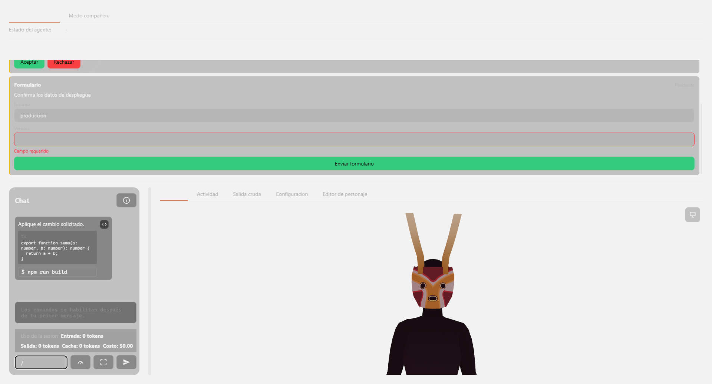
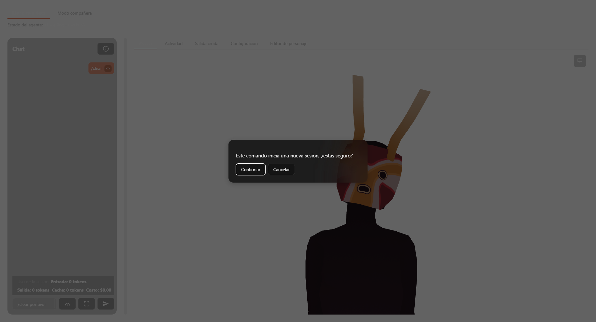
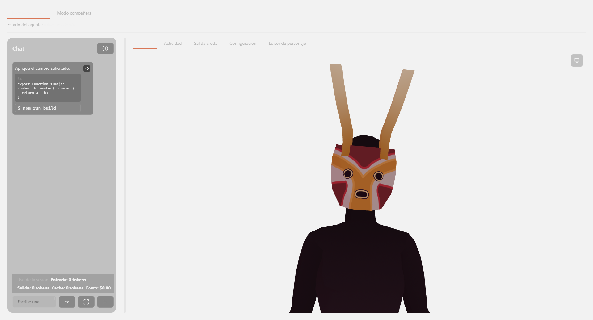
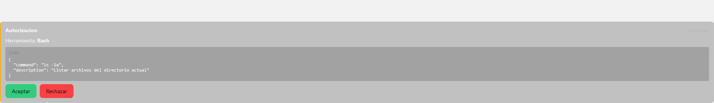
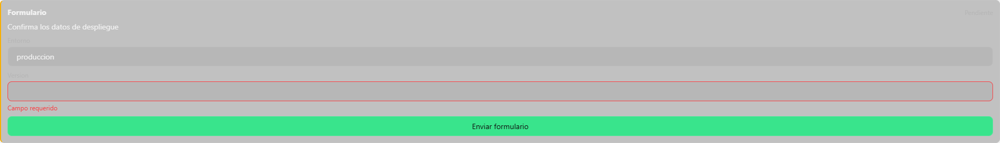

# Chat y contenido — referencia

Ver [overview.md](overview.md) para los flujos y conceptos. Este documento detalla cada función y cada elemento visual del dominio.

## `src/chat.ts`

Estado del chat completo: entradas cerradas + un turno abierto opcional + acumulado de uso/costo.

- **`ChatEntry`** — unión: `{ role: 'person'; text: string }` o `{ role: 'agent'; blocks: ContentBlock[] }`.
- **`SessionUsage`** — `{ inputTokens, outputTokens, cacheCreationInputTokens, cacheReadInputTokens, totalCostUsd }`, todos `number`.
- **`createSessionUsage(): SessionUsage`** — todo en cero.
- **`ChatState`** — `{ closedEntries: ChatEntry[], openTurn: OpenAgentTurn | null, usage: SessionUsage }`. `OpenAgentTurn` (interno, no exportado) es `{ buffer: StreamBufferState, console: ActivityConsoleState }`.
- **`createChatState(): ChatState`** — arreglo vacío, `openTurn: null`, uso en cero.
- **`chatEntries(state): ChatEntry[]`** — vista derivada; si hay `openTurn`, agrega al final una entrada `agent` sintética con `state.openTurn.console.blocks`, sin mutar ni duplicar `closedEntries`.
- **`shouldShowWorkingIndicator(state, isSending): boolean`** — `true` solo si `isSending` es verdadero **y** el turno abierto todavía no tiene ningún bloque (`(openTurn?.console.blocks.length ?? 0) === 0`); en cuanto llega el primer bloque, el indicador de "trabajando" se apaga aunque el turno siga abierto.
- **`recordPersonMessage(state, text): ChatState`** — cierra cualquier turno abierto previo (`closeOpenTurn`, interno) y agrega `{ role: 'person', text }` al final de `closedEntries`.
- **`applyChatEvent(state, event: NormalizedEvent): ChatState`** — reductor principal:
  - `session_finished`: cierra el turno abierto (barre pendientes con `sweepStalePending`, vacía el buffer de streaming con `flushStreamBuffer`, concatena ambos en una única entrada `agent`) y acumula `usage` sumando los 5 campos del evento a los existentes.
  - Cualquier tipo fuera de `TURN_CONTENT_EVENT_TYPES` (`assistant_message`, `tool_started`, `tool_finished`, `command_started`, `file_read`, `file_modified`, `permission_denied`): no-op, devuelve `state` sin cambios.
  - `assistant_message`: crea el turno si no existe (`ensureOpenTurn`, interno) y empuja el texto por `pushStreamChunk`, agregando los bloques que el buffer libere a `console.blocks`.
  - Cualquier otro evento del conjunto: crea el turno si no existe y delega en `handleNormalizedEvent` de `activity-console.ts`.
- **Constante interna `TURN_CONTENT_EVENT_TYPES`**: exactamente esos 7 tipos son los únicos que abren o alimentan un turno; `session_finished` se maneja aparte y todo lo demás (p. ej. eventos de sesión/transporte) se ignora en este reductor.

## `src/content-interpreter.ts`

Interpreta texto crudo del agente en bloques tipados. Ver [overview.md](overview.md#formación-de-bloques-desde-texto-plano) para la cascada de detectores.

- **`ContentBlock`** — unión discriminada por `type`, 12 variantes:
  | type | campos propios |
  |---|---|
  | `paragraph` | `text: string` |
  | `heading` | `level: number`, `text: string` |
  | `code` | `language?: string`, `code: string` |
  | `diff` | `file?: string`, `additions: DiffLine[]`, `deletions: DiffLine[]` |
  | `file_reference` | `path: string`, `action?: 'read'\|'write'\|'modify'\|'delete'` |
  | `command` | `command: string`, `status?: 'pending'\|'running'\|'success'\|'failed'`, `isShellCommand?: boolean` |
  | `table` | `headers: string[]`, `rows: string[][]` |
  | `ascii_art` | `content: string`, `detectedTheme?: string` (nunca se calcula hoy — ningún productor lo asigna) |
  | `warning` / `error` | `text: string` |
  | `plain_text` | `text: string` |
  | `command_invocation` | `name: string`, `message: string`, `args: string` |

  `DiffLine` es `{ content: string }`.
- **`stripAnsiSequences(text): string`** — quita toda secuencia `\x1b[...letra` (patrón `/\x1b\[[0-9;]*[a-zA-Z]/g`). Se aplica siempre antes de detectar el tipo de un segmento.
- **`isMarkdownTextBlock(block)`** — type guard: verdadero solo para `type === 'paragraph'` (no incluye `plain_text`, que se renderiza literal, no como Markdown).
- **`splitIntoSegments(text): string[]`** (interno) — parte el texto por líneas en blanco, pero una línea en blanco **dentro** de un fence (```` ``` ````, contador de apertura/cierre por línea) no cuenta como separador.
- **`findSafeBoundaryIndex(text): number`** (interno) — recorre línea por línea sin mirar la última; recuerda el offset del final de la última línea en blanco que no está dentro de un fence abierto. Ese offset es el límite hasta donde el streaming puede parsear con seguridad.
- **Detectores, en este orden exacto** (`DETECTORS`), el primero que matchea gana:
  1. `detectFence(segment)` — regex `^```([^\n]*)\n([\s\S]*?)\n```$` sobre el segmento trimeado completo. Lenguaje `diff` → `buildDiffBlock` (separa líneas por prefijo `+`/`-`, les quita el prefijo y espacios iniciales con `toDiffLine`). Lenguaje vacío → `ascii_art` con el contenido crudo. Cualquier otro lenguaje → `code`.
  2. `detectTable(segment)` — exige ≥2 líneas, la primera empieza con `|`, la segunda matchea `TABLE_SEPARATOR` (`^\|?\s*:?-+:?\s*(\|\s*:?-+:?\s*)*\|?$`). `splitTableRow` quita `|` inicial/final y separa por `|`, trimeando cada celda.
  3. `detectHeading(segment)` — solo si el segmento es **una sola línea** (`!includes('\n')`) y matchea `^(#{1,6})\s+(.+)$`.
  4. `detectCommandInvocation(segment)` — vía `parseCommandInvocationTags` (ver abajo): busca las 3 etiquetas `<command-name>`, `<command-message>`, `<command-args>` **por separado** (no en una sola regex secuencial) porque el orden real varía entre sesiones; si falta cualquiera de las 3, no matchea.
  5. `detectCommand(segment)` — una sola línea que matchea `^\$\s+(.+)$` → `{ type: 'command', isShellCommand: true }`.
  6. `detectFileReference(segment)` — una sola línea `` `contenido` `` (regex `^`([^`\n]+)`$`) donde el contenido matchea `/[./]/ ` (tiene un punto o una barra) → evita que cualquier código inline corto se confunda con una ruta.
  7. `detectWarningOrError(segment)` — empieza (case-insensitive) con `warning`/`advertencia` seguido de `:` o espacio → `warning`; empieza con `error` seguido de `:` o espacio → `error`.
  - Si ninguno matchea: `detectDefault(segment)` — `paragraph` si el texto trimeado tiene al menos una letra (patrón Unicode `[a-zA-ZÀ-ɏ]`), si no `plain_text`.
- **`parseCommandInvocationTags(text): CommandInvocationTags | null`** — exportada; `CommandInvocationTags = { name, message, args }`, todos trimeados. `null` si falta cualquiera de las 3 etiquetas.
- **`FAULT_INJECTION_MARKER`** (`'__forzar_fallo_parser__'`) y **`armParseFault(index: number | null): void`** — mecanismo de QA (TC-027): en `DEV`, arma que el segmento en esa posición (o cualquier segmento que contenga el marcador literal) lance una excepción de parseo controlada. No-op fuera de `DEV`.
- **`parseSegmentSafely(segment, index): ContentBlock`** (interno) — envuelve `parseSegment`; si lanza (real o inyectado), llama `registerFailure('parsing-error', mensaje)` (ver [robustez-y-actualizaciones](../robustez-y-actualizaciones/overview.md)) y devuelve `{ type: 'plain_text', text: segment }` con el texto original intacto.
- **`parseContentBlocks(rawText): ContentBlock[]`** — pipeline completo: `splitIntoSegments` → `parseSegmentSafely` por cada uno, con su índice.
- **`StreamBufferState`** — `{ readonly buffer: string }`. **`createStreamBuffer()`** → buffer vacío.
- **`pushStreamChunk(state, chunk): StreamPushResult`** — concatena `state.buffer + chunk`, calcula el límite seguro con `findSafeBoundaryIndex`, parsea la parte anterior al límite (`completedBlocks`) y conserva el resto como el nuevo `buffer` (`pendingText`). `StreamPushResult = { state, completedBlocks, pendingText }`.
- **`flushStreamBuffer(state): ContentBlock[]`** — fuerza el parseo de todo el `buffer` restante, cerrado o no (usado al terminar el turno).

## `src/chat-draft-markdown.ts`

- Instancia única de `MarkdownIt` con `{ html: false, linkify: true }` — `html: false` es la frontera de confianza completa (HTML crudo se escapa, no se deja pasar), sin sanitizador adicional.
- **`neutralizeUnpairedBackticks(text): string`** — algoritmo de emparejamiento tipo CommonMark: encuentra todas las corridas de backticks (`` /`+/g ``) con su longitud; para cada corrida sin usar, busca hacia adelante la siguiente corrida de **igual longitud** como cierre; si no la encuentra, esa corrida queda marcada como "literal" y se reemplaza por la entidad `&#96;` (así sobrevive visible en vez de que `markdown-it` la descarte al tratarla como delimitador de código inline fallido).
- **`renderChatDraftMarkdown(text): string`** — `renderer.render(neutralizeUnpairedBackticks(text))`. Usada tanto por `ContentBlockRenderer.vue` (bloques `paragraph`) como por `content-block-text.ts` (para derivar el texto hablado, ver abajo).

## `src/chat-history-window.ts`

- **`CHAT_HISTORY_CHUNK_SIZE = 24`**.
- **`revealMoreEntries(current, total): number`** — `Math.max(current, Math.min(current + 24, total))`. El `Math.max` externo es deliberado: si `total` llega a ser menor que `current` en algún momento transitorio (p. ej. la lista real todavía vacía cuando el centinela de scroll dispara), la función nunca "esconde" entradas ya reveladas.

## `src/chat-scroll.ts`

- **`CHAT_AUTOSCROLL_THRESHOLD_PX = 80`**.
- **`isNearChatBottom(scrollTop, scrollHeight, clientHeight, thresholdPx = 80): boolean`** — `scrollHeight - scrollTop - clientHeight <= thresholdPx`. Función pura sin acceso a DOM; el componente le pasa las 3 medidas ya leídas — así es testeable sin un DOM real.

## `src/activity-console.ts`

Reductor de eventos técnicos hacia el mismo arreglo de `ContentBlock` que ve el texto interpretado — comparten un único timeline visual.

- **`ConsoleViewMode`** — `'styled' | 'markdown' | 'raw'` (selector de presentación, ver UI del composer más abajo).
- **`ActivityConsoleState`** — `{ blocks: ContentBlock[], pendingToolIndices: PendingEntry[], pendingCommandIndices: PendingEntry[] }`; `PendingEntry = { id: string, index: number }` (`id` es el `tool_use_id` real, `index` la posición del bloque `command` correspondiente dentro de `blocks`).
- **`createActivityConsoleState()`** — todo vacío.
- **`handleNormalizedEvent(state, event): ActivityConsoleState`** — switch sobre `event.type`:
  - `assistant_message` → agrega los bloques de `parseContentBlocks(event.text)`.
  - `tool_started` → agrega un bloque `command` con `status: 'running'`, `isShellCommand: false`, y encola `{id: event.id, index}` en `pendingToolIndices`.
  - `tool_finished` → resuelve por `event.tool_use_id` (`resolvePendingBlockById`, busca en ambas colas) marcando `status: success ? 'success' : 'failed'` y sacándolo de la cola donde estuviera.
  - `command_started` → igual que `tool_started` pero `isShellCommand: true` y cola `pendingCommandIndices`.
  - `permission_denied` → resuelve como fallido el **primero** (más antiguo) de `pendingCommandIndices` (`resolvePendingBlock`, por posición de cola, no por id — este evento no trae un id que correlacionar).
  - `file_read` / `file_modified` → agrega un bloque `file_reference` con `action: 'read'`/`'modify'` respectivamente.
  - `session_finished` → `sweepStalePending`.
  - Cualquier otro tipo → no-op.
- **`sweepStalePending(state): ActivityConsoleState`** — marca como `status: 'failed'` todo bloque que siga en cualquiera de las 2 colas de pendientes y vacía ambas colas. Se invoca al cerrar sesión y al cerrar un turno (`chat.ts::closeOpenTurn`) — ningún bloque queda "En curso" indefinidamente tras terminar.
- **`resumeActivityConsoleState(events): ActivityConsoleState`** — `events.reduce(handleNormalizedEvent, createActivityConsoleState())`; reconstruye el estado completo a partir de un historial de eventos (reanudar sesión).
- **`appendRawActivity(lines, activity): string[]`** — solo agrega si `activity.kind === 'raw'`; alimenta el modo de vista `'raw'` (texto crudo sin interpretar, para depuración).

## `src/slash-commands.ts`

Funciones puras del listbox de comandos.

- **`filterCommands(commands, filterText): string[]`** — substring case-insensitive (`toLowerCase().includes`).
- **`nextCommandIndex(current, count, direction): number`** — `count === 0` siempre devuelve `0`; `'down'` avanza sin pasar de `count - 1`; `'up'` retrocede sin bajar de `0`.
- **`commandToCommitText(commands, index): string | null`** — `` `/${commands[index]}` `` o `null` si el índice no apunta a nada (lista vacía o fuera de rango).
- **`resolveCommandsEmptyStateMessage(sessionId, sendableCommands, filterText): string | null`** — orden de prioridad: (1) `sessionId === null` → "Los comandos se habilitan después de tu primer mensaje."; (2) `sendableCommands.length === 0` → "Este proyecto no tiene comandos personalizados."; (3) sin coincidencias con `filterText` → `` `Sin coincidencias para "${filterText}".` ``; (4) si nada de eso aplica → `null` (no hay mensaje que mostrar, la lista filtrada tiene contenido).

## `src/clear-command.ts`

- **`CLEAR_COMMAND = '/clear'`**.
- **`isClearCommandWithExtraContent(draft): boolean`** — compara el **primer token** del borrador trimeado contra `/clear` exacto; devuelve `false` si el borrador entero **es** `/clear` (ese caso lo maneja el flujo de selección del listbox, no este). Detecta casos reales como `/clear porfavor` o `/clear my context please`, que el proceso real de Claude Code interpreta igual que `/clear` solo — deben interceptarse con la misma confirmación. `/clearly` no matchea (el primer token no es `/clear` exacto).
- **`isClearSessionReset(previousSessionId, newSessionId): boolean`** — `previousSessionId !== null && previousSessionId !== newSessionId`. Como `beginSession`/`resumeSession` siempre ponen `sessionId` en `null` antes de arrancar, un cambio con `previousSessionId` no nulo solo puede originarse en un reset que el propio proceso de Claude Code decidió por su cuenta (no iniciado desde este composer).

## `src/interaction-requests.ts`

- **`InteractionDecision`** — unión: `permission{allow}`, `confirmation{allow}`, `choice{selected: string[]}`, `open_question{answer: string}`, `form{values: Record<string,string>}`.
- **`InteractionRequestsState`** — `{ pending: Record<requestId, InteractionRequest>, resolved: Record<requestId, {request, decision}> }`.
- **`InteractionRequestEntry`** — unión de vista: `{status:'pending', requestId, request}` o `{status:'resolved', requestId, request, decision}`.
- **`createInteractionRequestsState()`** — ambos records vacíos.
- **`isInteractionRequest(value)`** (interno, no exportado) — frontera de confianza: `value` debe ser un objeto con `type` string perteneciente a `KNOWN_TYPES` (los 5 tipos reales) **y** `request_id` string. Cualquier otra forma se rechaza.
- **`receivePendingRequest(state, payload): InteractionRequestsState`** — si `payload` no pasa `isInteractionRequest`, devuelve `state` sin cambios (no lanza, no registra error). Si pasa, lo agrega/sobrescribe en `pending` indexado por `request_id` — inyectar dos veces el mismo id nunca duplica, solo reemplaza.
- **`resolveRequest(state, id, decision): InteractionRequestsState`** — si `id` no está en `pending`, no-op (cubre tanto un id inexistente como uno ya resuelto antes). Si existe: lo quita de `pending` (`omitKey`) y lo agrega a `resolved` con su `decision`.
- **`countPendingInteractionRequests(state): number`** — `Object.keys(state.pending).length`.
- **`listInteractionRequests(state): InteractionRequestEntry[]`** — concatena todas las `pending` seguidas de todas las `resolved`; el orden entre peticiones simultáneas del mismo grupo sigue el orden de inserción de las claves del objeto.
- **`invalidFormFields(fields, values): string[]`** — devuelve los nombres de campo donde `values[field]?.trim()` es falsy; un valor de solo espacios en blanco cuenta como inválido igual que un campo vacío o ausente.

## `src/content-block-text.ts`

Convierte `ContentBlock[]` a texto plano, con dos variantes según destino.

- **`blocksToMarkdownText(blocks): string`** — `blocks.map(blockToText).join('\n\n')`; `blockToText` (interno) reserializa cada tipo a su forma Markdown-ish original: `code` reconstruye el fence con lenguaje, `diff` reconstruye líneas `+`/`-`, `file_reference` vuelve a backticks, `command` antepone `$ `, `command_invocation` antepone `/`, `table` reconstruye filas separadas por ` | `. Usado para copiar/exportar el contenido tal como se ve.
- **`stripMarkdownForSpeech(text)`** (interno) — reutiliza `renderChatDraftMarkdown` (el mismo renderer real de H6) y luego: reemplaza los cierres de bloque (`</p>`, `</li>`, `</h1-6>`, `</blockquote>`, `</tr>`, `<br>`) por saltos de línea, quita cualquier otra etiqueta HTML, y decodifica las 5 entidades que el propio renderer pudo generar (`&amp;`, `&lt;`, `&gt;`, `&quot;`, `&#39;`) — **no** sanitiza HTML arbitrario de terceros, solo deshace lo que su propio pipeline produjo.
- **`blockToSpeechText(block): string | null`** (interno) — decide qué se narra: `paragraph` pasa por `stripMarkdownForSpeech`; `plain_text`/`heading`/`warning`/`error` se leen literal; `table` se resume como la frase fija `"Hay una tabla."` (nunca celda por celda); `code`/`command`/`command_invocation`/`diff`/`ascii_art`/`file_reference` devuelven `null` (se omiten enteros, sin dejar un hueco de silencio notorio, para que la prosa alrededor suene continua).
- **`blocksToSpeechText(blocks): string`** — mapea, descarta los `null`, une con `\n\n`. Ver [reacciones-y-voz](../reacciones-y-voz/overview.md) para cómo se envía este texto a síntesis de voz.

## UI — Composer y listbox de comandos (`App.vue`)

- **Textarea del composer**: `@input="onChatComposerInput"` (redimensiona vía `resizeChatComposer`, midiendo el `line-height` real computado del propio elemento — no un valor fijo en píxeles — y abre/cierra el listado de comandos según `chatDraft.value.startsWith('/')`), `@keydown.enter="onComposerEnterKey"`, `@blur="onChatComposerBlur"`, `:disabled="isSending"`.
- **`onComposerEnterKey`** evalúa en orden: `isClearCommandWithExtraContent(draft)` → abre confirmación de `/clear` sin enviar; si no, `commandsListVisible` → `commitSelectedCommand()` (que a su vez detecta el caso especial de `/clear` exacto y abre la misma confirmación en vez de escribirlo); si ninguna aplica → `sendChatMessage()`.
- **Listado de comandos (listbox inline)**: se renderiza debajo del textarea cuando `commandsListVisible` es verdadero. Cada opción tiene `@mousedown.prevent` (evita robarle el foco al textarea antes de que `blur` se evalúe) y `@click="selectCommand(name)"`. Flechas arriba/abajo mueven `activeCommandIndex` vía `nextCommandIndex`; el estado vacío usa el texto de `resolveCommandsEmptyStateMessage`.
- **`onChatComposerBlur`**: cierra el listado salvo que `event.relatedTarget` caiga dentro del propio listbox.
- **Overlay de confirmación de `/clear`**: comparte el mecanismo de pila de overlays (`OverlayId`, `pushOverlay`/`popOverlay`) con el resto de modales de la app — ver [orquestacion-app](../orquestacion-app/overview.md). Foco atrapado dentro del overlay; tras confirmar, un timeout de 8000&nbsp;ms (`CLEAR_CONFIRMATION_TIMEOUT_MS`) detecta si el reset de contexto nunca llegó del proceso real.
- **`sendChatMessage()`**: no-op si `isSending` ya es verdadero o el borrador está vacío tras `trim()`. Si procede: `isSending = true`, cierra el turno previo y registra la entrada `person` vía `recordPersonMessage`, limpia el borrador, invoca `sendInstruction(text)`. Si el `invoke` real rechaza, revierte `isSending = false` de inmediato (sin este `catch` el composer quedaría deshabilitado para siempre, ya que de otro modo solo `session_finished` lo reactiva).
- **`restoreComposerFocusIfIdle()`**: tras `isSending` volver a `false`, devuelve el foco al textarea dentro de un `nextTick()` (el `:disabled` sigue activo hasta que Vue re-renderiza) — **solo** si el foco actual está en `document.body` o ya en el propio textarea, para no robarle el foco a un control donde la persona haya hecho clic intencionalmente mientras el mensaje seguía en vuelo.
- **`respondToInteractionRequest(request, decision)`**: si `request.type === 'permission'`, llama al comando real de Tauri `respond_to_permission_request` (`respondToPermissionRequest`) — es la única variante con efecto en el backend. Para las otras 4 variantes, llama directo a `resolveRequest` del reductor, sin ningún `invoke`.
- **`interactionRequestsState` / `countPendingInteractionRequests`**: un watcher expone el conteo de pendientes a `presentationManager.setPendingInteractionCount` y dispara `notifyOnRisingEdgeInPetMode` (título de notificación nativa fijo: "Codetuver Avatar") en el flanco de subida (0 → ≥1) — ver [presentacion-y-ventana](../presentacion-y-ventana/overview.md).

## Componente `ContentBlockRenderer.vue`

Props: `blocks: ContentBlock[]`, `showRaw?: boolean`. Renderiza una `<ul>` con un `<li>` por bloque, elige la plantilla por `block.type` (`v-else-if` en cascada, mismo orden que la unión de tipos):

| type | Render |
|---|---|
| `paragraph` | Si `showRaw`: `<pre>` con el texto crudo tal cual. Si no: `<div v-html>` con `renderChatDraftMarkdown(block.text)`; un handler de click (`openExternalLinkOnClick`) intercepta enlaces para abrirlos con el navegador del sistema en vez de navegar dentro del WebView. |
| `heading` | Elemento dinámico `<h{{level}}>` vía `<component :is>`. |
| `code` | Etiqueta de lenguaje (si existe) + `<pre><code>` con el código tal cual (`white-space: pre-wrap`, se envuelve en vez de desbordar). |
| `diff` | Nombre de archivo (si existe) + una línea `<div>` por cada adición (prefijo `+`, color `--color-success`) y cada eliminación (prefijo `-`, color `--color-error`). |
| `file_reference` | Ruta + etiqueta de acción traducida (`FILE_ACTION_LABELS`: read→Lectura, write→Escritura, modify→Modificación, delete→Eliminación). |
| `command` | Texto (con prefijo `$ ` si `isShellCommand`) + etiqueta de estado traducida (`COMMAND_STATUS_LABELS`: pending→Pendiente, running→En curso, success→Éxito, failed→Fallo); el color del estado depende de una clase modificadora `content-blocks__command--{status}`. |
| `command_invocation` | Solo el nombre con `/` antepuesto (sin barra duplicada si ya la traía). |
| `table` | `<table>` real dentro de un contenedor `overflow-x: auto` (para no romper el layout con tablas anchas). |
| `ascii_art` | `<pre>` con `white-space: pre` (a diferencia de `code`, que envuelve) — preserva el arte ASCII exacto sin reflow. |
| `warning` / `error` | Párrafo coloreado (`--color-warning` / `--color-error`). |
| cualquier otro (`plain_text`) | Párrafo de texto plano sin interpretar. |

Ningún bloque trae `backdrop-filter` propio — asume que siempre vive dentro de una superficie ya blureada (burbuja de chat o `InteractionRequestCard`).

## Componente `InteractionRequestCard.vue`

Props: `request: InteractionRequest`, `decision: InteractionDecision | null`. Emite `respond(decision)`. Encabezado fijo con la etiqueta del tipo (`TYPE_LABELS`: permission→Autorización, choice→Elección, open_question→Pregunta abierta, confirmation→Confirmación, form→Formulario) y el estado ("Pendiente"/"Respondida" según `decision`).

| type | Sin resolver | Resuelta |
|---|---|---|
| `permission` | Nombre de la herramienta (`request.tool_name`) + su `input` renderizado como un bloque `code` de lenguaje `json` (vía `ContentBlockRenderer`, reutilizando el mismo renderizador de bloques del chat) + botones Aceptar/Rechazar. | "Autorizada" o "Rechazada" según `decision.allow`. |
| `confirmation` | Título (`request.title`) + botones Aceptar/Rechazar. | "Confirmada" o "Rechazada". |
| `choice` | `<fieldset>` con un `<input type="radio">` por opción (incluida en `request.options`, mismo `name` = `request.request_id` para que el grupo de radios sea exclusivo); botón "Confirmar elección" deshabilitado hasta elegir una. Nota real: el contrato solo permite una opción a la vez — `respondChoice` siempre emite `selected` como un arreglo de un solo elemento (`interaction_request.rs` no trae ningún campo `allowMultiple`). | Título + "Elegido: " seguido de `selected.join(', ')`. |
| `open_question` | `request.prompt` + `<input type="text">` + botón "Enviar" deshabilitado si la respuesta trimeada está vacía. | "Respuesta: " + el texto enviado. |
| `form` | `request.title` + un campo de texto por cada entrada de `request.fields` (arreglo de nombres de campo, sin metadata de tipo/validación propia); al enviar, `invalidFormFields` marca en rojo cualquier campo vacío o de solo espacios y detiene el envío; el botón "Enviar formulario" se deshabilita mientras **todos** los campos estén vacíos (no exige que estén todos llenos para habilitarse, solo que al menos uno tenga contenido — la validación real, más estricta, ocurre al hacer click). | "Formulario enviado" (no reexpone los valores enviados). |

El borde izquierdo de la tarjeta cambia de color según el estado: `--color-warning` mientras está pendiente, `--color-success` (con opacidad reducida) una vez resuelta.

## Capturas pendientes











## Referencias cruzadas

- [overview.md](overview.md) — flujos, modelo de datos y huecos reales de este dominio.
- [sesion-y-transporte](../sesion-y-transporte/overview.md) — `NormalizedEvent`, `sendInstruction`, `__qaInjectPermissionPending`.
- [reacciones-y-voz](../reacciones-y-voz/overview.md) — consumo de `blocksToSpeechText`.
- [orquestacion-app](../orquestacion-app/overview.md) — pila de overlays compartida con la confirmación de `/clear`.
