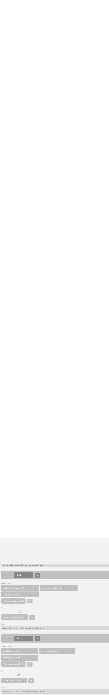
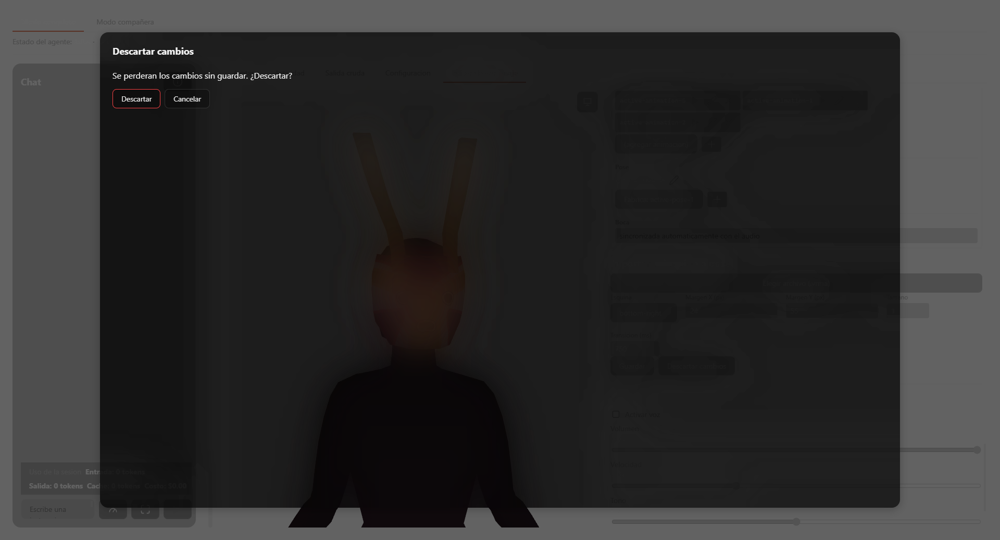
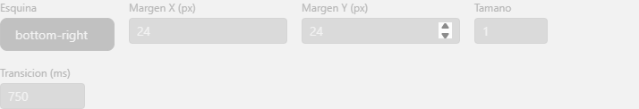
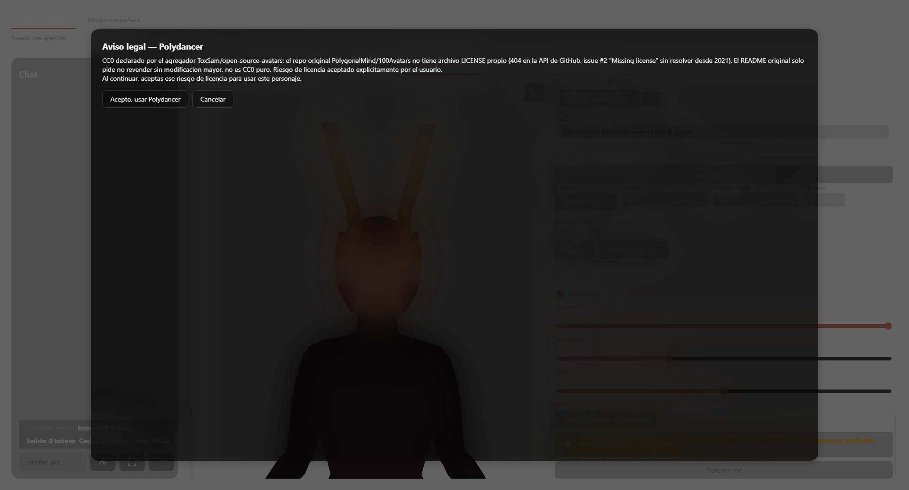
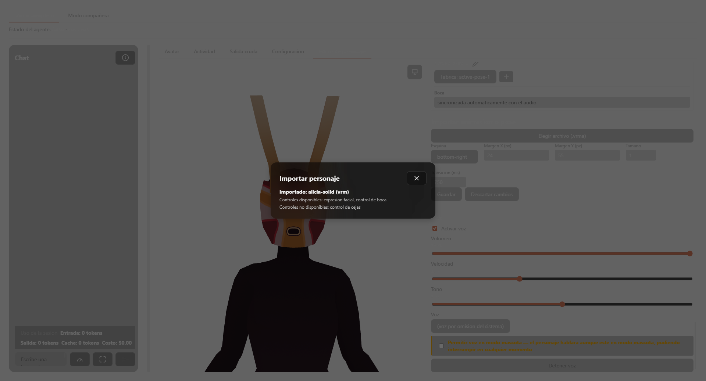

# Gestión de personajes — referencia

Referencia función por función de cada archivo del dominio. Para los flujos completos y el modelo mental, ver [overview.md](./overview.md).

## `src/character-catalog.ts`

- `CharacterKind = 'vrm'` — único valor hoy; el tipo existe para dejar espacio a formatos de catálogo futuros sin romper `CharacterCatalogEntry`.
- `CharacterCatalogEntry` — ver forma exacta en `overview.md` § Modelo de datos real.
- `LICENSE_DISCLAIMER` — constante de texto compartida por `rabbit` y `polydancer`, explica que su licencia CC0 fue declarada por un agregador externo, no verificada en la fuente original.
- `CHARACTER_CATALOG: CharacterCatalogEntry[]` — 3 entradas:
  - `rabbit` — `requiresLicenseAcceptance: true`.
  - `polydancer` — `requiresLicenseAcceptance: true`.
  - `alicia-solid` — VRM sample oficial, licencia VRoid Hub clara, sin gate.

## `src/character-import.ts`

- `CharacterImportErrorKind` — unión de 5 valores: `'file-not-found' | 'unsupported-format' | 'corrupt-vrm-header' | 'invalid-live2d-manifest' | 'io-error'`. Espejo TS de las variantes reales del error Rust.
- `ImportedCharacterFormat = 'vrm' | 'live2d'`.
- `CharacterCapabilities { expression, mouth, eyebrows }` — booleanos por eje.
- `ImportedCharacterSummary { id, name, format, savedPath, capabilities }`.
- `importCharacterFile(path: string): Promise<ImportedCharacterSummary>` — invoca el comando Tauri `import_character_file`; rechaza con el `CharacterImportErrorKind` real que devuelva el backend.
- `listImportedCharacters(): Promise<ImportedCharacterSummary[]>` — invoca `list_imported_characters`; usado para reconstruir el estado de importados al reiniciar la aplicación.

## `src-tauri/src/character_import.rs`

- `GLTF_MAGIC: u32 = 0x4654_6C67` — bytes `"glTF"` en little-endian, magic number real del formato binario glTF/VRM.
- `GLTF_HEADER_LEN: usize = 12` — tamaño del header binario glTF (magic 4 bytes + versión 4 bytes + longitud total 4 bytes).
- `LIVE2D_MANIFEST_SUFFIX = ".model3.json"` — sufijo real de un manifiesto Live2D Cubism.
- `validate_vrm_header(bytes: &[u8]) -> Result<(), CharacterImportError>` — rechaza si `bytes.len() < GLTF_HEADER_LEN`, si los primeros 4 bytes no igualan `GLTF_MAGIC`, o si la longitud declarada en `bytes[8..12]` (little-endian `u32`) no coincide con `bytes.len()` real.
- `validate_live2d_manifest(text: &str) -> Result<(), CharacterImportError>` — rechaza si `text` no parsea como JSON, si el JSON no es un objeto, o si le faltan las claves `"Version"` o `"FileReferences"`.
- `detect_format(path: &Path) -> Option<ImportedCharacterFormat>` — extensión `vrm`/`glb` → `Vrm`; nombre terminado en `.model3.json` → `Live2d`; cualquier otra → `None` (dispara `unsupported-format` en el llamador).
- `capabilities_for(format: ImportedCharacterFormat) -> CharacterCapabilities` — `Vrm` → `{expression: true, mouth: true, eyebrows: false}`; `Live2d` → `{expression: false, mouth: false, eyebrows: false}`. Comentario real en código: "sin parsear la escena/moc3 completa, las capacidades se declaran por formato, no por archivo".
- `save_imported_file(...)` — copia el archivo a `<app_data_dir>/imported-characters/`; **idempotente**: reimportar un archivo con el mismo nombre sobrescribe el anterior en vez de duplicar.
- Módulo `#[cfg(test)]` (8 pruebas): header truncado, magic number equivocado, longitud declarada no coincide, archivo vacío, header válido, JSON inválido, manifiesto sin `FileReferences`, manifiesto válido.

## `src/character-editor.ts`

### Constantes
- `EDITABLE_STATES: AvatarState[]` — 11 valores: `idle, thinking, reading, coding, executing, waiting_permission, success, error, confused, sleeping, speaking`.
- `EXPRESSION_OPTIONS: AvatarExpression[]` — 8 valores: `neutral, happy, sad, surprised, confused, angry, tired, excited`.
- `MOOD_TO_EXPRESSION: Record<Mood, AvatarExpression>` — mapea el resultado de `resolveMood()` (dominio de reacciones) a una expresión por defecto.
- `DEFAULT_CHARACTER_FOOTPRINT = { baseWidth: 128, baseHeight: 128 }` — corresponde a `8rem = --size-poc-avatar` (comentario real en código).
- `MIN_CHARACTER_SIZE = 0.5`, `MAX_CHARACTER_SIZE = 2`, `DEFAULT_CHARACTER_SIZE = 1`.
- `MIN_TRANSITION_DURATION_MS = 0`, `MAX_TRANSITION_DURATION_MS = 10000`.
- `MIN_ROTATION_DEGREES = -360`, `MAX_ROTATION_DEGREES = 360` (usadas por el editor de pose/animación de huesos, no por el formulario de anclaje de este componente — ver [animacion-y-render](../animacion-y-render/overview.md)).
- `DEFAULT_ANCHOR = { corner: 'bottom-right', marginX: 24, marginY: 24 }`.
- `REACTION_STATE_ALIASES: Record<string, AvatarState>` — ~23 entradas mapeando estados reales del motor de reacciones (`pensativa, confundida, no-entendio, error-grave, error-recuperable, concentrada, sorprendida, alarmada, curiosa, despertando, explorando, buscando-referencias, analizando-dependencias, planificando, eliminando-codigo, ejecutando-pruebas, compilando, instalando-dependencias, revisando-errores, comparando-cambios, generando-diff, cambio-aplicado, necesita-aclaracion, advirtiendo-riesgo`) hacia uno de los 11 `EDITABLE_STATES`.

### Tipos
`AxisCapability`, `EditorCapabilities`, `StateAssignment`, `CharacterEditorSettings`, `CharacterEditorState` — ver `overview.md` § Modelo de datos real.

### Funciones
- `capabilitiesForTestAvatar(): EditorCapabilities` — todos los ejes `{supported: true}`; usado para el personaje de prueba y para cualquier entrada del catálogo estático (todas son VRM completos).
- `capabilitiesForImportedCharacter(imported, format): EditorCapabilities` — `animation`/`pose` solo `supported: true` si `format === 'vrm'`; razón real cuando no: "el motor de animación/pose ya es genérico (`vrm-clip-retarget.ts`); solo Live2D carece de renderizador real". `expression`/`mouth` siguen las banderas de `CharacterCapabilities` del propio importado.
- `registerImportedAnimation(summary)` / `importedAnimationCatalog: Map<string, ImportedAnimationSummary>` — registro module-level (no persistido en disco por este módulo) keyed por `savedPath`, alimentado desde la importación de `.vrma` dentro del editor.
- `isKnownClipId(id, capabilities)` — verdadero si `id` existe en el catálogo procedural de fábrica **o** en `importedAnimationCatalog`.
- `sanitizeAssignment(assignment, capabilities): StateAssignment` — filtra `animations`/`pose` a solo ids conocidos (`isKnownClipId`), y además a solo ejes que `capabilities` declara soportados; preserva `poseCleared` y `transitionDurationMs` sin alterarlos.
- `defaultAssignmentsFor(capabilities): StateAssignment[]` — construye las 11 asignaciones de fábrica combinando `resolveMood(state)` → expresión, `animationPoolForState(state)`, `poseForState(state)`.
- `fillMissingAnimationFields(assignment, factoryDefault): StateAssignment` — completa `animations`/`pose` ausentes con los valores de fábrica del estado, campo por campo, preservando cualquier expresión ya personalizada; un arreglo vacío de animaciones cuenta como "nunca personalizado" (se rellena igual), mientras que `pose` distingue explícitamente `poseCleared` (ver abajo) de "nunca se tocó".
- `assignmentForState(persisted, state): StateAssignment | null` — coincidencia exacta en `persisted` primero; si no, busca `state` en `REACTION_STATE_ALIASES` y reintenta con el estado curado resultante; si tampoco, devuelve una asignación mínima `{state}` sin contenido.
- `resolveActiveStateAssignment(persisted, capabilities, currentState): StateAssignment` — para un estado curado (o uno con contenido ya resuelto), devuelve la asignación migrada (`fillMissingAnimationFields`); para un estado real no curado sin contenido persistido, cae al pool genérico por mood (`animationPoolForState`/`poseForState`) — nunca devuelve una asignación completamente vacía en silencio si hay soporte de capacidad.
- `isAnchorWithinArea(anchor, size, viewport): boolean` — verifica que el `CharacterFootprint` escalado por `size`, posicionado según `anchor.corner` con los márgenes dados, quepa dentro de `viewport` sin desbordarse.
- `clampAnchorToArea(anchor, size, viewport): CharacterAnchor` — corrige márgenes negativos a 0 y reduce cualquier margen que deje al personaje fuera del área visible, hasta que quepa.
- `clampCharacterSize(value): number` — usa `clamp(value, MIN_CHARACTER_SIZE, MAX_CHARACTER_SIZE)`.
- `clampTransitionDuration(value): number` — usa `clamp(value, MIN_TRANSITION_DURATION_MS, MAX_TRANSITION_DURATION_MS)`.
- `clampRotationDegrees(value): number` — usa `clamp(value, MIN_ROTATION_DEGREES, MAX_ROTATION_DEGREES)`; consumida por `PoseEditor.vue`/`AnimationTimelineEditor.vue`, no por el formulario de anclaje de `CharacterEditor.vue`.
- `createCharacterEditorState(characterId, capabilities): CharacterEditorState` — `original = defaultAssignmentsFor(capabilities) + DEFAULT_ANCHOR + DEFAULT_CHARACTER_SIZE`; `saved = loadCharacterEditorSettings(characterId) ?? clone(original)`; `editing = clone(saved)`.
- `discardEditorChanges(state): CharacterEditorState` — `editing = clone(original)`. Comentario real en código: "descartar vuelve aquí".
- `markEditorSaved(state): CharacterEditorState` — `saved = clone(editing)`, persiste con `persistCharacterEditorSettings`.
- `applyAssignmentChange(state, newAssignment): CharacterEditorState` — reemplaza la entrada de `editing.assignments` para ese `state`, pasando por `sanitizeAssignment`.
- `applyAnchorChange(state, newAnchor): CharacterEditorState` — aplica `clampAnchorToArea` antes de guardar en `editing.anchor`.
- `applySizeChange(state, newSize): CharacterEditorState` — aplica `clampCharacterSize`, y re-aplica `clampAnchorToArea` al anclaje existente contra el tamaño nuevo.
- `previewAssignment(avatarController, assignment)` — llama `avatarController.setState(assignment.state)` + `setExpression(assignment.expression)`, reutilizando el mismo camino que usa `ReactionEngine.emit` en producción.

## `src/character-editor-storage.ts`

- `STORAGE_KEY_PREFIX = 'codetuver-avatar.character-editor.'` — comentario real: "Interino: FEAT-028 (EPIC-006) reemplazará `localStorage` por el almacén unificado."
- `migrateAssignment(raw): StateAssignment` — si `raw` trae `animation: string` (shape antiguo, un solo clip) y **no** trae `animations`, convierte a `animations: [raw.animation]`. Si ambos existen, `animations` prevalece y `animation` se descarta.
- `persistCharacterEditorSettings(characterId, settings): void` — serializa a JSON bajo `STORAGE_KEY_PREFIX + characterId`.
- `loadCharacterEditorSettings(characterId): CharacterEditorSettings | null` — devuelve `null` si no hay nada guardado o si el JSON es inválido; aplica `migrateAssignment` a cada entrada antes de devolver.

## `src/character-editor-capability-cell.ts`

- `CapabilityCellProps { disabled, ariaLabel, title }`.
- `capabilityCellProps(axisLabel, state, capability, supportedDetail?): CapabilityCellProps` — helper de deduplicación; comentario real: "Paga la deuda de `docs/TECH_DEBT.md`: mismo patrón `disabled`/`aria-label`/`title`, antes copiado 4 veces en `CharacterEditor.vue`." Cuando `capability.supported` es falso, usa `capability.reason` en el `title`; cuando es verdadero, usa `supportedDetail` si se proporcionó.

## `src/character-selection.ts`

- `STORAGE_KEY = 'codetuver-avatar.character-selection'`.
- `persistCharacterId(id, storage?): void` — **no** captura excepciones de `storage.setItem`; se propagan tal cual (confirmado por prueba con nombre explícito de hallazgo, ver `overview.md`).
- `loadPersistedCharacterId(storage?): string | null`.
- `resolveActiveCharacter(catalog, persistedId): CharacterCatalogEntry | null` — busca `persistedId` en `catalog`; si no lo encuentra, devuelve `catalog[0]`; si `catalog` está vacío, devuelve `null`. Solo busca en el catálogo estático — nunca resuelve un id de personaje importado.

## `src/character-file-picker.ts`

- `CHARACTER_FILE_FILTERS = [{ name: 'Personaje', extensions: ['vrm', 'glb', 'json'] }]`.
- `pickCharacterFile(): Promise<string | null>` — envuelve `open({ multiple: false, filters: CHARACTER_FILE_FILTERS })`; si el resultado es un arreglo (selección múltiple inesperada) o `null` (cancelado), resuelve `null`; una ruta string se devuelve tal cual; un error del selector nativo se propaga sin envolver.

## `src/character-license-consent.ts`

- `STORAGE_KEY = 'codetuver-avatar.character-license.accepted'`.
- `loadAcceptedCharacterLicenses(storage?): Set<string>` — deserializa un arreglo JSON a `Set`; JSON inválido o ausente → `Set` vacío, sin lanzar.
- `hasAcceptedCharacterLicense(id, storage?): boolean`.
- `persistCharacterLicenseAccepted(id, storage?): void` — agrega `id` al `Set` existente y vuelve a serializar como arreglo; aceptar el mismo id dos veces no duplica (semántica de `Set`).

## `src/avatar-imported-model.ts`

- `resolveImportedVrmModelUrl(character: ImportedCharacterSummary | null, convertFileSrc): string | null` — devuelve `null` si `character` es `null` o su `format !== 'vrm'`; si es un VRM importado, devuelve `convertFileSrc(character.savedPath)` (la URL `asset://` real que el WebView puede cargar). `convertFileSrc` se inyecta como parámetro en vez de importarse directo, para que la función sea pura y testeable sin runtime real de Tauri.

## `src/App.vue` — orquestación de este dominio

- `activeCharacter: ComputedRef<CharacterCatalogEntry | null>` — `CHARACTER_CATALOG.find(id === activeCharacterId)`.
- `applyCharacterActivation(id): void` — punto único de activación real (catálogo e importados comparten esta función; solo difieren en de dónde viene el `id`, según comentario real en código). Fija `activeCharacterId`, persiste con `persistCharacterId` dentro de `try/catch` con `console.error` en el `catch`.
- `activateCharacter(id): void` — punto de entrada desde la UI; interpone el gate de licencia cuando aplica.
- `pendingCharacterLicenseId: Ref<string | null>` / `pendingCharacterLicenseEntry: ComputedRef<CharacterCatalogEntry | null>`.
- `acceptCharacterLicense(): void` / `cancelCharacterLicense(): void`.
- `importedCharacters: Ref<ImportedCharacterSummary[]>` / `activeImportedCharacter: ComputedRef<ImportedCharacterSummary | null>`.
- `onCharacterImported(summary): void` — agrega a `importedCharacters` y registra en el menú nativo (`nativeMenuHandle.addImportedCharacter`).
- `activeCharacterCapabilities: ComputedRef<EditorCapabilities>` — `capabilitiesForImportedCharacter(...)` si hay un importado activo, si no `capabilitiesForTestAvatar()`. Comentario real: "reconcilia el modelo `{expression, mouth, eyebrows}` de los importados con los 4 ejes editables (expresión/animación/pose/boca)".
- `characterEditorModelUrl: ComputedRef<string | null>` — `activeCharacter.value.modelUrl` si es un personaje del catálogo (`kind === 'vrm'`), si no `resolveImportedVrmModelUrl(activeImportedCharacter, convertFileSrc)`. Comentario real: "un solo punto de resolución de la URL del modelo para el Editor de personaje, en vez de duplicar el ternario en cada uso de `<CharacterEditor>`".
- `characterEditorSettingsVersion: Ref<number>` / `reloadActiveCharacterSettings(): void` — bump manual para forzar recomputar `activeStateAssignment` tras un guardado sin cambio de estado (porque `loadCharacterEditorSettings` no es reactivo).
- `activeStateAssignment: ComputedRef<StateAssignment | null>` — lee `characterEditorSettingsVersion` (para depender de él), carga settings persistidos del personaje activo, y llama `resolveActiveStateAssignment(persisted, activeCharacterCapabilities, avatarController.snapshot.state)`.
- `mouthOpenForActiveCharacter: ComputedRef<boolean>` — `false` explícito si `!capabilities.mouth.supported` (comentario real: "sin soporte de boca el personaje se queda fijo, no hereda el binario `isSpeaking`"); si soporta, refleja `mouthSyncController.snapshot.mouthOpen`.
- `CHARACTER_CAPABILITY_LABELS: Record<keyof CharacterCapabilities, string>` — `{expression: 'expresión facial', mouth: 'control de boca', eyebrows: 'control de cejas'}`.
- `describeCharacterCapabilities(capabilities, available): string` — filtra las claves de `CHARACTER_CAPABILITY_LABELS` cuyo valor en `capabilities` coincide con `available`, las une con `, `; devuelve `'ninguno'` si no hay ninguna. Comentario real: "la declaración es por formato (VRM/Live2D), no por archivo individual — no se parsea la escena 3D."
- `pendingCharacterImportPath: Ref<string | null>`, `isImportingCharacterFile: Ref<boolean>`, `characterImportError: Ref<string | null>`, `lastImportedCharacterSummary: Ref<ImportedCharacterSummary | null>`.
- `showCharacterImportOverlay(path): void`, `openCharacterImportOverlay(): Promise<void>`, `closeCharacterImportOverlay(): void` (guarda: no cierra mientras `isImportingCharacterFile`), `confirmCharacterImport(): Promise<void>`, `cancelCharacterImport(): void` (alias de `closeCharacterImportOverlay`).

## UI real — `CharacterEditor.vue`

Componente `
` colapsable con resumen "Editor de personaje". Props: `characterId, capabilities, avatarController, modelUrl, noSeparatorAbove?`. Emits: `settings-saved`, `preview-clip`.

**Tabla de estados** (`tableRows`, una fila por cada uno de los 11 `EDITABLE_STATES`):

- Columna **Expresión**: `CustomSelect` con las 8 `EXPRESSION_OPTIONS`.
- Columna **Probar**: botón ícono `play`, texto accesible "Probar reacción de `<estado>`", llama `previewAssignment`.
- Sección **Animaciones**: chips por animación asignada, cada uno con:
  - Botón **Ejecutar** (ícono `play`) — emite `preview-clip`.
  - Botón **Editar** (ícono `edit`) — abre `AnimationTimelineEditor` en modo `'editar-animacion'`.
  - Botón **Quitar** (ícono `trash`) — remueve la animación del pool de ese estado.
  - `CustomSelect` "Agregar animación" (excluye ya asignadas) + botón **"Crear animación nueva"** (abre el editor en modo `'nueva'`).

<!-- captura pendiente: fila de estado con 2+ animaciones asignadas mostrando los tres botones por chip. PENDIENTE: requiere importar un .vrma real vía el dialogo nativo de archivo de Windows, no automatizable por CDP/Playwright. -->

- Sección **Pose**: si hay pose asignada, texto de la pose + botón **Editar** (abre `PoseEditor` en `'editar-pose'`); si no, `CustomSelect` de poses disponibles + botón **"Crear pose nueva"**.
- Sección **Boca**: input de texto siempre `disabled`, placeholder condicional ("sincronizada automáticamente con el audio" / "no soportado").

**Párrafos de razón por eje no soportado**, debajo de la tabla, uno por cada eje con `capability.supported === false`.

**Importación de animación/pose**:

<!-- captura pendiente: botón "Elegir archivo (.vrma)", estado con ruta pendiente + select de tipo (animación/pose) + confirmar/cancelar. PENDIENTE: el mismo dialogo nativo de archivo no automatizable citado arriba. -->

- Botón **"Elegir archivo (.vrma)"** (deshabilitado si ni animación ni pose son soportadas por el personaje activo).
- Tras elegir archivo: ruta pendiente + `CustomSelect` de tipo (animación/pose, filtrado por capacidad) + botones **"Confirmar importación"** / **"Cancelar"**.
- Área de mensaje de estado con `aria-live="polite"`.

**Editores modales** (`EditorModal`, solo si `modelUrl` está presente y la capacidad correspondiente está soportada): `PoseEditor` / `AnimationTimelineEditor`, en modos `'nueva' | 'editar-animacion' | 'editar-pose'`.

**Diálogo de descartar cambios**:

`EditorModal` con `role="alertdialog"`, texto "Se perderán los cambios sin guardar. ¿Descartar?", botón **"Descartar"** (estilo de peligro) / **"Cancelar"**.

**Campos de anclaje/tamaño/transición** (globales, no por estado):

- **Esquina**: `CustomSelect` de 4 corners.
- **Margen X** / **Margen Y**: inputs numéricos, `min="0"`.
- **Tamaño**: input numérico, `min="0.5"`, `max="2"`, `step="0.1"`.
- **Transición ms**: input numérico, `min="0"`, `max="10000"`, `step="50"` — aplica a los 11 estados a la vez.

**Acciones finales**: botón **"Guardar"** / botón **"Descartar cambios"** (abre el diálogo de confirmación de arriba). Área de mensaje de estado con `aria-live="polite"`.

## UI real — diálogo de licencia (en `App.vue`)

`EditorModal` con `role="alertdialog"`, título `Aviso legal — <nombre del personaje>`, cuerpo con el texto de `entry.license` más el párrafo fijo de aceptación de riesgo, botones **"Acepto, usar `<nombre>`"** / **"Cancelar"**.

## UI real — panel de importación de personaje (en `App.vue`)

- Ruta pendiente mostrada como texto (`session-panel__folder`).
- Advertencia fija: "La licencia de este archivo es tu responsabilidad; la aplicación no la verifica."
- Botones **"Confirmar importación"** (texto cambia a "Importando..." mientras está en curso) / **"Cancelar"**.
- En error: párrafo con ícono `error` y el mensaje, `aria-live="polite"`.
- En éxito: resumen con nombre, formato, "Controles disponibles: `<lista>`", "Controles no disponibles: `<lista>`" (vía `describeCharacterCapabilities`).
