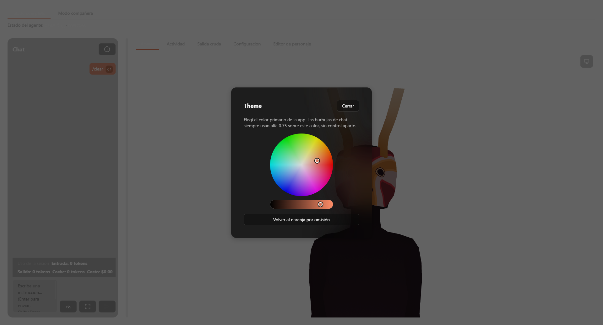
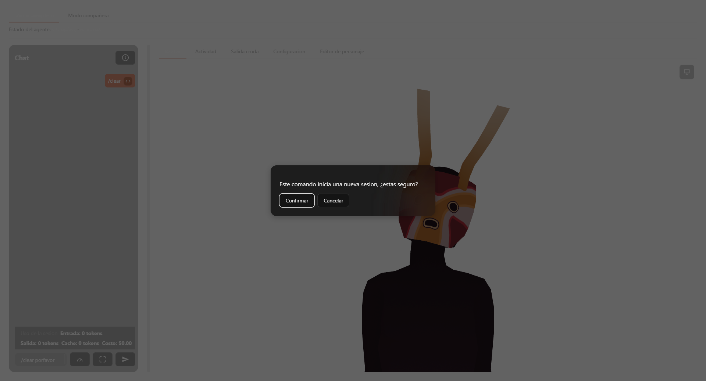

# Referencia — orquestación de la aplicación

## `src/App.vue` — pila de overlays

- `type OverlayId = 'clear' | 'usageDetail' | 'themePopup' | 'characterImport'` (línea 439).
- `openOverlayStack: Ref<OverlayId[]>` (línea 440) — pila real, único estado de visibilidad de los 4 overlays.
- `pushOverlay(id: OverlayId): void` (línea 442) — filtra `id` de la pila y lo vuelve a añadir al final (evita duplicados, no reordena el resto).
- `popOverlay(id: OverlayId): void` (línea 449) — filtra `id` fuera de la pila.
- `OVERLAY_CLOSERS: Record<OverlayId, () => void>` (línea 1212) — `{ clear: closeClearConfirmation, usageDetail: closeUsageDetail, themePopup: closeThemePopup, characterImport: closeCharacterImportOverlay }`.
- `closeTopOverlayOnEscape(event: KeyboardEvent): void` (línea 1219) — si `event.key !== 'Escape'` no hace nada; si no hay overlay abierto no hace nada; si lo hay, llama solo al cerrador del último elemento de `openOverlayStack`. Registrado en `window` (`keydown`) en `onMounted`, removido en `onUnmounted`.
- `openClearConfirmation()` / `closeClearConfirmation()` — el overlay de confirmación de `/clear`, con temporizador propio (`CLEAR_CONFIRMATION_TIMEOUT_MS = 8000`) que lo cierra solo si expira.
- `openCharacterImportOverlay()` (línea 1199) — `async`, llama primero `pickCharacterFile()` (diálogo nativo real); si el usuario cancela (`selected` falsy), no empuja el overlay. Solo si se eligió un archivo real llama `showCharacterImportOverlay(selected)`.
- `closeCharacterImportOverlay()` (línea 1205) — no hace nada si `isImportingCharacterFile.value` es `true` (importación en vuelo); si no, hace `popOverlay('characterImport')`, limpia `pendingCharacterImportPath` y devuelve el foco.
- `trapCharacterImportOverlayTab(event)` (línea 1225) → `trapOverlayTab(characterImportOverlayPanel.value, event)`, mismo mecanismo que `EditorModal.vue` (ver [ui-compartida](../ui-compartida/reference.md)).

## `src/App.vue` — pestañas

- `SECONDARY_TABS: { id: SecondaryTab; label: string }[]` (línea 1074) — 5 entradas reales: `avatar` ("Avatar"), `actividad` ("Actividad"), `salida-cruda` ("Salida cruda"), `configuracion` ("Configuracion"), `editor-personaje` ("Editor de personaje").
- `TOGGLEABLE_SECONDARY_TABS` (línea 1082) — `SECONDARY_TABS` filtrado sin `avatar` (las únicas 4 que el submenú nativo "Window" puede marcar/desmarcar).
- `activeSecondaryTab: Ref<SecondaryTab>` (línea 1085), inicial `'avatar'`.
- `enabledTabs: Ref<Record<ToggleableSecondaryTab, boolean>>` (línea 1086) — las 4 toggleables, todas `true` por defecto.
- `visibleSecondaryTabs` (línea 1092, computed) — `filterVisibleTabs(SECONDARY_TABS, 'avatar', enabledTabs.value)`.
- `secondaryTabFocus = createTabFocusRegistry()` (línea 1098) — registro de foco real para el tablist de pestañas secundarias, independiente de `modeTabFocus` (línea 644, mismo helper, instancia separada para el tablist de modo FULL/COMPANION).
- `MODE_TABS` (línea ~638) — 2 entradas: `FULL` ("Modo completo"), `COMPANION` ("Modo compañera"). `activateModeTab(id)` (línea 646) despacha a `switchToFullMode()`/`switchToCompanionMode()` de [presentacion-y-ventana](../presentacion-y-ventana/reference.md).
- `onModeTabClick(id)` (línea 651) — tras `activateModeTab`, re-aplica el foco manualmente (`modeTabFocus.focus(id)`) porque `PresentationManager` llama `windowManager.focus()` en toda transición FULL↔COMPANION, lo que en WebView2 resetea el foco del DOM a `<body>` — sin esto el contrato ARIA de tablist (el tab activo mantiene el foco) se rompe.
- `onModeTabKeydown(event)` (línea 657) — solo actúa si `isTabArrowKey(event.key)`; calcula el siguiente id con `nextTabId` (función pura reusada de la pieza de teclado genérica) y llama `activateModeTab` + re-foco, igual que el click.
- `toggleActivityVisibility()` (línea 669) — alterna `presentationState.value.activityVisibility` entre `'VISIBLE'`/`'HIDDEN'` vía `presentationManager.setActivityVisibility`.

## `src/App.vue` — ciclo de vida de sesión

- `beginSession(cwd: string): Promise<void>` (línea 1354) — guard de reentrancia (`isStarting`); valida `sessionStartOptionsDraft` antes de arrancar (si hay errores de validación, no hace nada); recrea `chatState`/`activityConsole` desde cero; aplica configuración de proyecto; arranca con `startSessionWithRetry`; en éxito persiste las opciones de arranque (`persistSessionStartOptions`, sin esperar); en error restaura `chosenCwd`/`sessionId` previos y, si el error es "Claude Code no encontrado" (`isClaudeCodeNotFound`), registra una `claude-code-error` en la taxonomía de fallas.
- `resumeSession(cwd, resumeSessionId, fork, folder): Promise<void>` (línea 1393) — mismo guard y guardado de estado previo que `beginSession`, pero en vez de vaciar el chat lee `readSessionTranscript`/`readSessionActivityEvents` en paralelo (`Promise.all`) y siembra `chatState`/`activityConsole` con datos reales de la sesión pasada, porque `startSession` en modo reanudar/bifurcar no reemite los turnos anteriores como eventos del proceso (comentario real `AC-113`).
- `closeActiveSession(): Promise<void>` (línea 1460) — no-op si `!sessionActive.value`; si hay sesión, `closeSession()` (transporte) y limpia `sessionActive`/`sessionId`. No toca `chatState` — el historial de la sesión cerrada permanece visible.
- `handleIncomingEvent(event: NormalizedEvent): void` (línea 1471) — pipeline real de todo evento normalizado: `activityConsole = handleNormalizedEvent(...)` → `chatState = applyChatEvent(...)` → `reactToEvent(event)`. Regla real: si el evento es `session_finished`, había un turno abierto, y **no** es la respuesta a un comando en caliente (`/effort`, `/usage`, `/clear` — verificado con `awaitingEffortResponse`/`awaitingUsageDetail`/`awaitingClearReset`), sintetiza un segundo evento sintético `assistant_turn_complete` con el texto hablable de la última entrada cerrada (`blocksToSpeechText`) y lo reenvía también a `reactToEvent` — es el único lugar donde se dispara la reacción de "respuesta completa del agente" (ver [reacciones-y-voz](../reacciones-y-voz/reference.md)).
- `isDevBuild = import.meta.env.DEV` (línea 1468) — leído una sola vez porque `import.meta` no es evaluable dentro de una expresión de plantilla Vue; gobierna el `v-if` que monta `DebugPanel.vue`.

## Hooks `window.__qa*` (registrados en `onMounted`, líneas 1556-1602)

| Hook | Firma real | Qué dispara |
|---|---|---|
| `__qaState` | `() => {...}` | Snapshot de solo lectura del estado completo relevante para QA: sesión activa/id, error de arranque, aviso de settings, snapshot del avatar (estado/expresión/hablando/último error), entradas de chat cerradas y visibles, último personaje importado, peticiones de interacción pendientes, y las últimas 5 líneas de actividad cruda (cada una truncada a 200 caracteres). |
| `__qaBeginSession` | `(cwd: string) => Promise<void>` | `beginSession(cwd)` — mismo camino real que el botón de iniciar sesión. |
| `__qaSend` | `(text: string) => Promise<void>` | Escribe `text` en `chatDraft` y llama `sendChatMessage()` — mismo camino que escribir en el composer y enviar. |
| `__qaInterrupt` | `() => Promise<void>` | `interruptSession()`. |
| `__qaClose` | `() => Promise<void>` | `closeSession()` (transporte directo, no pasa por `closeActiveSession`). |
| `__qaCloseSessionFromMenu` | `() => Promise<void>` | `closeActiveSession()` — el mismo handler que invoca el ítem "Cerrar sesión" del menú nativo (inalcanzable por CDP porque vive fuera del DOM). |
| `__qaSelectCharacter` | `(id: string) => void` | `activateCharacter(id)` — mismo handler que el submenú nativo de personajes. |
| `__qaTriggerAddNewCharacter` | `() => Promise<void>` | `openCharacterImportOverlay()` — dispara el diálogo nativo real de archivo (bloqueante para un test automatizado sin control adicional del sistema operativo). |
| `__qaOpenCharacterImportOverlayWithPath` | `(path: string) => void` | `showCharacterImportOverlay(path)` — salta el diálogo nativo no automatizable y prueba el resto del flujo real (confirmar/cancelar/error/éxito) contra el backend real. |
| `__qaOpenTheme` | `() => void` | `openThemePopup()`. |
| `__qaOpenCommandsFromMenu` | `() => void` | `openCommandsListFromMenu()` — mismo handler que el ítem del menú nativo que abre el listado de comandos. |
| `__qaInjectEvent` | `(event: NormalizedEvent) => void` | `handleIncomingEvent(event)` — inyecta un evento normalizado sintético como si viniera del proceso real de Claude Code. |
| `__qaInjectPermissionPending` | `(request: InteractionRequest) => void` | Añade `request` directamente a `interactionRequestsState` vía `receivePendingRequest` — mismo camino que consume `onPermissionPending`, que en sí no es inyectable desde CDP por ser un evento nativo de backend de Tauri. |

Todos existen porque el menú nativo real de Windows vive fuera del DOM/CDP; cada hook llama al mismo handler real que ese menú invocaría — ninguno simula clics ni teclas sobre el menú en sí (regla explícita del proyecto).

Estos 13 son los hooks `window.__qa*` de `App.vue`. Existe una 14ª superficie con el mismo prefijo fuera de este archivo: `window.__qaSpeechLog` (`src/text-to-speech.ts`, ver [reacciones-y-voz](../reacciones-y-voz/reference.md)), con un propósito distinto (log de síntesis de voz en dev, no un bypass de menú nativo) — el total real de superficies `window.__qa*` del proyecto es 14, repartidas en estos dos módulos.

## UI real — capturas pendientes

## Inconsistencias reales encontradas

Ninguna respecto a los 8 dominios completados que se revisaron para calibrar formato (`robustez-y-actualizaciones` como referencia principal de estilo). Fuera de alcance de este dominio pero visible en el código: `App.vue` importa `hasAcceptedCharacterLicense`/`persistCharacterLicenseAccepted` de `character-license-consent` (gate de licencia, dominio [gestion-de-personajes](../gestion-de-personajes/overview.md)) — no se documenta aquí el flujo de ese gate en detalle, solo se confirma que el cableado real vive en `App.vue` igual que el resto de los flujos de personaje.
