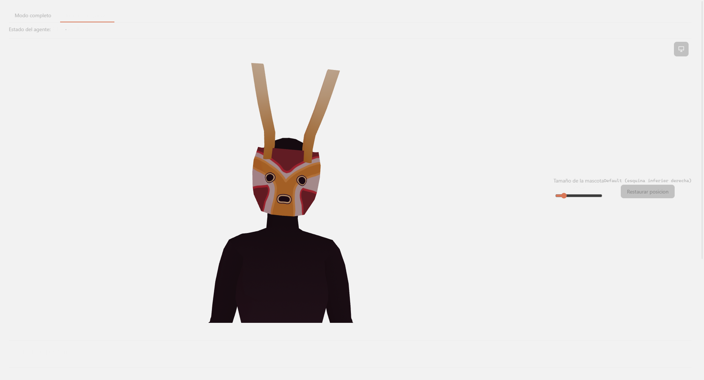
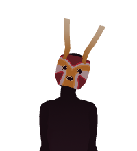
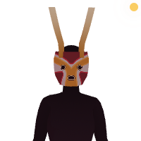
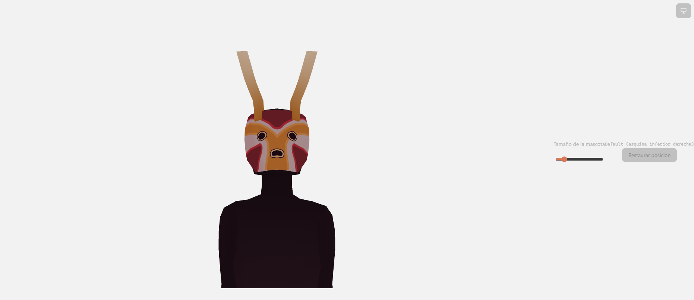

# Presentación y ventana — referencia

## `PresentationManager` (`src/presentation-manager.ts`)

| Miembro | Firma real | Qué hace |
|---|---|---|
| `getState()` | `(): Readonly<PresentationState>` | Devuelve el estado reactivo actual (`mode`, `activityVisibility`, `avatarPosition`, `window`, `pendingInteractionCount`, `isTransitioning`). |
| `transitionTo(mode)` | `(mode: PresentationMode): Promise<void>` | Encola una transición de gesto. No-op si ya hay una transición en curso o si `mode` es igual al actual. |
| `applyPersistedSettings(settings)` | `(settings: PersistedPresentationSettings): Promise<void>` | Se llama una sola vez al arrancar; aplica el modo inicial y la geometría persistida antes de cualquier `transitionTo`. |
| `startWindowDrag()` | `(): Promise<void>` | No-op fuera de `PET`; delega en `windowManager.startDragging()`. |
| `setPetWindowSize(size)` | `(size: WindowSize): void` | Actualiza el tamaño en memoria que usará la próxima entrada a `PET` — no persiste ni aplica de inmediato. |
| `setPetWindowPosition(position)` | `(position: PetWindowPosition \| null): void` | Cache en memoria; la persistencia real en disco vive en `App.vue`/`PetView.vue`. |
| `refreshPetGeometry()` | `(): Promise<void>` | Recalcula la geometría de `PET` sin pasar por una transición de modo — usado solo al restaurar la posición. |
| `setPendingInteractionCount(count)` | `(count: number): void` | Lanza `RangeError` si `count < 0`. |
| `setActivityVisibility(v)` | `(v: PanelVisibility): void` | No-op fuera de `FULL`. |
| `onTransitionFault(handler)` | `(handler: PresentationFaultHandler): Unsubscribe` | Suscribe un handler a fallos de transición; devuelve función de desuscripción. |

Funciones de módulo para pruebas/depuración (solo `import.meta.env.DEV`, se tree-shakean en producción):

- `armPresentationTransitionFault(mode: PresentationMode | null): void` — de un solo uso.
- Reexportadas desde otros módulos y usadas en conjunto: `armMissingWindowCapability` (`desktop-window-manager.ts`), `armSimulatedMonitors` (`monitor-position.ts`, persistente hasta `null`).

`PRESENTATION_TRANSITIONS` es un arreglo constante de 6 objetos `{ from, to, gesture }` — la única fuente de verdad de qué transiciones son válidas (ver overview.md para la tabla legible).

`MODE_PROFILES` (constante interna, no exportada) define, por modo, `avatarPosition` y las 6 `PresentationWindowFlags` de partida — `PET` es el único con `transparent: true, borderless: true, resizable: false, alwaysOnTop: true, focusable: false`.

## `DesktopWindowManager` (`src/desktop-window-manager.ts`)

Interfaz de 21 métodos, todos `Promise`-based; ningún componente Vue llama a la API de ventanas de Tauri directamente, todos pasan por esta interfaz.

| Método | Firma |
|---|---|
| `setPresentationMode` | `(mode: PresentationMode) => Promise<void>` |
| `setAlwaysOnTop` | `(enabled: boolean) => Promise<void>` |
| `setTransparent` | `(enabled: boolean) => Promise<void>` |
| `setBorderless` | `(enabled: boolean) => Promise<void>` |
| `setResizable` | `(enabled: boolean) => Promise<void>` |
| `setMaximized` | `(enabled: boolean) => Promise<void>` |
| `setPosition` | `(position: WindowPosition) => Promise<void>` |
| `getPosition` | `() => Promise<{x: number; y: number}>` |
| `setSize` | `(size: WindowSize) => Promise<void>` |
| `startDragging` | `() => Promise<void>` |
| `setIgnoreMouseEvents` | `(enabled: boolean, options?: MouseEventOptions) => Promise<void>` |
| `setFocusable` | `(enabled: boolean) => Promise<void>` |
| `showPetWindow` | `(position: WindowPosition, size: WindowSize, alwaysOnTop: boolean) => Promise<void>` |
| `hidePetWindow` | `() => Promise<void>` |
| `show` / `hide` / `minimize` / `restore` / `focus` | `() => Promise<void>` |
| `getMonitors` | `() => Promise<MonitorInfo[]>` |
| `getCurrentMonitor` | `() => Promise<MonitorInfo \| null>` |

`WindowPosition` es una unión discriminada: `{type:'absolute', x, y}` \| `{type:'screen_corner', corner, marginX, marginY}` \| `{type:'monitor_relative', monitorId, x, y}`. `resolvePosition` (privado de `TauriDesktopWindowManager`) resuelve cualquiera de las tres a coordenadas absolutas antes de llamar a `setPosition`/`setSize` reales.

`WindowManagerError` tiene 5 `kind` posibles: `window-management-error`, `unsupported-capability`, `mode-change-error`, `window-restore-error`, `monitor-query-error`. Todo método pasa por `guarded()`, que primero comprueba si hay una falla de capacidad armada (`armMissingWindowCapability`) para ese método exacto; si la hay, lanza el error simulado y limpia el armado (uso único). Un error que ya tiene forma `WindowManagerError` se relanza tal cual (`isWindowManagerError`), nunca se envuelve dos veces.

Caso especial documentado en el propio código: `setTransparent` no cambia la propiedad de creación `transparent` en runtime (Tauri no lo permite, ADR-0008) — pinta el color de fondo entre `[255,255,255,255]` (opaco) y `[0,0,0,0]` (transparente real) con `setBackgroundColor`.

Caso especial: `setIgnoreMouseEvents(enabled, { hitTestAvatarOnly: true })` lanza siempre un error explicativo ("clic solo sobre el avatar no soportado por Tauri") — ninguna llamada real del código usa esta opción con `true` hoy.

`getCurrentWindowLabel(): Promise<string>` (función de módulo, no de la clase) devuelve `getCurrentWindow().label` — usada por `main.ts` para decidir si montar `App.vue` o `PetView.vue`.

## Ventana pet — capa Tauri real (`src/pet-window.ts`)

| Función | Firma | Nota |
|---|---|---|
| `showPetWindow` | `(position: {x,y}, size: {width,height}, alwaysOnTop: boolean) => Promise<void>` | Crea la ventana la primera vez (`getOrCreatePetWindow`), luego siempre re-aplica `setAlwaysOnTop`/`setSize`/`setPosition`/`show` en cada llamada. |
| `hidePetWindow` | `() => Promise<void>` | Tolerante a que la ventana nunca se haya creado (`petWindow?.hide()`). |

Constantes internas: `PET_WINDOW_LABEL = 'pet'`, `PET_WINDOW_URL = 'index.html'` (mismo HTML que la ventana principal).

`createPetWindow(alwaysOnTop)` construye la `WebviewWindow` con `transparent: true, decorations: false, shadow: false, alwaysOnTop, focusable: false, resizable: false, skipTaskbar: true, visible: false`, y devuelve una promesa que solo resuelve tras el evento `tauri://created` (o rechaza tras `tauri://error`) — llamar `setSize`/`setPosition` inmediatamente después del constructor se pierde en silencio porque el webview real tarda en crearse de forma asíncrona (confirmado en vivo por CDP).

`getOrCreatePetWindow(alwaysOnTop)` comprueba primero `WebviewWindow.getByLabel('pet')` — la variable de módulo `petWindow` no sobrevive un recargo del frontend, pero el webview real de Tauri sí; sin este chequeo, un segundo intento de crear la ventana con la misma etiqueta rechaza con error de Tauri.

Solo la primera vez que se crea la ventana, se invoca `invoke('clear_pet_window_menu')` en modo best-effort (`.catch(() => undefined)`).

## Comando Tauri `clear_pet_window_menu` (`src-tauri/src/lib.rs:40-45`)

```rust
fn clear_pet_window_menu(app: tauri::AppHandle) -> Result<(), String> {
    if let Some(window) = app.get_webview_window("pet") {
        window.remove_menu().map_err(|e| e.to_string())?;
    }
    Ok(())
}
```

Sin este comando, el menú nativo (aplicado globalmente vía `menu.setAsAppMenu()`) se hereda en la ventana pet y Windows reserva una fila para la barra de menú pese a `decorations: false`. Tolerante a que la ventana `pet` aún no exista (`if let Some(...)`, no falla si `get_webview_window` devuelve `None`).

## `src/pet-sync.ts` — contrato de sincronización

```ts
interface PetSyncPayload {
  avatarState: string;
  avatarExpression: string;
  mouthOpen: boolean;
  activeCharacterId: string | null;
  sessionActive: boolean;
  attentionVisible: boolean;
  attentionVisualIndicator: boolean;
  attentionBubble: boolean;
  animationPoolUrls?: string[];
  poseUrl?: string;
  transitionDurationMs?: number;
}
```

3 constantes de nombre de evento Tauri: `PET_SYNC_EVENT = 'pet-sync'`, `PET_SYNC_REQUEST_EVENT = 'pet-sync-request'`, `PET_RESTORE_REQUESTED_EVENT = 'pet-restore-requested'`.

En `App.vue`: `petSyncPayload` (línea 1006) es un `computed` que arma el payload completo desde el estado real de la app (controlador de avatar, personaje activo, sesión, señal de atención, asignación de estado activo). Un `watch(petSyncPayload, ..., { deep: true, immediate: true })` (línea 1019) emite `PET_SYNC_EVENT` cada vez que cambia, empezando inmediatamente al montar. Un listener aparte responde a `PET_SYNC_REQUEST_EVENT` reemitiendo el valor actual (línea ~1656 según overview), y otro escucha `PET_RESTORE_REQUESTED_EVENT` y llama `switchToFullMode()`.

En `PetView.vue`: `applySync(payload)` (línea 58) es la única función que muta el estado local reactivo del componente a partir del payload — nunca decide nada por cuenta propia.

## `PetView.vue` — arrastre vs. click

| Función/constante | Firma | Nota |
|---|---|---|
| `DRAG_THRESHOLD_PX` | `4` | Umbral de distancia en píxeles. |
| `onPetMouseDown` | `(event: MouseEvent): void` | Registra `dragStart`, resetea `didDrag = false`, añade listeners globales a `window`. |
| `onPetMouseMove` | `(event: MouseEvent): Promise<void>` | Si `Math.hypot(dx, dy) < 4` no hace nada; al superar el umbral marca `didDrag = true`, llama `windowManager.startDragging()` y luego `persistDraggedPosition()`. |
| `onPetMouseUp` | `(): void` | Limpia `dragStart = null` y remueve ambos listeners globales, incondicionalmente. |
| `requestFullMode` | `(): void` | Solo emite `PET_RESTORE_REQUESTED_EVENT` si `didDrag === false`. |
| `persistDraggedPosition` | `(): Promise<void>` | Lee `windowManager.getPosition()` + `getAppSettings()`, reescribe `AppSettings` completo con `petWindowPosition` actualizado vía `setGlobalAppSettings`. Cualquier fallo solo se registra con `console.error`. |

El elemento `.pet-stage` tiene `role="button"` y `tabindex="0"`; `requestFullMode` también se dispara por `Enter`/`Space` (accesible por teclado, no solo por mouse).

## Persistencia y sincronización de posición (`App.vue`)

| Función | Firma | Línea aprox. |
|---|---|---|
| `syncPetWindowPositionBeforeActivating` | `(): Promise<void>` | 577 — relee `AppSettings` de disco y sincroniza `petWindowPosition` en el `PresentationManager` justo antes de cada `switchToPetMode()`. |
| `switchToPetMode` | `(): Promise<void>` | 592 — llama primero a `syncPetWindowPositionBeforeActivating()`, luego `transitionTo('PET')`. |
| `onRestorePetWindowPosition` | `(): Promise<void>` | 602 — pone `petWindowPosition` a `null` en memoria y en disco (`petWindowPosition: undefined`), y si `PET` ya está activo llama `refreshPetGeometry()` en vez de una transición normal. |
| `onPetWindowSizeChange` | `(event: Event): Promise<void>` | 620 — lee el valor del `<input type="range">`, lo sanitiza con `sanitizePetWindowSizePx`, actualiza `PresentationManager.setPetWindowSize` y persiste en `AppSettings.windowSize`. |

## Cálculo de posición por defecto (`src/monitor-position.ts`)

| Función | Firma |
|---|---|
| `getMonitors` | `(): Promise<MonitorInfo[]>` |
| `getCurrentMonitor` | `(): Promise<MonitorInfo \| null>` |
| `calculateCornerPosition` | `(monitor: MonitorInfo, position: ScreenCornerPosition, size: WindowDimensions): {x,y}` — función pura, siempre usa `monitor.workArea`, nunca `monitor.bounds`. |
| `selectMonitor` | `(monitors: MonitorInfo[], preferredId: string \| null): MonitorInfo \| null` |
| `toMonitorInfoList` | `(monitors: Monitor[], primary: Monitor \| null): MonitorInfo[]` |
| `armSimulatedMonitors` | `(monitors: MonitorInfo[] \| null): void` — solo `DEV`, persiste hasta `null` (no es de un solo uso). |

`resolvePetPosition` (privado de `PresentationManager`) prioriza siempre una posición arrastrada persistida (`this.petWindowPosition`) sobre el cálculo de esquina; si no hay ninguna, arma un `screen_corner` con `PET_WINDOW_MARGIN = 20`, resuelve el monitor (`petMonitorId` guardado o el monitor actual) y llama a `calculateCornerPosition` — si ningún monitor resuelve, devuelve la posición de esquina sin resolver a coordenadas absolutas.

## Sanitización de tamaño y posición

| Función | Firma | Archivo |
|---|---|---|
| `clampPetWindowSizePx` | `(px: number): number` — clamp `[100, 800]` | `pet-window-size.ts` |
| `sanitizePetWindowSizePx` | `(value: unknown): number` — no numérico/`NaN`/`Infinity` → `200` (default) | `pet-window-size.ts` |
| `sanitizePetWindowPosition` | `(value: unknown): PetWindowPosition \| null` — exige `{x,y}` ambos finitos, redondea a enteros; cualquier otra forma → `null` | `pet-window-position.ts` |
| `describePetWindowPosition` | `(position: PetWindowPosition \| null): string` — `null` → `"Default (esquina inferior derecha)"`, si no `"Personalizada (x, y)"` | `pet-window-position.ts` |

Constantes: `PET_WINDOW_SIZE_MIN_PX = 100`, `PET_WINDOW_SIZE_MAX_PX = 800`, `DEFAULT_PET_WINDOW_SIZE_PX = 200`.

## Señales de atención

| Función/constante | Firma | Archivo |
|---|---|---|
| `resolveAttentionSignal` | `(pendingInteractionCount: number, mode: PresentationMode): AttentionSignalState` — `visible: count > 0 && mode === 'PET'` | `attention-signals.ts` |
| `ATTENTION_SIGNAL_MESSAGE` | `'Necesito tu autorizacion'` | `attention-signals.ts` |
| `loadAttentionSignalSettings` | `(storage?: Storage): AttentionSignalSettings` — combina 5 campos de `localStorage` (clave `codetuver-avatar.attention-signals.settings`) + `voice` desde `loadVoiceEnabled()` | `attention-signal-settings.ts` |
| `persistAttentionSignalSettings` | `(settings: StoredAttentionSignalSettings, storage?: Storage): void` | `attention-signal-settings.ts` |
| `sendAttentionNotification` | `(notification: {title, body}): Promise<void>` — sin permiso concedido, no hace nada (no lanza) | `system-notification.ts` |
| `notifyOnRisingEdgeInPetMode` | `(count: number, previousCount: number): void` (en `App.vue`, línea 1033) | `App.vue` |

`AttentionSignalSettings` tiene 6 campos: `expressionChange`, `animation`, `visualIndicator`, `bubble`, `voice`, `systemNotification`. Default (`DEFAULT_STORED_SETTINGS`): solo `expressionChange: true` y `visualIndicator: true`. Una configuración guardada corrupta o parcial cae a los defaults sin lanzar (`{ ...DEFAULT_STORED_SETTINGS, ...JSON.parse(raw) }` en `try/catch`).

`notifyOnRisingEdgeInPetMode` dispara `sendAttentionNotification` solo si las 3 condiciones se cumplen a la vez: `previousCount === 0`, `count > 0`, `presentationState.value.mode === 'PET'` — y además respeta `attentionSignalSettings.value.systemNotification`.

De las 6 variantes, solo `visualIndicator` y `bubble` están cableadas en `PetView.vue` (`.pet-stage__indicator` y `.pet-stage__bubble`, condicionadas por `attentionVisible && attentionVisualIndicator` / `attentionVisible && attentionBubble`). `expressionChange`/`animation` afectan al avatar en sí (ver [animacion-y-render](../animacion-y-render/overview.md)); `voice` se resuelve en [reacciones-y-voz](../reacciones-y-voz/overview.md).

## Menú nativo (`src/native-menu.ts`)

`installNativeMenu(tabs, characters, handlers): Promise<NativeMenuHandle>` construye el menú una sola vez (`App.vue`, `onMounted`, línea 1626) y devuelve un handle con 6 métodos de actualización incremental — nunca reconstruye el menú completo:

| Método del handle | Firma |
|---|---|
| `setPluginsEnabled` | `(enabled: boolean): Promise<void>` |
| `setTabChecked` | `(tabId: string, checked: boolean): Promise<void>` |
| `setSessionInfo` | `(folder: string \| null, sessionId: string \| null, closable: boolean): Promise<void>` |
| `setActiveCharacter` | `(characterId: string): Promise<void>` |
| `addImportedCharacter` | `(entry: NativeMenuCharacterEntry): Promise<void>` |
| `setRecentSessions` | `(outcome: RecentSessionsOutcome, folder: string): Promise<void>` |

`RecentSessionsOutcome = {status:'ok', sessions} | {status:'read-failed'}`. `setRecentSessions` siempre limpia por completo los items dinámicos anteriores (`clearRecentSessionItems`) antes de insertar los nuevos, e inserta en el índice fijo `SESSION_SUBMENU_BASE_ITEM_COUNT = 4`. Si `status === 'read-failed'`: un único item deshabilitado "No se pudo leer el historial". Si hay éxito pero 0 sesiones: un único item deshabilitado "Sin sesiones recientes". Si hay sesiones: ordenadas por fecha descendente, cortadas a `RECENT_SESSIONS_LIMIT = 5`, texto vía `truncateSessionTitle` de [sesion-y-transporte](../sesion-y-transporte/reference.md).

El item "Sesion: `<id>`" tiene acción real: copia al portapapeles (`navigator.clipboard.writeText`) y cambia su propio texto a `"Sesion: <id> (copiado)"` durante `SESSION_ID_COPIED_DISPLAY_MS = 1500` ms, luego vuelve al texto normal — única confirmación visual posible en un menú nativo justo tras el click.

Las 4 entradas de primer nivel (`Window`, `Sesion`, `Character`, `Comandos`) son todas `Submenu`, nunca `MenuItem` suelto — corrección de un defecto visual documentado en el propio código.

## Controles de modo en la interfaz (`App.vue`)

| Función | Firma | Línea aprox. |
|---|---|---|
| `switchToFullMode` | `(): Promise<void>` | 553 |
| `switchToCompanionMode` | `(): Promise<void>` | 562 |
| `activateModeTab` | `(id: ModeTabId): Promise<void>` | 646 — delega a `switchToFullMode`/`switchToCompanionMode` |
| `onModeTabClick` | `(id: ModeTabId): Promise<void>` | 651 — `await activateModeTab(id)` y luego `modeTabFocus.focus(id)` |
| `onModeTabKeydown` | `(event: KeyboardEvent): Promise<void>` | 657 — reimplementa el cálculo de "siguiente id" con las primitivas puras de [ui-compartida](../ui-compartida/reference.md) (`isTabArrowKey`, `nextTabId`), en vez de usar el helper genérico `handleTabListKeydown` (que asume una transición síncrona) |

`ModeTabId = 'FULL' | 'COMPANION'` — `PET` deliberadamente no es una tercera pestaña de esta tablist; se entra desde el botón flotante "Enviar al escritorio" (`SendToDesktopButton`, ver [ui-compartida](../ui-compartida/overview.md)).

`presentationError` (`ref<string | null>`, línea 547) se puebla vía `presentationManager.onTransitionFault` y se muestra en la plantilla (línea 1782-1783) como un `<p class="session-panel__error">` con el ícono `error` — visible justo debajo de los controles de modo.

## Fault injection expuesta al panel de depuración

Ver [robustez-y-actualizaciones](../robustez-y-actualizaciones/overview.md) para el mecanismo general del panel. Las 3 funciones `arm*` de este dominio (`armMissingWindowCapability`, `armPresentationTransitionFault`, `armSimulatedMonitors`) son las que ese panel invoca para las pruebas manuales TC-067, TC-079, TC-091/TC-096.

## Placeholders de captura Playwright










<!-- captura pendiente: menú nativo de Windows con el submenú "Sesion" abierto mostrando hasta 5 sesiones recientes. PENDIENTE: es un menú nativo del sistema operativo, fuera del DOM/CDP -- no capturable con Playwright. -->


<!-- captura pendiente: mensaje de error de presentación visible debajo de los controles de modo tras una transición fallida inyectada con armPresentationTransitionFault. PENDIENTE: se probó vía el panel de depuración ("Fallo de transicion de modo") sin lograr disparar el error de forma reproducible en esta pasada -- revisar la condición real de armado antes de reintentar. -->


## Inconsistencias reales encontradas

Ninguna entre el `overview.md` ya escrito y el código real revisado para este `reference.md` — los números de línea citados en el overview (546, 1019, 1626, 1652-1655, 1656) coinciden con lo verificado aquí. Un detalle no cubierto por el overview que vale la pena que quien revise `orquestacion-app` (`App.vue`) tenga presente: `notifyOnRisingEdgeInPetMode` vive físicamente en `App.vue` (línea 1033), no en `attention-signals.ts` ni `system-notification.ts` — es lógica de orquestación entre el conteo de peticiones pendientes y el envío de notificación, con 3 condiciones evaluadas ahí mismo, no una función pura reutilizable de este dominio.
