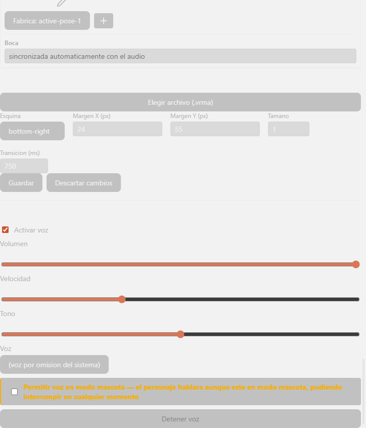

# Reacciones y voz — referencia

Referencia exhaustiva función por función y la tabla completa de las 83 entradas del catálogo. Ver el porqué y los flujos en [overview.md](./overview.md).

## Tabla completa: las 83 entradas de `REACTION_CATALOG`

Fuente: `src/reaction-catalog.ts`. `triggers: —` significa arreglo vacío (nunca se activa desde `resolveReaction`, ver overview). La columna **Nota real** transcribe el texto verbatim de `fallback` cuando existe, o el texto verbatim de `phrase` cuando la entrada sí puede hablar (marcado **[HABLA]**). Todas las prioridades son enteros; mayor número gana en el desempate por prioridad.

### Eje 1 — Estado mental (`MENTAL_STATE_REACTIONS`, 19 entradas)

| id | prioridad | triggers | speechPolicy | Nota real |
|---|---|---|---|---|
| `mental-neutral` | 5 | — | never | Estado base de reposo; es el punto de partida antes de cualquier reacción, no requiere evento propio. |
| `mental-concentrada` | 20 | `tool_started` | never | Comparte `tool_started` con `tecnica-explorando-el-proyecto` (32), que siempre gana por prioridad; nunca visible en el catálogo real. |
| `mental-pensativa` | 15 | `thinking` | never | Comparte `thinking` con `tecnica-planificando` (20), que siempre gana por prioridad; nunca visible en el catálogo real. |
| `mental-analizando` | 15 | — | never | Se infiere de una secuencia sostenida de thinking/tool_started, no de un evento discreto propio. |
| `mental-confundida` | 25 | — | optional | `unclassified` ya no dispara esta reacción (ruido de infraestructura/hooks no es "el agente no entendió"); sin evento propio de confusión real del agente. |
| `mental-dudosa` | 15 | — | never | Variante más suave de `mental-confundida`; sin evento propio que la distinga de ella. |
| `mental-sorprendida` | 20 | `interaction_required` | never | Comparte `interaction_required` con 3 reacciones de mayor prioridad (`interaccion-pidiendo-permiso` 95, `tecnica-esperando-permisos` 92, `interaccion-necesita-aclaracion` 85); nunca gana en el catálogo real. |
| `mental-alarmada` | 59 | `permission_denied` | never | `durationMs: 4000`. Sin `fallback` (sí se activa en la práctica). |
| `mental-preocupada` | 25 | — | never | Misma brecha que `mental-alarmada`: depende de severidad, no de tipo de evento. |
| `mental-cansada` | 10 | — | never | Ambiental por duración de sesión, no por evento discreto; fuera de alcance de este Hito. |
| `mental-aliviada` | 20 | — | never | Depende de éxito tras un fallo previo (payload success de `tool_finished`), no expresable por tipo de evento solo. |
| `mental-satisfecha` | 20 | — | never | Misma brecha que `mental-aliviada`: depende del payload success, no del tipo. |
| `mental-entusiasmada` | 15 | — | never | Ambiental; no hay evento discreto que distinga entusiasmo de éxito simple. |
| `mental-orgullosa` | 15 | — | never | Ambiental, sin evento propio. |
| `mental-curiosa` | 10 | `file_read` | never | Comparte `file_read` con `tecnica-leyendo-archivos` (prioridad 30); casi siempre pierde por prioridad y queda como variante de humor documentada. |
| `mental-impaciente` | 15 | — | never | Se asociaría a esperas largas medidas por temporizador, no por evento. |
| `mental-esperando` | 15 | — | never | Versión genérica de `interaccion-esperando-respuesta` y `tecnica-esperando-permisos`; sin evento propio. |
| `mental-dormida` | 20 | `session_finished` | never | `durationMs: 4000`. Comparte `session_finished` con `resultado-sesion-finalizada` (prioridad 45), que gana en la práctica. |
| `mental-despertando` | 20 | `session_started` | optional | Sin `fallback` (sí se activa en la práctica). |

### Eje 2 — Actividad técnica (`TECHNICAL_ACTIVITY_REACTIONS`, 19 entradas)

| id | prioridad | triggers | speechPolicy | Nota real |
|---|---|---|---|---|
| `tecnica-leyendo-archivos` | 30 | `file_read` | never | `cooldownMs: 3000`. Sin `fallback` (sí se activa en la práctica). |
| `tecnica-explorando-el-proyecto` | 32 | `tool_started` | never | `cooldownMs: 3000`. Sin `fallback` (sí se activa en la práctica; gana el desempate de `tool_started` genérico). |
| `tecnica-buscando-referencias` | 26 | `tool_started` | never | `tool_started` no distingue Grep de Glob de otras herramientas por tipo (solo por el campo `name`, fuera de lo que `triggers` filtra); suele perder frente a `tecnica-explorando-el-proyecto`. |
| `tecnica-analizando-dependencias` | 18 | `tool_started` | never | Misma limitación de `tool_started` genérico que `tecnica-buscando-referencias`. |
| `tecnica-planificando` | 20 | `thinking` | never | `cooldownMs: 3000`. Sin `fallback` (sí se activa en la práctica; gana el desempate de `thinking`). |
| `tecnica-escribiendo-codigo` | 30 | `file_modified` | never | `file_modified` no distingue creación de edición; compite con `resultado-cambio-aplicado` (40) y `tecnica-modificando-codigo` (35) por el mismo evento. |
| `tecnica-modificando-codigo` | 35 | `file_modified` | never | Comparte `file_modified` con `resultado-cambio-aplicado` (40), que siempre gana por prioridad; nunca visible en el catálogo real. |
| `tecnica-eliminando-codigo` | 25 | `file_modified` | never | `file_modified` no distingue creación/edición/eliminación por path; suele perder frente a `tecnica-modificando-codigo`. |
| `tecnica-ejecutando-comandos` | 30 | `command_started` | never | `cooldownMs: 3000`. Sin `fallback` (sí se activa en la práctica; gana el desempate de `command_started` genérico). |
| `tecnica-ejecutando-pruebas` | 28 | `command_started` | never | `command_started` no distingue un comando de pruebas de cualquier otro; suele perder frente a `tecnica-ejecutando-comandos`. |
| `tecnica-compilando` | 26 | `command_started` | never | Misma limitación que `tecnica-ejecutando-pruebas`. |
| `tecnica-instalando-dependencias` | 24 | `command_started` | never | Misma limitación que `tecnica-ejecutando-pruebas`. |
| `tecnica-revisando-errores` | 22 | `tool_started` | never | Misma limitación de `tool_started` genérico que `tecnica-buscando-referencias`. |
| `tecnica-comparando-cambios` | 16 | `tool_started` | never | Misma limitación de `tool_started` genérico. |
| `tecnica-generando-un-diff` | 14 | `tool_started` | never | Misma limitación de `tool_started` genérico. |
| `tecnica-esperando-una-herramienta` | 10 | — | never | No existe evento de "a punto de ejecutar"; `tool_started` ya significa que la herramienta arrancó, no que se espera. |
| `tecnica-esperando-permisos` | 92 | `interaction_required` | recommended | **[HABLA]** `phrase`: *"Estoy esperando que autorices este paso para continuar."* `interruptible: false`. Comparte `interaction_required` con `interaccion-pidiendo-permiso` (95); pierde por poco, decisión de framing deliberada (interpersonal sobre técnico). |
| `tecnica-reintentando` | 12 | — | never | `command_started` no distingue un primer intento de un reintento; no hay contador de intentos en el contrato de eventos. |
| `tecnica-recuperandose-de-un-error` | 20 | — | never | Se infiere de un `tool_finished` exitoso justo después de uno fallido; correlación entre eventos fuera de alcance de este Hito. |

### Eje 3 — Resultado (`RESULT_REACTIONS`, 14 entradas)

| id | prioridad | triggers | speechPolicy | Nota real |
|---|---|---|---|---|
| `resultado-operacion-exitosa` | 60 | `tool_finished` | optional | `durationMs: 5000`, `cooldownMs: 4000`. Rama "éxito" de la tabla de desempate por resultado del motor (`event.success`), no de triggers por tipo. |
| `resultado-pruebas-exitosas` | 55 | — | optional | `tool_finished` no distingue un comando de pruebas de otro exitoso; requeriría inspeccionar el comando ejecutado. |
| `resultado-compilacion-exitosa` | 55 | — | optional | Misma limitación que `resultado-pruebas-exitosas`. |
| `resultado-cambio-aplicado` | 40 | `file_modified` | never | `durationMs: 4000`, `cooldownMs: 3000`. Sin `fallback` (sí se activa en la práctica; gana el desempate de `file_modified`). |
| `resultado-advertencia` | 45 | — | optional | Ninguno de los 12 eventos reales representa una advertencia distinta de un fallo; requeriría un tipo de evento propio que no existe hoy. |
| `resultado-error-recuperable` | 58 | `tool_finished` | optional | `durationMs: 5000`, `cooldownMs: 4000`. Rama "fallo" de la misma tabla de desempate que `resultado-operacion-exitosa`. |
| `resultado-error-grave` | 85 | — | recommended | **[HABLA si se activara]** `phrase`: *"Algo salió mal y necesito que lo revises."* `interruptible: false`. No existe un evento "error" propio entre los 12 reales (el plan asumía uno que no llegó a implementarse en EPIC-002); distinguir "grave" de "recuperable" exige severidad de payload ausente hoy. |
| `resultado-comando-rechazado` | 50 | — | optional | `tool_finished` con `success: false` no distingue "rechazado" de cualquier otro fallo. |
| `resultado-permiso-concedido` | 40 | — | never | La resolución de una petición de permiso es una llamada saliente (`respondToPermissionRequest`), no llega como `NormalizedEvent`. |
| `resultado-permiso-denegado` | 40 | — | never | Misma razón que `resultado-permiso-concedido`. |
| `resultado-sesion-cancelada` | 35 | — | optional | `session_finished` no distingue cancelación de cierre normal sin leer `stop_reason`, que `triggers` (solo tipo) no puede expresar. |
| `resultado-sesion-finalizada` | 45 | `session_finished` | optional | `durationMs: 4000`. Sin `fallback` (sí se activa en la práctica; gana el desempate de `session_finished`). |
| `resultado-resultado-parcial` | 30 | — | never | Ambiguo por diseño: la consola es la fuente de verdad para resultados parciales (`research/avatar-and-tts.md`, eje Resultado); el avatar no lo comunica por evento propio. |
| `resultado-resultado-ambiguo` | 30 | — | never | Misma razón que `resultado-resultado-parcial`. |

### Eje 4 — Interacción con el usuario (`USER_INTERACTION_REACTIONS`, 11 entradas)

| id | prioridad | triggers | speechPolicy | Nota real |
|---|---|---|---|---|
| `interaccion-recibiendo-instruccion` | 15 | — | never | No hay evento que confirme la recepción; el primer evento real tras enviar una instrucción suele ser `thinking` o `assistant_message`, ya cubiertos por otras entradas. |
| `interaccion-no-entendio-la-instruccion` | 40 | — | optional | `cooldownMs: 3000`. `unclassified` ya no dispara esta reacción (Hallazgo 1): "no entendí" debe reservarse para cuando el agente no entiende una instrucción real del usuario, no para ruido de infraestructura (hooks u otros subtypes de sistema no reconocidos). |
| `interaccion-necesita-aclaracion` | 85 | `interaction_required` | recommended | **[HABLA]** `phrase`: *"No estoy segura de haber entendido, ¿me lo puedes aclarar?"* Comparte `interaction_required` con `interaccion-pidiendo-permiso` (95) y `tecnica-esperando-permisos` (92); pierde siempre por prioridad pese a estar semánticamente más cerca de "no entendí" que de "permiso". |
| `interaccion-esperando-respuesta` | 20 | — | never | Estado sostenido tras `interaction_required`, no un evento nuevo; el motor no recibe una señal de "sigo esperando". |
| `interaccion-mostrando-opciones` | 20 | — | never | El `NormalizedEvent` `interaction_required` es genérico (solo trae texto); la variante "choice" vive en el canal `InteractionRequest` (`onPermissionPending`), fuera del vocabulario de eventos que consume este Hito. |
| `interaccion-recibiendo-una-respuesta` | 15 | — | never | La resolución de una petición es una llamada saliente (`respondToPermissionRequest`), no un `NormalizedEvent` entrante. |
| `interaccion-agradeciendo` | 10 | — | never | Depende del contenido semántico del mensaje, no de su tipo; interpretar contenido es lógica de IA, fuera de ADR-0003. |
| `interaccion-confirmando-una-decision` | 10 | — | never | Misma razón que `interaccion-agradeciendo`. |
| `interaccion-advirtiendo-sobre-un-riesgo` | 80 | `interaction_required` | recommended | **[HABLA si se activara]** `phrase`: *"Antes de seguir, quiero advertirte de un riesgo en esto."* Comparte `interaction_required` con 3 reacciones de mayor prioridad (95/92/85); nunca gana en el catálogo real, aunque semánticamente distinta. |
| `interaccion-pidiendo-permiso` | 95 | `interaction_required` | required | **[HABLA]** `phrase`: *"Necesito tu autorización para continuar."* `interruptible: false`. Sin `fallback` (siempre gana el desempate de `interaction_required`). |
| `interaccion-celebrando-una-solucion` | 35 | — | optional | Depende de éxito confirmado (payload success); misma brecha que las entradas de éxito del eje Resultado. |

### Eje 5 — Presentación (`PRESENTATION_REACTIONS`, 19 entradas)

Ninguna entrada de este eje define `state`/`expression`; todas usan `animation` en su lugar (ver limitación en overview: `emit()` hoy no consume `animation`).

| id | prioridad | triggers | speechPolicy | Nota real |
|---|---|---|---|---|
| `presentacion-parpadeo` | 2 | — | never | Ambiental por temporizador propio (frecuencia natural de parpadeo); no dispara con `NormalizedEvent`, fuera de alcance de este Hito. |
| `presentacion-respiracion` | 2 | — | never | Misma razón que `presentacion-parpadeo`. |
| `presentacion-movimiento-leve-de-cabeza` | 2 | — | never | Ambiental, sin evento propio. |
| `presentacion-mirada-hacia-el-panel-de-actividad` | 3 | — | never | Matiz de presentación sin evento propio dedicado; se deja sin disparador para no inventarlo. |
| `presentacion-mirada-hacia-el-chat` | 3 | — | never | Misma razón que `presentacion-mirada-hacia-el-panel-de-actividad`. |
| `presentacion-senalar-una-tarjeta` | 3 | — | never | Ambiental/UI, sin evento propio. |
| `presentacion-sacar-una-notificacion` | 4 | — | never | Ambiental/UI, sin evento propio. |
| `presentacion-icono-de-alerta` | 4 | — | never | `durationMs: 1500`. Depende de severidad del resultado (payload); misma brecha que el eje Resultado. |
| `presentacion-icono-de-exito` | 4 | — | never | `durationMs: 1500`. Depende de éxito (payload success); misma brecha que el eje Resultado. |
| `presentacion-cambiar-iluminacion` | 2 | — | never | Efecto de escena del renderizador, no del avatar (`research/avatar-and-tts.md`, eje Presentación); además ambiental, sin evento propio. |
| `presentacion-cambiar-fondo` | 2 | — | never | Misma razón que `presentacion-cambiar-iluminacion`. |
| `presentacion-particulas-sutiles` | 2 | — | never | Efecto de renderizador, ambiental, sin evento propio. |
| `presentacion-efecto-de-escritura` | 30 | `assistant_message` | never | `cooldownMs: 1500`. Sin `fallback` (sí se activa en la práctica). |
| `presentacion-efecto-de-carga` | 12 | `tool_started`, `command_started` | never | `cooldownMs: 2000`. Comparte `tool_started`/`command_started` con reacciones técnicas de mayor prioridad (32/30 respectivamente); nunca gana en el catálogo real. |
| `presentacion-transicion-de-escena` | 2 | — | never | Se dispara al cambiar de personaje/pantalla, evento de UI ajeno a `NormalizedEvent`. |
| `presentacion-senal-de-atencion-en-modo-mascota` | 3 | — | never | Por la regla del paso 2.5 el motor nunca consulta el modo activo; solo la capa de presentación (fuera de este Hito) puede activar esta entrada. |
| `presentacion-burbuja-de-interaccion-pendiente` | 5 | `interaction_required` | never | Prioridad deliberadamente baja: acompaña a `interaccion-pidiendo-permiso` (95), nunca la reemplaza. |
| `presentacion-animar-sin-robar-el-foco` | 1 | — | never | Ambiental por diseño, sin evento propio. |
| `presentacion-reaccionar-al-clic-que-restaura-la-interfaz` | 1 | — | never | Es un handler de clic de UI, no un `NormalizedEvent`; no existe entre los 12 tipos reales. |

### Categoría de respuesta hablada (`SPOKEN_RESPONSE_REACTIONS`, 1 entrada)

| id | prioridad | triggers | speechPolicy | Nota real |
|---|---|---|---|---|
| `respuesta-hablada` | 65 | `assistant_turn_complete` | recommended | **[HABLA]** `durationMs: 3000`. `phrase` es una función: `(event) => event.type === 'assistant_turn_complete' ? event.text : ''` — el texto real del mensaje del agente, no un texto fijo. |

## Referencia función por función

### `src/reaction-catalog.ts`

| Símbolo | Tipo | Descripción |
|---|---|---|
| `ClaudeEventType` | tipo | Alias de `NormalizedEvent['type']`; los 13 tipos reales de evento. |
| `VALID_CLAUDE_EVENT_TYPES` | constante | Arreglo literal de los 13 valores válidos, usado por `validateCatalog`. |
| `SpeechPolicy` | tipo unión | `'never' \| 'optional' \| 'recommended' \| 'required'`. |
| `AvatarReactionDefinition` | interfaz | Forma de una entrada del catálogo: `id`, `triggers`, `priority`, `durationMs?`, `expression?`, `state?`, `animation?`, `speechPolicy`, `phrase?` (string o función de `NormalizedEvent` a string), `cooldownMs?`, `interruptible`, `fallback?`. |
| `REACTION_CATALOG` | constante exportada | Concatenación de los seis arreglos de eje, 83 entradas totales. |
| `validateCatalog(catalog)` | función | Devuelve los `id` de entradas cuyo `triggers` contiene algún tipo fuera de `VALID_CLAUDE_EVENT_TYPES`. No valida alcanzabilidad, solo validez de tipo. |

### `src/reaction-engine.ts`

| Símbolo | Tipo | Descripción |
|---|---|---|
| `SPEAKABLE_POLICIES` | constante | `Set` con `'required'` y `'recommended'`. `'optional'` queda fuera hasta que exista lógica de personalidad (comentario "paso 6.7 R7"). |
| `DEFAULT_GROUPING_WINDOW_MS` | constante | `2500`. Supuesto verificable (paso 2.4): agrupa ráfagas típicas de lecturas/herramientas sin sentirse lento. |
| `OUTCOME_REACTION_ID_BY_TRIGGER` | constante | Tabla de una sola clave (`tool_finished`) con `{ success, failure }` apuntando a los IDs de `resultado-operacion-exitosa`/`resultado-error-recuperable`. |
| `isOutcomeCarryingEvent(event)` | función | Type guard: `true` solo si `event.type === 'tool_finished'`. |
| `pickByOutcome(candidates, event)` | función | `null` si el evento no es "portador de resultado"; si lo es, busca en `candidates` el id esperado según `event.success`. |
| `pickHighestPriority(candidates)` | función | `reduce` que conserva el de mayor `priority`; en empate exacto, conserva el primero (orden de declaración del catálogo). |
| `resolveReaction(catalog, event)` | función pura exportada | Filtra por trigger → `pickByOutcome` → `pickHighestPriority`. `null` si no hay candidatos. |
| `ReactionEngineOptions` | interfaz | `groupingWindowMs?`, `now?` (inyectable para pruebas deterministas), `textToSpeech?`. |
| `ActiveReaction` | interfaz interna | `id`, `priority`, `interruptible`, `expiresAt` (`number \| null`). |
| `ReactionEngine` | clase exportada | Ver método público y privados abajo. |
| `ReactionEngine.handleEvent(event)` | método público | Único punto de entrada: expira → resuelve → chequea supresión → chequea activación → activa. |
| `ReactionEngine.expireActiveReaction()` | privado | Limpia `this.active` si `expiresAt` ya pasó. |
| `ReactionEngine.isSuppressed(reaction)` | privado | `true` si no pasó `max(groupingWindowMs, cooldownMs ?? 0)` desde el último disparo de esa misma reacción. |
| `ReactionEngine.canActivate(reaction)` | privado | `true` si no hay activa, o si la nueva tiene prioridad estrictamente mayor Y la activa es `interruptible`. |
| `ReactionEngine.activate(reaction, event)` | privado | Registra `lastFiredAt`, calcula `expiresAt`, llama a `emit`. |
| `ReactionEngine.emit(reaction, event)` | privado | Aplica `state`/`expression` al `AvatarController`, luego `speakIfAuthorized`. |
| `ReactionEngine.handleSpeakError(err)` | privado | `registerFailure('tts-error', message)` + `console.error`; nunca relanza. |
| `ReactionEngine.speakIfAuthorized(reaction, event)` | privado | Las 5 guardas descritas en overview.md; llama a `textToSpeech.speak(...)` con `.catch`. |

### `src/text-to-speech.ts`

| Símbolo | Tipo | Descripción |
|---|---|---|
| `TextToSpeech` | interfaz | `speak(text): Promise<void>`, `stop()`, `pause()`, `resume()`. |
| `persistVoiceEnabled(enabled, storage?)` / `loadVoiceEnabled(storage?)` | funciones | Persisten/leen `codetuver-avatar.voice.enabled`. `storage` inyectable para pruebas (default `window.localStorage`). |
| `VoiceSettings` | interfaz | `{ volume, rate, pitch, voiceURI }`. |
| `DEFAULT_VOICE_SETTINGS` | constante | `{ volume: 1, rate: 1, pitch: 1, voiceURI: null }`. |
| `persistVoiceSettings(settings, storage?)` / `loadVoiceSettings(storage?)` | funciones | JSON en `codetuver-avatar.voice.settings`; `loadVoiceSettings` hace merge sobre `DEFAULT_VOICE_SETTINGS` y cae a los defaults completos si el JSON está corrupto. |
| `persistAllowVoiceInPetMode(allow, storage?)` / `loadAllowVoiceInPetMode(storage?)` | funciones | Booleano en `codetuver-avatar.voice.allow-in-pet-mode`. |
| `SpeechQueueState` | interfaz | `{ queue: string[], lastAccepted: string \| null }`. |
| `createSpeechQueueState()` | función | Estado inicial vacío. |
| `acceptPhrase(state, phrase)` | función pura | `null` si `phrase === state.lastAccepted` (dedup de consecutivos); si no, nuevo estado con la frase encolada. |
| `dequeuePhrase(state)` | función pura | Extrae la primera frase de la cola (`{ phrase, next }`); `phrase: null` si la cola está vacía. |
| `clearSpeechQueue()` | función | Estado vacío, usado por `stop()`. |
| `armVoiceFault()` | función | Solo-dev: arma un fallo sintético que `speak()` consume una vez y relanza como error. |
| `consumeVoiceFault()` | función privada del módulo | Lee y resetea el flag de fallo armado. |
| `QaSpeechLogEntry` | interfaz | `{ text, voice, startedAt, endedAt }` — instrospección de QA sin oído humano. |
| `qaSpeechLog()` | función privada del módulo | `null` fuera de dev; en dev, devuelve (creando si falta) `window.__qaSpeechLog`. |
| `VoiceOption` | interfaz | `{ voiceURI, name, lang }` — una voz real del sistema/navegador. |
| `VoiceSnapshot` | interfaz | Estado reactivo completo expuesto a la UI: `enabled`, `volume`, `rate`, `pitch`, `voiceURI`, `voices`, `allowInPetMode`, `isSpeaking`, `queueLength`, `lastError`. |
| `WebSpeechTextToSpeech` | clase exportada | Implementa `TextToSpeech` y `MouthSyncSource`. Constructor recibe `SpeechSynthesis` inyectable (default `window.speechSynthesis`). |
| `.snapshot` | propiedad readonly | `readonly(this.state)` — snapshot de solo lectura para consumo de la UI. |
| `.refreshVoices()` | privado | Relee `synth.getVoices()`; recableado a `voiceschanged` en el constructor (las voces del navegador cargan async). Si el sistema operativo no tiene ninguna voz instalada, `voices` queda como `[]` sin error — el selector de `VoiceControls.vue` se queda solo con la opción `(voz por omisión del sistema)`. |
| `.setEnabled/.setVolume/.setRate/.setPitch/.setVoice/.setAllowVoiceInPetMode(valor)` | públicos | Mutan el snapshot reactivo y persisten a `localStorage` de inmediato. **No afectan una frase ya sonando**: `buildUtterance` lee el snapshot solo al construir el `SpeechSynthesisUtterance` de cada frase, así que un cambio de volumen/velocidad/tono/voz a mitad de una frase en curso solo se aplica a partir de la siguiente frase de la cola. |
| `.setPetMode(isPetMode)` | público | Sin caller conocido en el código actual (modo mascota real pendiente de EPIC-005). |
| `.onBoundary(cb)` / `.onSpeechEnd(cb)` | públicos (`MouthSyncSource`) | Suscriben/devuelven función de desuscripción; usados por `MouthSyncController`. |
| `.canSpeakNow()` | privado | `false` si `!enabled`, o si `isPetMode && !allowInPetMode`. |
| `.speak(text)` | público async | Ver flujo de 9 pasos en overview.md. |
| `.playNextIfIdle()` | privado | No-op si ya hay `this.current`; si no, saca de la cola y llama a `synth.speak(buildUtterance(...))`. |
| `.buildUtterance(text)` | privado | Construye `SpeechSynthesisUtterance` con los parámetros del snapshot y cablea `onboundary`/`onend`/`onerror`. |
| `.wireQaSpeechLog(utterance, text)` | privado | Encadena (no reemplaza) los handlers previos de `onstart`/`onend`/`onerror` para registrar tiempos en modo dev. |
| `.finishCurrent(errorMessage)` | privado | Limpia estado, notifica fin de habla, resuelve la promesa pendiente, y siempre reintenta `playNextIfIdle()`. |
| `.stop()` | público | `synth.cancel()`, resuelve TODAS las promesas pendientes (actual + encoladas), vacía la cola. |
| `.pause()` / `.resume()` | públicos | Delegan directo a `synth.pause()`/`synth.resume()`, sin lógica propia. |

### `src/mouth-sync.ts`

| Símbolo | Tipo | Descripción |
|---|---|---|
| `MouthSyncSource` | interfaz | `onBoundary(cb): unsub`, `onSpeechEnd(cb): unsub` — contrato que cualquier fuente de habla debe cumplir para sincronizar boca. |
| `MouthSyncSnapshot` | interfaz | `{ mouthOpen: boolean }`. |
| `DEFAULT_CLOSE_DELAY_MS` | constante | `180` (ms de silencio entre boundaries antes de cerrar la boca sola). |
| `MouthSyncController` | clase exportada | Constructor recibe una `MouthSyncSource` y un `closeDelayMs` opcional (default 180). |
| `.snapshot` | propiedad readonly | `{ mouthOpen }` reactivo de solo lectura. |
| `.openMouth()` | privado | `mouthOpen = true` + `scheduleClose()`. |
| `.scheduleClose()` | privado | Cancela temporizador previo y agenda cierre en `closeDelayMs`. |
| `.closeMouth()` | privado | `mouthOpen = false`, cancela temporizador. |
| `.clearTimer()` | privado | `clearTimeout` si hay temporizador pendiente. |
| `.dispose()` | público | Limpia temporizador y desuscribe de ambos eventos de la fuente. |

## UI: `VoiceControls.vue`

Componente de un solo `<section class="voice-controls">`, sin estado propio salvo `statusMessage` (mensaje transitorio tras activar/desactivar voz o detenerla). Recibe la instancia compartida de `WebSpeechTextToSpeech` como prop (`textToSpeech`) y lee/escribe directo sobre su `.snapshot`/métodos — no duplica estado.

| Control | Elemento | Comportamiento |
|---|---|---|
| Activar voz | `<input type="checkbox">` | `@change="toggleEnabled"` → `textToSpeech.setEnabled(checked)` + mensaje de estado ("Voz activada."/"Voz desactivada."). |
| Volumen | `<input type="range" min="0" max="1" step="0.1">` | Deshabilitado si `!enabled`. Muestra `Math.round(volume * 100)}%`. `@input="onVolume"` → `setVolume(Number(value))`. |
| Velocidad | `<input type="range" min="0.5" max="2" step="0.1">` | Deshabilitado si `!enabled`. Muestra `rate.toFixed(1)}x`. `@input="onRate"` → `setRate(...)`. |
| Tono | `<input type="range" min="0" max="2" step="0.1">` | Deshabilitado si `!enabled`. Muestra `pitch.toFixed(1)`. `@input="onPitch"` → `setPitch(...)`. |
| Voz | `<CustomSelect>` | Opciones = `[{ value: '', label: '(voz por omisión del sistema)' }, ...voces reales mapeadas a { value: voiceURI, label: 'nombre (lang)' }]`. Deshabilitado si `!enabled`. `@update:model-value="onVoice"` → `setVoice(value || null)` (cadena vacía se traduce a `null`, es decir, "voz por omisión"). |
| Permitir voz en modo mascota | `<input type="checkbox">` | Fila con borde izquierdo de advertencia (`--color-warning`) y texto en negrita: *"Permitir voz en modo mascota — el personaje hablará aunque esté en modo mascota, pudiendo interrumpir en cualquier momento"*. `@change="onAllowInPetMode"` → `setAllowVoiceInPetMode(checked)`. |
| Detener voz | `<button>` | Deshabilitado cuando `!isSpeaking && queueLength === 0` (nada sonando ni encolado). `@click="stopSpeaking"` → `textToSpeech.stop()` + mensaje "Voz detenida." |
| Mensaje de estado | `
` | Solo visible si `statusMessage` no es null; anuncia cambios a lectores de pantalla. |
| Mensaje de error | `
` | Solo visible si `textToSpeech.snapshot.lastError` no es null; muestra el último error real de síntesis. |

Se monta en dos puntos de `App.vue` (línea 2292 y línea 2360), ambos pasando la misma instancia de `textToSpeech` — nunca hay dos estados de voz independientes en pantalla a la vez, solo dos ubicaciones posibles según el layout activo (ver [presentacion-y-ventana](../presentacion-y-ventana/overview.md)).

## Consistencia verificada contra el código real

Durante la elaboración de este documento se releyeron íntegros los cinco archivos fuente del dominio (no solo `grep`), y se confirmó:

- Las 83 entradas suman exactamente 19+19+14+11+19+1, coincidiendo con los comentarios de conteo en el propio código fuente.
- Cada entrada con `triggers: []` o con prioridad perdedora documentada tiene un `fallback` no vacío explicando la brecha — no se encontró ninguna excepción real durante esta relectura completa.
- El `AvatarState`/`AvatarExpression` referenciados por el catálogo son alias de `string` (`src/avatar-controller.ts` líneas 3-4) — el catálogo no está acoplado a un enum cerrado de estados; cualquier string es válido en tiempo de compilación, la validez real la impone qué estados reconoce cada implementación de `AvatarController`/renderizador ([animacion-y-render](../animacion-y-render/overview.md)).
- No se encontró ninguna inconsistencia entre este documento y el código al momento de escribirlo (2026-09-14).
