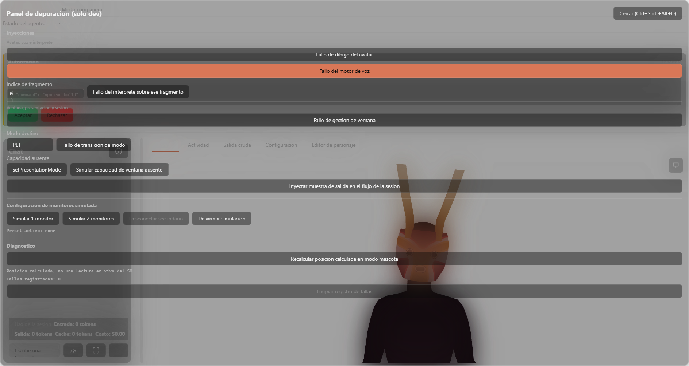

# Referencia — robustez y actualizaciones

## `src/failure-taxonomy.ts`

### Tipos

- `FailureOrigin` — unión de 8 strings literales: `'agente' | 'proceso' | 'comunicacion' | 'interpretacion' | 'voz' | 'avatar' | 'interfaz' | 'ventana'`.
- `FailureClass` — unión de 12 strings literales (ver overview.md).
- `FAILURE_CLASS_ORIGIN: Record<FailureClass, FailureOrigin>` — mapeo fijo, exhaustivo, sin excepción.
- `FailureLogEntry { origin, failureClass, message, timestamp }`.

### Funciones

- `registerFailure(failureClass: FailureClass, message: string): FailureLogEntry` — resuelve el origen desde el mapeo fijo, arma la entrada con `Date.now()`, la empuja al log en memoria (`reactive<FailureLogEntry[]>`) y la devuelve.
- `listFailures(): readonly FailureLogEntry[]` — devuelve el array reactivo tal cual (de solo lectura por tipo, no por `Object.freeze`).
- `clearFailureLog(): void` — `splice(0, length)` sobre el array reactivo (in-place, para no perder la reactividad — un array plano nuevo no dispararía los watchers de Vue, según el comentario real del código).

## `src/components/DebugPanel.vue`

### Props

- `onIncomingEvent: (event: NormalizedEvent) => void` — callback real que procesa un evento como si viniera del proceso de Claude Code; lo usa `injectSampleEvent`.

### Estado interno relevante

- `isOpen` — visibilidad del panel.
- `parseFaultIndex` — índice de fragmento a fallar en el intérprete.
- `transitionFaultMode` / `missingCapability` — selección de destino para las 2 inyecciones de ventana/presentación.
- `monitorPreset: 'none' | 'single' | 'dual'` — qué simulación de monitores está activa.
- `petPosition` — resultado de la última llamada a `recalculatePetPosition`.

### Funciones

- `handleShortcut(event)` — escucha `Ctrl+Shift+Alt+D` (togglea `isOpen`) y `Escape` (cierra si está abierto). Registrado en `window` solo si `import.meta.env.DEV`.
- `focusableElements()` / `trapFocus(event)` — mismo patrón de foco atrapado que `EditorModal.vue` (ver [ui-compartida](../ui-compartida/overview.md)), implementado localmente en vez de reusar el componente (este panel no usa `EditorModal` porque no es un modal centrado, es un panel fijo a los bordes de la ventana).
- `injectAvatarFault()` → `armAvatarDrawFault()` (`avatar-controller.ts`).
- `injectVoiceFault()` → `armVoiceFault()` (`text-to-speech.ts`).
- `injectParseFault()` → `armParseFault(parseFaultIndex.value)` (`content-interpreter.ts`).
- `injectWindowManagementFault()` → `armMissingWindowCapability('setPosition')` — proxy real: no existe un mecanismo genérico de "fallo de gestión de ventana" en `desktop-window-manager.ts`, así que se reusa la simulación de capacidad ausente sobre `setPosition` específicamente.
- `injectTransitionFault()` → `armPresentationTransitionFault(transitionFaultMode.value)` (`presentation-manager.ts`).
- `injectMissingCapability()` → `armMissingWindowCapability(missingCapability.value)`.
- `injectSampleEvent()` → llama `props.onIncomingEvent` con un `NormalizedEvent` fijo (`{type: 'assistant_message', text: 'Muestra de salida inyectada desde el panel de depuracion (TC-085).'}`).
- `armSingleMonitor()` / `armDualMonitors()` / `disconnectSecondaryMonitor()` / `clearMonitorSimulation()` → `armSimulatedMonitors(...)` (`monitor-position.ts`) con monitores sintéticos fijos (`SIMULATED_PRIMARY`/`SIMULATED_SECONDARY`, 1920×1080 y 1920×1080 con `scaleFactor:1.25` respectivamente).
- `recalculatePetPosition()` — `async`, llama `getCurrentMonitor()` real y calcula la posición con `calculateCornerPosition` usando las mismas constantes que `presentation-manager.ts` (`PET_WINDOW_CORNER`, `PET_WINDOW_MARGIN`, `PET_WINDOW_SIZE`) — es un cálculo, no una lectura en vivo de dónde está la ventana pet realmente.

### Constantes de UI

- `WINDOW_CAPABILITIES` — array literal con las 15 capacidades reales de `WindowCapability` (`setPresentationMode`, `setAlwaysOnTop`, `setTransparent`, `setBorderless`, `setPosition`, `setSize`, `setIgnoreMouseEvents`, `setFocusable`, `show`, `hide`, `minimize`, `restore`, `focus`, `getMonitors`, `getCurrentMonitor`).
- `PRESENTATION_MODES` — `['FULL', 'COMPANION', 'PET']`.

## `src/update-check.ts`

- `interface UpdateCheckOutcome { available: boolean; version: string | null }`.
- `buildUpdateNoticeText(outcome: UpdateCheckOutcome): string | null` — función pura. Devuelve `null` si `!outcome.available` o si `!outcome.version` (dato incompleto, nunca inventa un texto). Si ambos están presentes, arma: `` `Hay una version nueva disponible (v${outcome.version}). Usa "Descargar e instalar" para actualizar.` ``.
- `normalizeReleaseNotes(body: string | null | undefined): string | null` — función pura. `body?.trim()` y, si el resultado es falsy (ausente, vacío, solo espacios), devuelve `null`; si no, el texto recortado tal cual (markdown crudo del release de GitHub, sin transformar).

## Wiring real en `src/App.vue`

- `updateNotice = ref<string | null>(null)` (línea 195) — mismo patrón visual que `appSettingsNotice`.
- `updateReleaseNotes = ref<string | null>(null)` (línea 196) — body normalizado del release, `null` mientras no hay notas reales que mostrar.
- `pendingUpdate` (línea 197) — variable de módulo (no reactiva), guarda el objeto `Update` real que devuelve `check()` del plugin mientras el usuario decide si instalar.
- `checkForUpdateSilently()` (línea 201) — `async`, importa dinámicamente `@tauri-apps/plugin-updater`, llama `check()`, si `result?.available` arma `pendingUpdate`, `updateNotice.value` vía `buildUpdateNoticeText` y `updateReleaseNotes.value` vía `normalizeReleaseNotes(result.body)`. Cualquier error se captura y solo se loguea (`console.error`), nunca se propaga.
- `downloadAndInstallUpdate()` (línea 220) — si no hay `pendingUpdate` no hace nada; si lo hay, llama `pendingUpdate.downloadAndInstall()` y luego `relaunch()` (importado dinámicamente de `@tauri-apps/plugin-process`). Si falla, `updateNotice.value` se sobreescribe con el mensaje de error real (vía `errorMessage(err)`); `updateReleaseNotes` no se toca.
- Se invoca sin bloquear en el montaje: `void checkForUpdateSilently();` (línea 1612), justo después de `initializeAppSettings()`.
- Render (línea 1721): `
` con el ícono de advertencia, el texto (solo versión) y el botón "Descargar e instalar" que llama `downloadAndInstallUpdate`.
- Render de las release notes (línea 1732): `
` — reusa el renderer markdown sanitizado (`html:false`) y el interceptor de enlaces externos que ya usa el resto de contenido markdown de la app (consola de actividad, mensajes de chat); `.update-notes` (CSS) le agrega `max-height: 30vh; overflow-y: auto` sobre `.activity-console__markdown` para no desbordar el panel con un changelog largo.

## Configuración real del actualizador

- `src-tauri/Cargo.toml`: `tauri-plugin-updater = "2"`, `tauri-plugin-process = "2"`.
- `src-tauri/src/lib.rs`: `.plugin(tauri_plugin_updater::Builder::new().build())`, `.plugin(tauri_plugin_process::init())`.
- `src-tauri/tauri.conf.json`: `bundle.createUpdaterArtifacts: true`; `plugins.updater.pubkey` (llave pública Ed25519 real del proyecto); `plugins.updater.endpoints` = `["https://github.com/MiguelALRendon/CodeTuver/releases/latest/download/latest.json"]` (repositorio real; sin verificar en vivo hasta que exista al menos una release publicada, ver overview.md).
- La llave privada correspondiente vive en `.tauri-updater-keys/codetuver-avatar-updater.key` (ignorada por git, `.gitignore`) — nunca se commitea; perderla obliga a generar un par nuevo y a que todas las instalaciones existentes se reinstalen manualmente (el mecanismo de firma no tiene rotación).

## UI real — capturas pendientes

<!-- captura pendiente: la pantalla de sesion (antes de iniciar) mostrando el aviso "Hay una version nueva disponible" con su boton "Descargar e instalar" -- requiere simular una respuesta positiva de check() ya que el endpoint real es un placeholder. PENDIENTE: no se fabricó forzando el estado por no representar un flujo real disponible hoy en este entorno. -->

