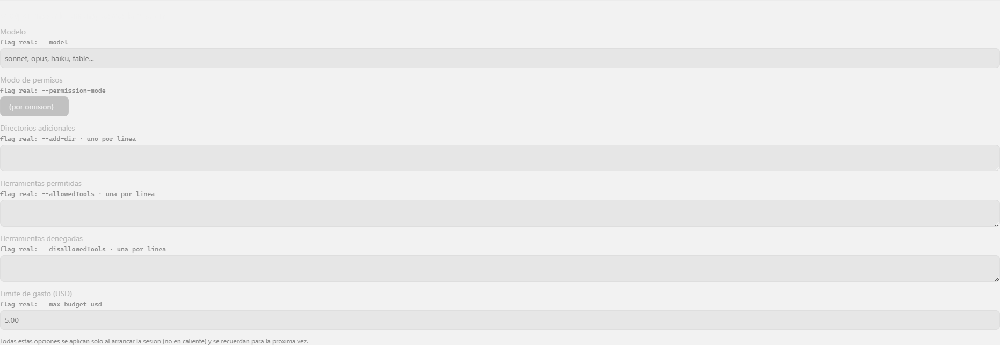
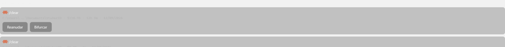
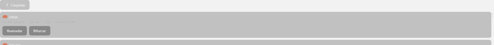

# Sesión y transporte — referencia

Referencia función por función y comando por comando del dominio [sesion-y-transporte](overview.md). Los tipos y funciones de administración de plugins/MCP que también viven físicamente en `src/claude-transport.ts` (líneas 175-287: `listPlugins`, `McpStatus`, `authenticateMcp`, etc.) pertenecen al dominio [administracion-y-configuracion](../administracion-y-configuracion/reference.md) y no se documentan aquí.

## `src/claude-transport.ts` — capa delgada sobre Tauri (frontend)

Es la única capa que el resto del frontend usa para hablar con el proceso real de Claude Code; ningún componente Vue llama a `invoke`/`listen` de Tauri directamente para esto (regla de arquitectura: "la presentación no sabe que es escritorio").

### Tipos

- `TransportErrorKind`: `'process-spawn-failed' | 'claude-code-not-found' | 'session-already-active' | 'session-not-active' | 'write-failed' | 'invalid-startup-options'`.
- `TransportError { kind: TransportErrorKind; message: string }`.
- `PermissionMode`: `'acceptEdits' | 'auto' | 'bypassPermissions' | 'manual' | 'dontAsk' | 'plan'` — los 6 modos reales, confirmados contra `claude --help` de la versión 2.1.263.
- `SessionStartOptions { model?, permissionMode?, addDir?: string[], allowedTools?: string[], disallowedTools?: string[], maxBudgetUsd?: number }`.
- `ResumeOptions { sessionId: string; fork: boolean }` — deliberadamente separado de `SessionStartOptions`: `SessionStartOptions` se persiste y se reaplica en cada arranque; "reanudar la sesión X" nunca debería recordarse para el siguiente arranque normal.
- `ClaudeActivity`: `{ kind: 'raw'; line: string } | { kind: 'invalid-line'; line: string; error: string }`.
- `SessionClosed { expected: boolean; exitCode: number | null }`.
- `NormalizedEvent`: unión discriminada de 12 variantes — `session_started`, `session_finished`, `assistant_message`, `assistant_turn_complete`, `thinking`, `file_read`, `file_modified`, `command_started`, `tool_started`, `tool_finished`, `interaction_required`, `permission_denied`, `unclassified`. Espejo TypeScript exacto del `ClaudeEvent` de Rust.
- `SessionPreference { lastWorkingDirectory: string; lastSessionId: string }`.
- `InteractionRequest`: unión de 5 variantes; 4 de ellas (`choice`, `open_question`, `confirmation`, `form`) no tienen ningún sitio en el código que las construya — quedan documentadas como formas posibles del tipo pero sin evento crudo confirmado que las dispare hoy. Ver [ui-compartida](../ui-compartida/reference.md) para el manejo real de interacciones.

### Funciones

| Función | Firma | Comando Tauri invocado | Notas |
|---|---|---|---|
| `startSession` | `(cwd: string, options?: SessionStartOptions, resume?: ResumeOptions) => Promise<void>` | `start_claude_session` | `options` por omisión `{}`; `resume` por omisión `null`. |
| `sendInstruction` | `(text: string) => Promise<void>` | `send_claude_instruction` | Envía un turno de usuario al proceso ya vivo. |
| `interruptSession` | `() => Promise<void>` | `interrupt_claude_session` | Interrumpe el turno en curso sin cerrar el proceso. |
| `closeSession` | `() => Promise<void>` | `close_claude_session` | Cierra el proceso hijo. |
| `onActivity` | `(handler: (activity: ClaudeActivity) => void) => Promise<UnlistenFn>` | escucha `claude-activity` | Línea cruda o línea inválida, sin normalizar. |
| `onStderr` | `(handler: (line: string) => void) => Promise<UnlistenFn>` | escucha `claude-stderr` | Incluye errores no fatales (p.ej. fallo al escribir preferencias). |
| `onSessionClosed` | `(handler: (closed: SessionClosed) => void) => Promise<UnlistenFn>` | escucha `session-closed` | Distingue cierre esperado de caída inesperada. |
| `onNormalizedEvent` | `(handler: (event: NormalizedEvent) => void) => Promise<UnlistenFn>` | escucha `claude-normalized-event` | El canal principal que consume [chat-y-contenido](../chat-y-contenido/reference.md). |
| `getLastSessionPreference` | `() => Promise<SessionPreference \| null>` | `get_last_session_preference` | `null` en el primer arranque de la app. |
| `onPermissionPending` | `(handler: (request: InteractionRequest) => void) => Promise<UnlistenFn>` | escucha `permission-request-pending` | Ver [ui-compartida](../ui-compartida/overview.md). |
| `respondToPermissionRequest` | `(requestId: string, allow: boolean, updatedInput?: unknown, message?: string) => Promise<void>` | `respond_to_permission_request` | — |

## `src/session-history.ts` — historial de sesiones pasadas (frontend)

| Símbolo | Firma / forma | Comando Tauri | Notas |
|---|---|---|---|
| `ModelUsage` | `{ inputTokens, outputTokens, cacheReadInputTokens, cacheCreationInputTokens, costUsd }` (todos `number \| null`) | — | Espejo TS del `ModelUsage` de Rust. |
| `SessionSummary` | `{ id, title, cwd, gitBranch, cliVersion, totalCostUsd, totalDurationMs, startTimeMs, modelUsage }` | — | Espejo TS del `SessionSummary` de Rust. |
| `listProjectFolders` | `() => Promise<string[]>` | `list_project_folders` | Ordenadas alfabéticamente; excluye scratchpads sintéticos. |
| `listProjectSessions` | `(folder: string) => Promise<SessionSummary[]>` | `list_project_sessions` | Una llamada por carpeta; no pagina. |
| `TranscriptEntry` | `{ role: 'person' \| 'agent'; text: string }` | — | — |
| `readSessionTranscript` | `(folder: string, sessionId: string) => Promise<TranscriptEntry[]>` | `read_session_transcript` | Solo turnos principales con texto real. |
| `readSessionActivityEvents` | `(folder: string, sessionId: string) => Promise<NormalizedEvent[]>` | `read_session_activity_events` | Reusa el mismo `normalize()` que el streaming en vivo. |

## `src/session-history-format.ts` — formateo puro (sin I/O)

Todas las funciones son puras (mismo input, mismo output, sin efectos secundarios) y sin dependencia de locale del sistema operativo (evita `toLocaleDateString`, no determinista entre máquinas).

| Función | Firma | Comportamiento en bordes |
|---|---|---|
| `formatSessionDuration` | `(durationMs: number \| null) => string` | `null` → `"duracion desconocida"`. Formatea como `Xh Ym`, `Xm` o `Xs` según la magnitud. |
| `formatSessionCost` | `(costUsd: number \| null) => string` | `null` → `"costo desconocido"`. Si no, `$X.XX`. |
| `totalSessionTokens` | `(modelUsage: Record<string, ModelUsage> \| null) => number \| null` | `null` si no hay `modelUsage`; suma input+output de todos los modelos. |
| `formatTokenCount` | `(total: number \| null) => string` | `null` → `"tokens desconocidos"`; abrevia a `M`/`K` sobre 1 millón / 1 mil. |
| `formatSessionTokens` | `(modelUsage) => string` | Compone `totalSessionTokens` + `formatTokenCount`. |
| `formatSessionDate` | `(startTimeMs: number \| null) => string` | `null` → `"fecha desconocida"`. Formato manual `DD/MM/AAAA`. |
| `truncateSessionTitle` | `(title: string \| null) => string` | Sin título → `"Sesion sin titulo"`. Si el título es una invocación de comando (`parseCommandInvocationTags`), muestra `/nombre-comando` en vez del texto completo. Colapsa espacios/saltos de línea; trunca a 80 caracteres con `…`. |
| `sortSessionsByDateDescending` | `<T extends SessionSummary>(sessions: readonly T[]) => T[]` | Sesiones sin `startTimeMs` se tratan como `0` (van al final). |
| `pickRecentSessionsAcrossFolders` | `(sessionsByFolder: readonly FolderSessions[], limit: number) => SessionSummaryWithFolder[]` | Aplana todas las carpetas, ordena por fecha descendente, corta a `limit`. |
| `cwdToProjectFolder` | `(cwd: string) => string` | Reemplaza `\`, `/`, `:` y espacio por `-`. |
| `describeProjectFolder` | `(folder: string) => string` | Inversa best-effort: solo reconstruye si detecta el prefijo de unidad (`^[A-Za-z]--`); ambigua si el segmento original tenía un guion literal. |
| `truncateProjectFolderSegments` | `(readablePath: string) => string` | Si hay más de `PROJECT_FOLDER_DISPLAY_MAX_SEGMENTS` (4) segmentos, conserva los primeros 2 y últimos 2 con `...` en medio. |
| `formatProjectFolderDisplay` | `(folder: string) => string` | Compone `describeProjectFolder` + `truncateProjectFolderSegments`; es lo que se muestra en la tarjeta de carpeta y en el meta de cada sesión. |

## `src/session-start-options.ts` — borrador de opciones de arranque

| Símbolo | Firma / forma | Notas |
|---|---|---|
| `PERMISSION_MODES` | `readonly PermissionMode[]` | Los 6 valores de `PermissionMode`, en el orden en que se listan en el `CustomSelect`. |
| `SessionStartOptionsDraft` | `{ model: string; permissionMode: PermissionMode \| ''; addDir: string; allowedTools: string; disallowedTools: string; maxBudgetUsd: string }` | Forma "todo texto plano" para enlazar con `<input>`/`<textarea>`; distinta de `SessionStartOptions`. |
| `emptyStartOptionsDraft` | `() => SessionStartOptionsDraft` | Todos los campos en cadena vacía. |
| `StartOptionsValidationError` | `{ field: keyof SessionStartOptionsDraft; message: string }` | — |
| `validateStartOptionsDraft` | `(draft) => StartOptionsValidationError[]` | Único campo validado hoy: `maxBudgetUsd` — si no está vacío, debe parsear a un número finito y positivo. Mismo criterio que la validación real en Rust (frontera de confianza duplicada a propósito). |
| `buildSessionStartOptions` | `(draft) => SessionStartOptions` | Recorta espacios; convierte los `<textarea>` multilínea en arreglos (`splitLines`, descarta líneas vacías); omite cualquier campo vacío del objeto resultante en vez de enviarlo como cadena vacía. |
| `draftFromSessionStartOptions` | `(options: SessionStartOptions \| undefined) => SessionStartOptionsDraft` | Inversa de `buildSessionStartOptions`; `undefined` → `emptyStartOptionsDraft()`. |

## `src/session-start-retry.ts`

| Función | Firma | Comportamiento |
|---|---|---|
| `isSessionAlreadyActive` | `(err: unknown) => err is TransportError` | Type guard: `true` solo si `err` es objeto no nulo con `kind === 'session-already-active'`. |
| `startSessionWithRetry` | `(attemptStart: () => Promise<void>, closeStaleSession: () => Promise<void>) => Promise<void>` | Intenta `attemptStart()`. Si falla con cualquier error que NO sea `session-already-active`, relanza el error tal cual. Si es `session-already-active`, llama `closeStaleSession()` y reintenta `attemptStart()` **una sola vez** — un segundo fallo se propaga sin más reintentos. |

## `src/session-hot-options.ts`

| Símbolo | Firma / forma | Notas |
|---|---|---|
| `EFFORT_LEVELS` | `['low', 'medium', 'high', 'xhigh', 'max'] as const` | Única opción del carril caliente con cambio de estado confirmado contra un proceso real. |
| `EffortLevel` | `(typeof EFFORT_LEVELS)[number]` | — |
| `buildEffortCommand` | `(level: EffortLevel) => string` | Devuelve `` `/effort ${level}` ``. |
| `EffortChangeConfirmation` | `'confirmed' \| 'unknown'` | — |
| `parseEffortChangeConfirmation` | `(responseText: string) => EffortChangeConfirmation` | `'confirmed'` solo si el texto matchea `/set effort level to/i`; si no, `'unknown'` (nunca asume éxito por ausencia de error). |

## `src/session-transcript.ts`

| Función | Firma | Comportamiento |
|---|---|---|
| `transcriptToChatEntries` | `(entries: readonly TranscriptEntry[]) => ChatEntry[]` | Turnos `person` pasan a `{ role: 'person', text }`; turnos `agent` se envuelven como un único bloque `paragraph` (`{ role: 'agent', blocks: [{ type: 'paragraph', text }] }`). Ver [chat-y-contenido](../chat-y-contenido/reference.md) para `ChatEntry`. |

## `src-tauri/src/claude_transport.rs` (backend, 1179 líneas) — puntos relevantes a este dominio

Contiene el spawn real del proceso hijo, la escritura por stdin, el lector async de stdout (`read_stdout`) y los comandos Tauri `start_claude_session`, `send_claude_instruction`, `interrupt_claude_session`, `close_claude_session`. Puntos documentados aquí:

- `read_stdout(app, stdout, raw_log, cwd)` (línea 332): por cada línea de stdout — la anexa al registro crudo si hay uno activo (best-effort, un fallo emite `claude-stderr` pero no detiene el bucle), la normaliza (`normalize(&line)`) y la emite como `claude-normalized-event`, llama a `persist_session_started` y a `register_permission_request_if_present`, y reemite la línea cruda vía `emit_activity_line`.
- `persist_session_started(app, cwd, event)` (línea 356): solo actúa sobre la variante `ClaudeEvent::SessionStarted`; construye un `SessionPreference { last_working_directory: cwd, last_session_id: session_id }` y lo escribe en `preferences.json` (dentro de `app_data_dir()`) mediante `session_preferences::write_preference`, ejecutado en `tokio::task::spawn_blocking` para no bloquear el hilo async que lee stdout. Un fallo de escritura emite `claude-stderr` pero no aborta la sesión.

## `src-tauri/src/event_normalizer.rs` (628 líneas)

Expone `normalize(line: &str) -> ClaudeEvent` y el enum `ClaudeEvent` (espejo Rust de `NormalizedEvent`). Traduce el JSON crudo real del CLI (esquema evolutivo, no controlado por esta app) a las 12 variantes cerradas. Una línea no reconocida cae a la variante `Unclassified` en vez de fallar. Las pruebas de este módulo usan fixtures de líneas reales capturadas de ejecuciones del CLI, no JSON construido a mano.

## `src-tauri/src/raw_log.rs` (195 líneas)

Expone `RawLogWriter`, con un método `append(&self, line: &str) -> io::Result<()>` async, seguro ante múltiples llamadas concurrentes (cubierto por pruebas de concurrencia — varias tareas anexando a la vez no corrompen el archivo ni pierden líneas). Existe para cumplir la regla de arquitectura "la salida cruda se escribe antes de interpretarla y sobrevive a cualquier fallo del intérprete".

## `src-tauri/src/session_preferences.rs` (122 líneas)

| Símbolo | Firma / forma | Notas |
|---|---|---|
| `SessionPreference` | `{ last_working_directory: String, last_session_id: String }` (`camelCase` en JSON) | — |
| `preferences_path` | `(app_data_dir: &Path) -> PathBuf` | Siempre `<app_data_dir>/preferences.json`. |
| `read_preference` | `(app_data_dir: &Path) -> Option<SessionPreference>` | `None` si el archivo no existe, está vacío o es JSON inválido — nunca falla, nunca hace panic. |
| `write_preference` | `(app_data_dir: &Path, preference: &SessionPreference) -> io::Result<()>` | Crea el directorio si falta (`create_dir_all`) antes de escribir. |
| `get_last_session_preference` (comando Tauri) | `(app: AppHandle<R>) -> Option<SessionPreference>` | `None` si no se puede resolver `app_data_dir()` o si `read_preference` devuelve `None`. |

Nota real confirmada por prueba (`ruta_guardada_que_ya_no_existe_en_disco_se_lee_igual_sin_validarla_aqui`): la ruta guardada se lee y devuelve tal cual **sin verificar que siga existiendo en disco** — la validación de que la carpeta sigue siendo válida ocurre al intentar arrancar una sesión ahí, no en esta capa.

## `src-tauri/src/session_history.rs` (580 líneas) — comandos de historial

Constante: `TAIL_READ_CAP_BYTES = 256 * 1024` — nunca se carga un archivo `.jsonl` entero (hay sesiones reales de hasta 3MB); esta cota alcanza de sobra para una sola línea de `cost-state`, incluso con varios modelos.

| Símbolo | Firma / forma | Notas |
|---|---|---|
| `ModelUsage` (Rust) | `{ input_tokens, output_tokens, cache_read_input_tokens, cache_creation_input_tokens, cost_usd }` (`Option` cada uno) | `camelCase` al serializar. |
| `SessionSummary` (Rust) | `{ id, title, cwd, git_branch, cli_version, total_cost_usd, total_duration_ms, start_time_ms, model_usage }` | `camelCase` al serializar; espejo de `SessionSummary` en TS. |
| `claude_config_dir` | `<R: Runtime>(app: &AppHandle<R>) -> Option<PathBuf>` | Prioriza `CLAUDE_CONFIG_DIR` si está definida y no en blanco; si no, `<home>/.claude`. |
| `projects_dir` | `<R: Runtime>(app) -> Option<PathBuf>` | `<claude_config_dir>/projects`. |
| `is_scratchpad_project_folder` | `(name: &str) -> bool` | `true` si el nombre **contiene** (no requiere que termine en) tanto `"AppData-Local-Temp-claude-"` como `"-scratchpad"` — un nombre con ese substring en medio también califica. |
| `list_project_folders_in` | `(dir: &Path) -> Vec<String>` | Filtra scratchpads, ordena alfabéticamente; directorio inexistente → `Vec` vacío sin error. |
| `list_project_folders` (comando Tauri) | `<R: Runtime>(app) -> Vec<String>` | — |
| `list_session_files_in` | `(dir: &Path) -> Vec<PathBuf>` | Solo archivos con extensión `.jsonl`, ordenados. |
| `list_project_sessions` (comando Tauri) | `<R: Runtime>(app, folder: String) -> Vec<SessionSummary>` | Una lectura de resumen por archivo de sesión encontrado. |
| `extract_text_content` | `(content: &Value) -> Option<String>` | Maneja ambas formas reales del campo `content`: string plano, o arreglo de bloques (toma solo los de `type: "text"`, los une con `\n`). Cadena vacía (tras `trim`) → `None`. |
| `transcript_role` | `(message_role: &str) -> Option<&'static str>` | `"user"` → `"person"`, `"assistant"` → `"agent"`, cualquier otro → `None` (se omite el turno). |
| `read_transcript_entries` | `(path: &Path) -> Vec<TranscriptEntry>` | Excluye `isSidechain: true` e `isMeta: true`; turnos sin texto extraíble se omiten. |
| `read_session_transcript` (comando Tauri) | `<R: Runtime>(app, folder: String, session_id: String) -> Vec<TranscriptEntry>` | — |
| `is_main_thread_line` | `(line: &str) -> bool` | Una línea que no parsea como JSON se trata como `true` (se conserva) — solo se excluye lo explícitamente marcado como sidechain/meta. |
| `read_activity_events` | `(path: &Path) -> Vec<ClaudeEvent>` | Reusa exactamente `event_normalizer::normalize` — el mismo parser que el streaming en vivo, para que la consola de Actividad al reanudar no tenga un segundo camino de interpretación divergente. |
| `read_session_activity_events` (comando Tauri) | `<R: Runtime>(app, folder: String, session_id: String) -> Vec<ClaudeEvent>` | — |
| `session_id_from_path` | `(path: &Path) -> String` | El nombre de archivo sin extensión (`file_stem`). |
| `read_session_summary` | `(path: &Path) -> SessionSummary` | Nunca propaga un fallo de parseo: cada campo cae a `None` de forma independiente; la sesión nunca deja de listarse por eso. |
| `extract_title` | `(user_line: &Value) -> Option<String>` | `None` si el contenido, tras `trim`, queda vacío. |
| `extract_model_usage` | `(value: &Value) -> Option<HashMap<String, ModelUsage>>` | Un `modelUsage: {}` real se distingue de ausente: devuelve `Some(HashMap::new())`, no `None`. |
| `is_useful_user_line` | `(line: &Value) -> bool` | `type == "user"` y `isMeta != true`. |
| `find_first_useful_user_line` | `(path: &Path) -> Option<Value>` | Recorre desde el principio; **se detiene en la primera coincidencia** — nunca lee el archivo completo si no hace falta. |
| `find_last_cost_state` | `(path: &Path) -> Option<Value>` | Lee solo la cola del archivo (`TAIL_READ_CAP_BYTES`, vía `seek(SeekFrom::End(...))`); usa `String::from_utf8_lossy` (el corte puede caer a mitad de un carácter multibyte al principio del buffer — esa primera línea parcial se descarta). Solo devuelve `Some` si la última línea no vacía es de `type: "cost-state"`. |

## UI: `SessionStartOptionsPanel.vue`

Componente de formulario (sin estado propio de red; usa `defineModel<SessionStartOptionsDraft>()` para enlace bidireccional con el padre) montado dentro del panel de administración como un `
` colapsable ("Opciones de arranque de la sesión").

Campos, en orden de aparición:
1. **Modelo** — `<input type="text">`, placeholder `"sonnet, opus, haiku, fable..."`. Pista visible: `flag real: --model`.
2. **Modo de permisos** — `CustomSelect` con las opciones `(por omision)` + los 6 valores de `PERMISSION_MODES`. Pista: `flag real: --permission-mode`.
3. **Directorios adicionales** — `<textarea>`, una ruta por línea. Pista: `flag real: --add-dir`.
4. **Herramientas permitidas** — `<textarea>`, una por línea. Pista: `flag real: --allowedTools`.
5. **Herramientas denegadas** — `<textarea>`, una por línea. Pista: `flag real: --disallowedTools`.
6. **Límite de gasto (USD)** — `<input type="text">`, placeholder `"5.00"`. Muestra un mensaje de error (`role="alert"`) debajo si `validateStartOptionsDraft` reporta un problema en este campo.
7. Nota fija al pie: "Todas estas opciones se aplican solo al arrancar la sesión (no en caliente) y se recuerdan para la próxima vez."

## UI: `SessionHistoryExplorer.vue`

Explorador de historial con dos vistas internas (`view: 'folders' | 'sessions'`), montado normalmente dentro del panel de administración o de un modal dedicado a "Historial".

**Vista `'folders'` (inicial, al montar el componente):**
- Sección "Sesiones recientes" (siempre visible primero): hasta 5 (`RECENT_SESSIONS_LIMIT`) sesiones más nuevas **de todas las carpetas combinadas**, cargadas con `loadRecentSessions` tras `loadFolders`. Cada tarjeta muestra: ícono `claude` (color `--color-accent-primary`) + título truncado, luego una línea de meta con carpeta / costo / duración / fecha separados por `·`. Si `session.cwd` existe, muestra botones **Reanudar** y **Bifurcar** (emiten `resume-session` con `fork: false`/`true` respectivamente); si no hay `cwd` registrado, muestra el texto "Sin carpeta real registrada -- no se puede reanudar." en su lugar.
- Rejilla de carpetas debajo: un botón por carpeta (ícono `folder` + nombre formateado con `formatProjectFolderDisplay`), en una grilla responsive (`auto-fill, minmax(9rem, 1fr)`). Click → `openFolder(folder)`, que cambia a la vista `'sessions'`.
- Estados de carga: "Cargando sesiones recientes..." / "Sin sesiones recientes." y "Cargando carpetas..." / "Sin historial de sesiones previas." — todos con `role="status"`.

**Vista `'sessions'` (tras elegir una carpeta):**
- Cabecera con botón "Carpetas" (ícono `chevronLeft`) que vuelve a la vista de carpetas (`backToFolders`, limpia `sessions` y `activeFolder`).
- Lista de sesiones de esa carpeta, ordenadas por fecha descendente (`sortSessionsByDateDescending`). Cada tarjeta: ícono `claude` + título truncado, meta con tokens/costo/duración/fecha, y los mismos botones Reanudar/Bifurcar condicionados a `cwd`.
- Estado vacío: "Esta carpeta no tiene sesiones registradas."

Evento emitido por el componente: `resume-session` con la firma `[cwd: string, sessionId: string, fork: boolean, folder: string]` — consumido por `App.vue` para llamar a `resumeSession(...)`.

## Panel: "Retomar última carpeta" (en `App.vue`)

Cuando existe una `SessionPreference` guardada (`lastPreference`, cargada una vez al montar la app vía `getLastSessionPreference()`), la pantalla de selección de carpeta muestra un botón adicional "Retomar `<ruta>`" que llama a `retomarUltimaCarpeta()` — esto arranca una sesión **nueva** en esa carpeta (`beginSession`), no reanuda el `sessionId` guardado.

