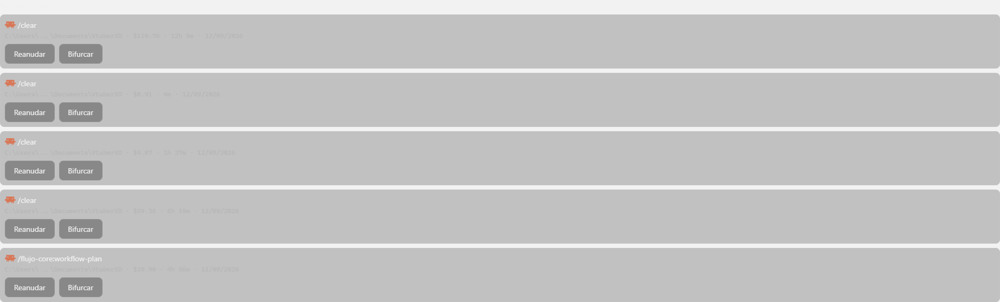
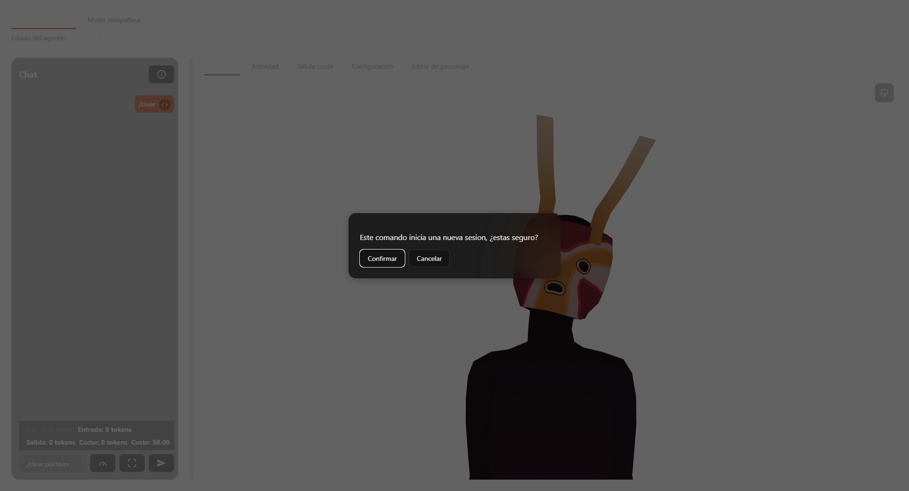

# UI compartida

> Componentes y utilidades sin lógica de negocio propia, reusados por varios de los demás dominios. Ninguno sabe qué es un personaje, una sesión o una reacción — solo resuelven un problema de interfaz genérico.

## Qué cubre este dominio

- `CustomSelect.vue` — desplegable propio (sin `<select>` nativo), en dos modos.
- `EditorModal.vue` — diálogo modal genérico con foco atrapado.
- `ScrollableListPanel.vue` — layout de panel con cabecera fija + lista con scroll + pie fijo.
- `IconGlyph.vue` + `src/icons.ts` — sistema de iconos SVG inline propio, sin librería.
- `src/error-message.ts` — normalización de errores de cualquier forma a un string mostrable.
- `src/external-link-click.ts` — interceptor de clics en enlaces generados por markdown.
- `src/chat-draft-markdown.ts` — el renderer de markdown compartido (ver también [chat-y-contenido](../chat-y-contenido/overview.md), que documenta su uso en el flujo de chat).
- La pila de overlays modales de `App.vue` (`commands-overlay`), que es el patrón visual que varios diálogos ad-hoc de `App.vue` comparten sin pasar por `EditorModal`.

Ninguno de estos archivos tiene `.spec.ts` de componente propio — ver la nota de exención de pruebas de componente en [arquitectura-general](../arquitectura-general/reference.md). `error-message.ts` y `chat-draft-markdown.ts` sí son funciones puras con `.spec.ts` real, al no ser componentes `.vue`.

## `CustomSelect.vue` — dos modos reales, un solo componente

No es un desplegable genérico de propósito único: tiene **dos modos de operación** controlados por la prop `inline`, porque dos consumidores reales necesitan comportamiento de teclado distinto:

- **Modo trigger** (`inline: false`, el modo por defecto) — un botón que abre/cierra un listbox flotante (`position: absolute`, anclado al padre relativo — ver comentario D9 en el propio archivo sobre por qué no usa CSS anchor positioning nuevo). El propio componente gestiona el índice activo, `ArrowUp`/`ArrowDown`/`Home`/`End`/`Enter`/`Escape`, y el cierre al perder foco (`focusout`, solo si el nuevo foco cae fuera del `rootEl`). Usado por: `SessionStartOptionsPanel.vue` (selector de modo de permiso), `DebugPanel.vue`, `PoseEditor.vue`, `VoiceControls.vue`, `CharacterEditor.vue`, y varios selectores dentro de `App.vue`.
- **Modo inline** (`inline: true`) — el listbox se renderiza siempre visible (sin botón trigger), y la navegación de teclado NO la maneja el componente: el padre (el composer del chat, para el listbox de comandos slash) es quien escucha las flechas sobre su propio `<textarea>` y le pasa el índice activo por la prop `activeIndex`. Este modo existe únicamente para el listbox de comandos slash de `App.vue` — ver [chat-y-contenido](../chat-y-contenido/overview.md).

`Home`/`End` en modo trigger van directo al primer/último índice — **no envuelven** (no hay wraparound de `End` a `0` ni de `Home` al último). `ArrowUp`/`ArrowDown` sí usan `nextCommandIndex` (de `../slash-commands`, compartida con el modo inline del composer) para decidir si envuelven.

`selectOption` usa `@mousedown.prevent` (no `@click`) sobre cada `<li>` — evita que el `blur` del trigger dispare antes que el `mousedown` registre la selección, un orden de eventos real del navegador que rompería la selección con un `@click` normal.

## `EditorModal.vue` — diálogo modal genérico

Un modal con:
- **Trampa de foco real** (`trapTab`): calcula los elementos enfocables dentro del panel (`button, input, select, [tabindex]:not([tabindex="-1"])`) en cada `Tab`, y envuelve manualmente del último al primero y viceversa.
- **Cierre por Escape**: emite `close` (el padre decide si de verdad cierra — el modal no se autocierra).
- **Devolución de foco real**: al montar, guarda `document.activeElement`; al desmontar, le devuelve el foco. No es una convención documental — es código que corre en cada apertura/cierre.
- **`role`**: `dialog` por defecto, o `alertdialog` vía prop — quien lo usa decide cuál corresponde semánticamente, el componente no lo infiere.
- Se monta con `<Teleport to="body">`, fuera del árbol del padre — necesario porque su overlay es `position: fixed; inset: 0`.

Consumidores reales: `App.vue` y `CharacterEditor.vue`. Ambos son los únicos dos lugares del código que usan `<EditorModal>` — cualquier otro diálogo modal de la aplicación (importar personaje, aviso de `/clear`, detalle de uso, popup de tema) usa el patrón `commands-overlay` inline de `App.vue` en su lugar (ver más abajo), no este componente.

## `ScrollableListPanel.vue` — layout de lista con scroll

Estructura de 3 franjas: cabecera fija (`slot="header"`, opcional), cuerpo con scroll (`slot="list"`, o un indicador de carga con spinner si `loading` es verdadero), y pie fijo (`slot="footer"`, opcional). No tiene lógica más allá de decidir cuál de los tres slots renderizar — todo el contenido real lo aporta quien lo usa.

Consumidores reales: `App.vue`, `AdminSettingsPanel.vue`, `SessionHistoryExplorer.vue` (ver [sesion-y-transporte](../sesion-y-transporte/overview.md), [administracion-y-configuracion](../administracion-y-configuracion/overview.md)).

## Sistema de iconos (`icons.ts` + `IconGlyph.vue`)

Decisión explícita registrada en el propio código (comentario D10/D13 en `icons.ts`): **sin librería de iconos**, porque el volumen real del proyecto es menor a 20 iconos distintos — paths SVG inline a mano son más baratos que una dependencia nueva. A la fecha de esta documentación el registro `ICONS` tiene 19 entradas, de las cuales 16 se renderizan a trazo (`STROKE_ICONS`) y 3 sólidas por relleno (`send`, `play`, `claude`).

- **`IconGlyph.vue`** es el único componente que renderiza un icono: recibe `name: IconName` (tipo derivado de `keyof typeof ICONS`, así que un nombre inexistente es un error de compilación TypeScript, no un fallo en tiempo de ejecución) y un `label` opcional (si se pasa, el `<svg>` toma `role="img"` y `aria-label`; si no, `aria-hidden="true")`.
- Cada icono es **o bien de relleno sólido, o bien de trazo** — nunca ambos — decidido por pertenencia al `Set` `STROKE_ICONS`. `isStrokeIcon(name)` es la única función de decisión; `IconGlyph.vue` la usa para elegir entre `fill="currentColor"` (con `fill-rule="evenodd"` fijo, ver abajo) o `stroke="currentColor"` con `stroke-width="2"` y extremos/uniones redondeados.
- **Todos los iconos usan `currentColor`** — ninguno tiene un color de marca fijo en el path. El único que visualmente parece tener un color de marca (`claude`, la marca real de Claude Code) lo logra porque el componente que lo consume (`SessionHistoryExplorer.vue`) le aplica `color: var(--color-accent-primary)` por CSS — y ese token ya es, por coincidencia numérica exacta, el naranja de marca `#D97757` (`rgb(217 119 87)`), documentado en [arquitectura-general](../arquitectura-general/overview.md). El icono `claude` reemplazó una silueta genérica de "sunburst" que ocupaba esa clave mientras no existía el asset de marca real (evitaba riesgo de marca antes de tenerlo) — la silueta genérica ya no existe en el código, solo queda el comentario que documenta por qué el path cambió.
- `fill-rule="evenodd"` en el `<path>` de `IconGlyph.vue` **no es condicional** — se aplica siempre, incluso a iconos de trazo (donde no tiene efecto visible porque no hay relleno). Es necesario específicamente para que los cortes internos del logo `claude` se rendericen como agujeros y no como relleno sólido; se confirmó que no rompe la geometría de ningún otro icono existente (ninguno tiene subtrazados que se autointersequen de forma que `evenodd` cambie su apariencia).

## Normalización de errores (`error-message.ts`)

Una sola función pura, `errorMessage(err: unknown): string`, usada en **más de 20 sitios reales** del código (`App.vue`, `AdminSettingsPanel.vue`, `AnimationTimelineEditor.vue`, `CharacterEditor.vue`, `PoseEditor.vue`, `VrmAvatar.vue`, `presentation-manager.ts`) para convertir cualquier valor lanzado — que en TypeScript siempre es `unknown`, nunca garantizado `Error` — en un string mostrable en la interfaz:

1. Si es una instancia real de `Error`, usa `.message`.
2. Si es un objeto con una propiedad `message` (pero no instancia de `Error` — ej. un error serializado desde Rust vía `invoke`), usa esa propiedad.
3. Si no, intenta `JSON.stringify` — con el caso borde real de que `JSON.stringify(undefined)` (o de una función) devuelve `undefined` en vez de un string, cubierto explícitamente.
4. Si `JSON.stringify` lanza (referencia circular), cae a `String(err)`.

Es la única función de este dominio con una responsabilidad de manejo de errores real — el resto son de presentación pura.

## Interceptor de enlaces externos (`external-link-click.ts`)

`openExternalLinkOnClick(event)` — un único manejador de clic reusado en 3 sitios (`App.vue` dos veces, `ContentBlockRenderer.vue` una vez, ver [chat-y-contenido](../chat-y-contenido/overview.md)) sobre el contenedor que envuelve HTML generado por markdown-it. Necesario porque un `<a href>` dentro de un WebView navega la ventana entera si no se intercepta — hay una sola aplicación de escritorio, no una pestaña de navegador que se pueda perder. Usa `event.target.closest('a[href]')` para tolerar clics en elementos hijos del enlace (ej. texto en negrita dentro de un link), y delega la apertura real al plugin `opener` de Tauri (`openUrl`) en vez de `window.open`, para que abra en el navegador del sistema y no en una ventana nueva de la app.

## Renderer de markdown compartido (`chat-draft-markdown.ts`)

`renderChatDraftMarkdown(text)` usa una única instancia de `MarkdownIt` configurada con `html: false` (basta como frontera de confianza: HTML crudo se escapa en vez de dejarse pasar — sin sumar un sanitizador aparte) y `linkify: true`. Antes de renderizar, pasa el texto por `neutralizeUnpairedBackticks`, que implementa el mismo algoritmo de emparejamiento de CommonMark que usa markdown-it internamente (cada corrida de backticks busca la siguiente corrida de igual longitud como cierre) para detectar backticks sin cerrar y convertirlos en texto literal (`&#96;`) en vez de dejar que markdown-it los descarte silenciosamente — comportamiento real de markdown-it que de otro modo hace desaparecer un backtick suelto del mensaje mostrado. Ver [chat-y-contenido](../chat-y-contenido/overview.md) para cómo se usa esto en el intérprete de contenido real.

## La pila de overlays modales de `App.vue` (`commands-overlay`)

`EditorModal.vue` **no es el único** patrón de modal de la aplicación. `App.vue` tiene su propio patrón inline, repetido 4 veces (confirmación de `/clear`, detalle de uso/costo, importación de personaje, popup de tema), con la misma estructura visual (`commands-overlay` + `commands-overlay__panel`, mismo scrim y mismo `z-index: var(--z-overlay)` que usa `EditorModal.vue`) pero **sin** trampa de foco ni devolución de foco automáticas — cada overlay de `App.vue` maneja su propio cierre y, cuando aplica, su propio guard de "no cerrar mientras hay una operación en vuelo" (documentado explícitamente en el propio código para el overlay de importar personaje: no se cierra mientras la importación está en curso, para que el resultado — éxito o error — no quede calculado pero invisible).

Esto significa que **hay dos patrones de modal coexistiendo en el código real**, no uno solo: `EditorModal.vue` (con accesibilidad de teclado completa) para `CharacterEditor.vue`, y el patrón `commands-overlay` ad-hoc de `App.vue` para los 4 diálogos que viven directamente en el componente raíz. Ver [orquestacion-app](../orquestacion-app/overview.md) para el detalle de cada uno de esos 4 overlays y cómo se relacionan con la pila general de overlays de la ventana principal.

