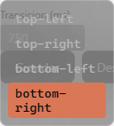
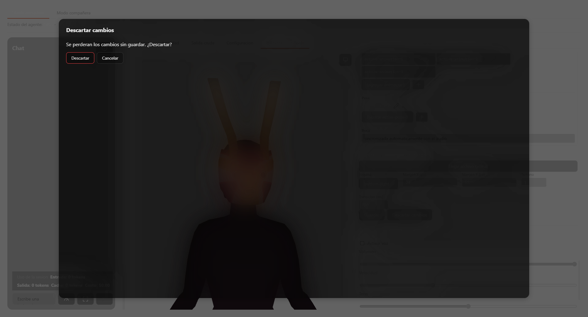

# UI compartida — referencia

## `src/components/CustomSelect.vue`

| Elemento | Detalle real |
|---|---|
| Props | `options: CustomSelectOption[]`, `modelValue: string`, `placeholder?`, `inline?` (default `false`), `activeIndex?` (default `-1`, solo se lee en modo inline), `emptyMessage?` (default `null`), `listboxId?`, `listboxLabel?`, `disabled?`, `title?`, `ariaLabel?` |
| Emits | `update:modelValue` |
| `triggerLabel` (computed) | Busca en `options` el que coincide con `modelValue`; si no hay coincidencia, usa `placeholder` |
| `highlightedIndex` (computed) | `props.activeIndex` si `inline`, si no `internalActiveIndex` (estado propio) |
| `openPanel()` | Fija `internalActiveIndex` al índice del `modelValue` actual (o `0` si no se encuentra), abre el panel |
| `closePanel()` / `toggle()` | Cierran / alternan `panelOpen` |
| `selectOption(index)` | Emite `update:modelValue` con el `value` de esa opción, cierra el panel. No hace nada si el índice no tiene opción real |
| `onTriggerKeydown(event)` | No-op si `inline`. `ArrowUp`/`ArrowDown` abren el panel si estaba cerrado, si no mueven el índice vía `nextCommandIndex` (de `../slash-commands`). `Home`/`End` saltan directo a `0`/`length-1` (sin wraparound). `Enter` selecciona el índice activo. `Escape` cierra y detiene la propagación |
| `onFocusOut(event)` | No-op si `inline`. Cierra el panel salvo que el nuevo foco (`event.relatedTarget`) siga dentro del `rootEl` |
| `optionId(value)` | `${resolvedListboxId}-option-${value}` — id determinista por opción, usado en `aria-activedescendant` |
| ARIA | `aria-haspopup="listbox"`, `aria-expanded`, `aria-controls`, `aria-activedescendant` en el trigger; `role="listbox"`/`role="option"`/`aria-selected` en la lista |

## `src/components/EditorModal.vue`

| Elemento | Detalle real |
|---|---|
| Props | `title: string`, `role?: 'dialog' \| 'alertdialog'` (default `'dialog'`) |
| Emits | `close` |
| `focusableElementsWithin(container)` | Selector real: `'button, input, select, [tabindex]:not([tabindex="-1"])'` |
| `closeOnEscape(event)` | Escucha `keydown` a nivel de `window` (no solo dentro del panel); emite `close` en `Escape` |
| `trapTab(event)` | Solo actúa en `Tab`. Calcula primero/último enfocable; si el foco está en el último y se presiona `Tab` (sin `Shift`), salta al primero; si está en el primero y se presiona `Shift+Tab`, salta al último |
| `onMounted` | Guarda `document.activeElement` en `returnFocusTo`; registra el listener de `Escape`; en el siguiente tick, enfoca el primer elemento enfocable del panel |
| `onUnmounted` | Quita el listener; devuelve el foco a `returnFocusTo` |
| Montaje | `<Teleport to="body">` — el panel vive fuera del árbol DOM del padre |
| Slots | `default` (cuerpo del modal); el título va por la prop `title`, no por slot |

## `src/components/ScrollableListPanel.vue`

| Elemento | Detalle real |
|---|---|
| Props | `loading?: boolean` |
| Slots | `header` (opcional, se renderiza solo si `$slots.header` existe), `list` (cuerpo con scroll, oculto mientras `loading` es verdadero), `footer` (opcional) |
| Estado de carga | Reemplaza el slot `list` completo por un `
` con un spinner CSS (`@keyframes scrollable-list-panel-spin`, `animation` sobre `border-top-color`) |

## `src/icons.ts`

| Elemento | Detalle real |
|---|---|
| `ICONS` | Objeto constante (`as const`) de 19 entradas: `send`, `expand`, `collapse`, `sendToDesktop`, `play`, `edit`, `plus`, `trash`, `check`, `copy`, `close`, `folder`, `chevronLeft`, `warning`, `error`, `info`, `claude`, `code`, `gauge` — cada valor es un `d` de SVG (paths reales medidos en un viewBox `0 0 24 24`) |
| `IconName` | `keyof typeof ICONS` — un nombre inválido es error de compilación, no de runtime |
| `STROKE_ICONS` | `Set<IconName>` con 16 de las 19 claves. Las 3 restantes se renderizan sólidas (fill, no stroke): `send`, `play` y `claude` |
| `isStrokeIcon(name)` | `STROKE_ICONS.has(name)` |

## `src/components/IconGlyph.vue`

| Elemento | Detalle real |
|---|---|
| Props | `name: IconName` (obligatoria), `label?: string` |
| `stroke` (computed) | `isStrokeIcon(props.name)` |
| Render | Un único `<svg viewBox="0 0 24 24">` con un único `<path :d="ICONS[name]">`. Si `stroke`: `fill="none"`, `stroke="currentColor"`, `stroke-width="2"`, `stroke-linecap="round"`, `stroke-linejoin="round"`. Si no: `fill="currentColor"`. **`fill-rule="evenodd"` se aplica siempre**, sin condición de `stroke` |
| Accesibilidad | Si `label` está presente: `role="img"` + `aria-label`. Si no: `aria-hidden="true"` |
| Estilos | `.icon-glyph { width: var(--size-icon-md); height: var(--size-icon-md); flex-shrink: 0; }` — el tamaño lo fija el token, ningún consumidor lo sobreescribe con un tamaño propio salvo mediante clases adicionales de utilidad del propio consumidor |

## `src/error-message.ts`

| Función | Firma | Comportamiento real |
|---|---|---|
| `errorMessage` | `(err: unknown) => string` | 1) `err instanceof Error` → `err.message`. 2) `typeof err === 'object' && err !== null && 'message' in err` → `String(err.message)`. 3) `JSON.stringify(err)`, con fallback a `String(err)` si el resultado es `undefined` (caso real: `JSON.stringify` de `undefined` o de una función). 4) Si `JSON.stringify` lanza (ej. referencia circular): `String(err)` |

Consumidores reales (grep confirmado, sin componente `.vue` excluido): `App.vue` (9 sitios), `AdminSettingsPanel.vue` (11 sitios), `AnimationTimelineEditor.vue`, `CharacterEditor.vue`, `PoseEditor.vue`, `VrmAvatar.vue`, `presentation-manager.ts`.

## `src/external-link-click.ts`

| Función | Firma | Comportamiento real |
|---|---|---|
| `openExternalLinkOnClick` | `(event: MouseEvent) => void` | `event.target.closest('a[href]')`; si no hay enlace, no hace nada. Si lo hay: `event.preventDefault()` y `openUrl(href)` del plugin `@tauri-apps/plugin-opener` (fire-and-forget, `void`) |

Consumidores reales: `App.vue` (2 sitios, sobre los contenedores de contenido markdown renderizado), `ContentBlockRenderer.vue` (ver [chat-y-contenido](../chat-y-contenido/reference.md)).

## `src/chat-draft-markdown.ts`

| Función | Firma | Comportamiento real |
|---|---|---|
| `neutralizeUnpairedBackticks` | `(text: string) => string` | Encuentra todas las corridas de backticks (`` /`+/g ``) con sus posiciones y longitudes. Para cada corrida, busca hacia adelante la siguiente corrida de **igual longitud** como cierre; si no la encuentra, la marca como literal. Reconstruye el texto reemplazando cada corrida marcada como literal por su forma escapada (`&#96;` repetido) |
| `renderChatDraftMarkdown` | `(text: string) => string` | `renderer.render(neutralizeUnpairedBackticks(text))`, donde `renderer` es una única instancia módulo-level de `MarkdownIt({ html: false, linkify: true })` |

Consumidores reales: `App.vue`, `ContentBlockRenderer.vue`, `content-block-text.ts` (ver [chat-y-contenido](../chat-y-contenido/reference.md) para el flujo completo de interpretación de bloques de contenido).

## Convenciones verificadas de este dominio

- Ningún componente de este dominio importa nada de Tauri directamente salvo `external-link-click.ts` (que importa `@tauri-apps/plugin-opener` — es, por definición, la capa delgada de aislamiento nativo para este caso puntual, no una violación de la regla "la presentación no sabe que es de escritorio" documentada en [arquitectura-general](../arquitectura-general/overview.md); es justamente el módulo delgado que esa regla exige que exista).
- `CustomSelect.vue`, `EditorModal.vue` y `ScrollableListPanel.vue` no tienen `.spec.ts` — exención de pruebas de componente documentada en [arquitectura-general](../arquitectura-general/reference.md) (`vitest.config.ts` con `environment: 'node'`, sin `jsdom`/`@vue/test-utils`).
- `error-message.ts` y `chat-draft-markdown.ts` sí tienen `.spec.ts` reales (`error-message.spec.ts`, `chat-draft-markdown.spec.ts` — no son componentes `.vue`, son funciones puras).

## Inconsistencias reales encontradas (reportadas, no corregidas aquí)

- Ninguna encontrada en los dominios ya escritos al momento de redactar este archivo respecto a los nombres de carpeta o enlaces cruzados hacia `ui-compartida` (no se encontró ningún enlace roto apuntando a este dominio con un nombre distinto).
- El patrón de modal `commands-overlay` de `App.vue` (4 usos: `/clear`, detalle de uso, importar personaje, popup de tema) **no** pasa por `EditorModal.vue` y por tanto no tiene trampa de foco ni devolución de foco automática — es una duplicación real de patrón visual (mismo scrim, mismo `z-index`, misma clase de panel) sin duplicación de comportamiento de accesibilidad. Documentado en `overview.md` de este mismo dominio; el detalle línea por línea de cada uno de esos 4 overlays le corresponde a `orquestacion-app`, no a este archivo.
